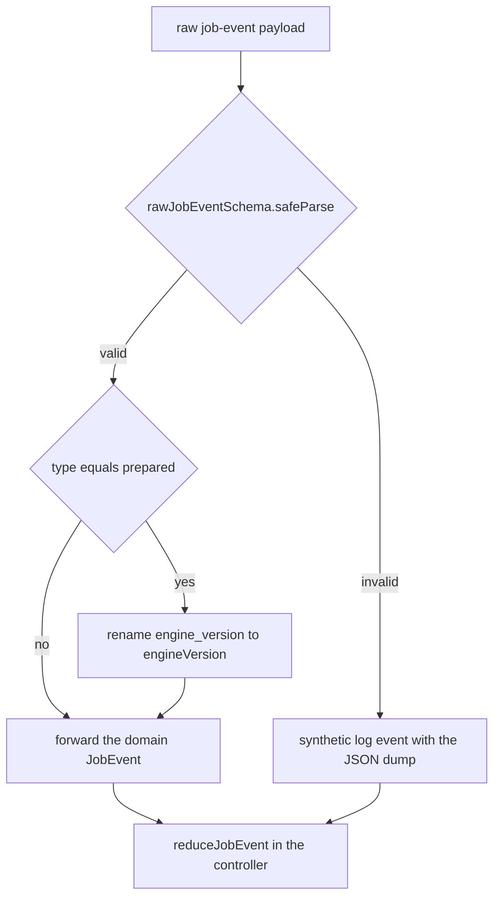
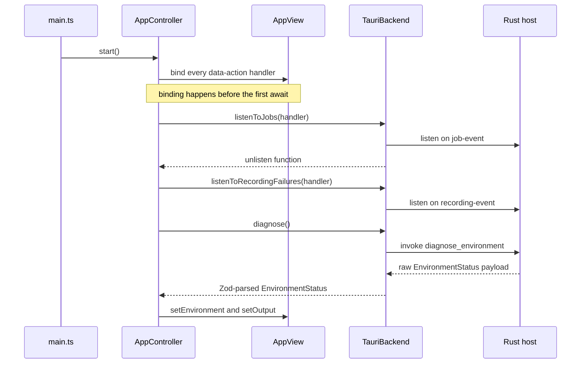
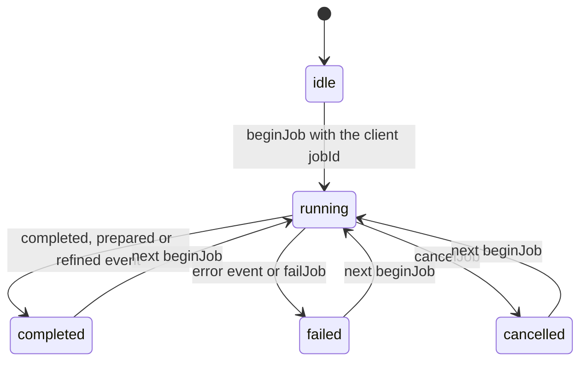
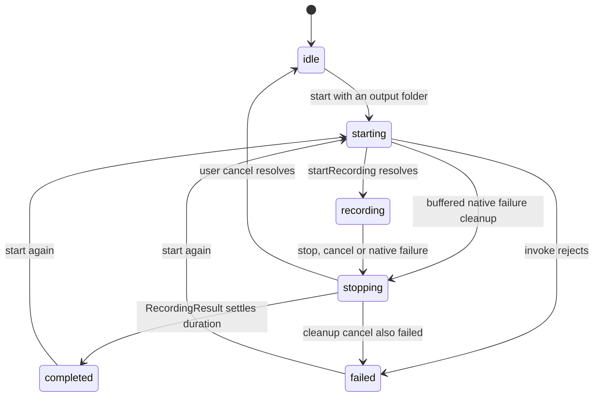

# Frontend Architecture (TypeScript)

Galpi's frontend is a framework-light DOM application: there is no UI framework,
no virtual DOM, and no state library. The window is one static HTML template
injected into `#app`, driven by a handful of plain classes (`AppController`,
`AppView`, `RecordingController`, and the per-panel settings widgets), two pure
immutable state machines, and one adapter that speaks Tauri IPC. Everything
user-facing is Korean copy; every value crossing the native boundary is
schema-validated before it reaches frontend state.

## Composition and entry point

`src/main.ts` is the entire composition root for the webview. It imports the
stylesheet, constructs `TauriBackend` (the only `BackendPort` implementation)
and `AppView` over the `#app` root, hands both to `AppController`, awaits
`controller.start()`, and registers a `beforeunload` hook that calls
`controller.stop()` exactly once. Nothing else wires the frontend together.

```ts
const controller = new AppController(new TauriBackend(), new AppView(root))
await controller.start()
window.addEventListener("beforeunload", () => controller.stop(), { once: true })
```

The build is Vite with `target: "safari17"` and lightningcss minification,
because the window ships inside a WKWebView on macOS 14+; there is no older
engine to down-level for, and no transpilation safety net for newer syntax.

## Layer map and the dependency fence

The frontend mirrors the same inward-pointing dependency rule as the Rust host:

| Layer | Directory | Contents | May import |
|---|---|---|---|
| domain | `src/domain` | `BackendPort`, DTO/value contracts (`job`, `speaker`, `participant`, `glossary`), error-copy helpers | nothing from other layers |
| application | `src/application` | pure immutable reducers `job-machine.ts`, `recording-machine.ts` | domain only |
| ui | `src/ui` | `AppController`, `AppView`, template, per-panel settings widgets | domain + application |
| adapters | `src/adapters` | `TauriBackend` + Zod schemas + `toJobEvent` | domain only |

`scripts/check-architecture.ts` is the executable fence (`bun run
architecture:check`, part of `bun run check`). It scans every `.ts` file per
layer for forbidden import strings: `src/domain` must not import
`../application/`, `../ui/`, or `../adapters/`; `src/application` and `src/ui`
must never import `../adapters/` or `@tauri-apps/`; and `src/adapters` must
never import `../ui/` or `../application/`. The fence exists because the
placement was wrong once: `BackendPort` originally lived in
`adapters/tauri-backend.ts`, which forced `ui/` and `application/` to import
the adapter module, and the 2026-08 refactor moved the contract into
`src/domain/backend.ts` (documented as violation #1 in `docs/ARCHITECTURE.md`
§6). Run the fence before claiming any layering change is safe.

The standing extension rule follows directly: **new port methods go in
`src/domain/backend.ts` and are implemented in `src/adapters/tauri-backend.ts`**.
A new native capability means: add the `BackendPort` method, implement it in
`TauriBackend` with a Zod schema, and register the command in the Rust inbound
adapter (`src-tauri/src/adapters/inbound/tauri.rs`) plus `composition.rs` —
never by importing `@tauri-apps/*` outside `src/adapters`.

## The BackendPort contract

`BackendPort` in `src/domain/backend.ts` is a single interface owned by the
inner layers and implemented by the adapter. It covers the full native surface:
environment (`diagnose`, `prepare`), credentials (`huggingFaceTokenStored`,
`saveHuggingFaceToken`, `saveAssistantApiKey`), settings
(`loadAssistantSettings`, `saveAssistantSettings`, `saveEnginePreset`), work
(`transcribe`, `refineTranscript`, `importTranscript`, `cancel`), artifacts
(`openArtifact`, `revealOutput`), recording (`startRecording`,
`stopRecording`, `cancelRecording`, `listenToRecordingFailures`), file dialogs
(`chooseAudio`, `chooseTranscript`, `chooseOutputDirectory`),
`openModelAccessPage`, and `listenToJobs`. Alongside it live the request and
result DTOs (`SetupResult`, `TranscriptionRequest`, `RecordingStatus`,
`RecordingResult`, `RecordingFailure`, `ArtifactKind`) and the error-copy
helpers `errorMessage()` / `errorDetail()`.

Three details of the contract are deliberate:

- The listener methods return **plain `() => void` unlisten functions**, not
  Tauri's `UnlistenFn`. The port was deliberately framework-neutralized so
  `ui/controller.ts` never names a Tauri type (violation #2 in the same
  refactor).
- **Credentials never cross the border as values.** The port exposes only
  stored-flags — `huggingFaceTokenStored(): Promise<boolean>` and the
  `apiKeyStored` field of `AssistantSettings` — plus per-credential save/clear
  commands. The assistant key rides its own `saveAssistantApiKey` command
  (a blank string clears it) precisely so the settings payload can never carry
  it; replacing a stored value means clearing it and typing a new one, because
  the window never receives the stored value and every keychain read would put
  a macOS authorization prompt on opening settings.
- The contract is one cohesive interface for its single consumer
  (`AppController`). ISP splitting is deliberately not applied; the port is
  injected as a type everywhere in `ui/` and `application/`, which is what
  makes the test fakes possible.

## The Tauri adapter: a Zod-parsed boundary

`src/adapters/tauri-backend.ts` is the **only** frontend module allowed to
import `@tauri-apps/*` or `zod` — the architecture fence enforces it, and the
imports (`invoke`, `listen`, dialog `open`, `openUrl`) sit at the top of the
file. Every native response is parsed with a Zod schema before it enters
frontend state: `environmentSchema`, `setupResultSchema`,
`transcriptionResultSchema`, `assistantSettingsSchema`,
`refinementResultSchema`, `transcriptImportSchema`, and the recording schemas.
A malformed payload throws at the adapter edge, not deep inside a render.

Events arrive on two channels: `job-event` (all `JobEvent`s) and
`recording-event` (`RecordingFailure` payloads only). The adapter listens via
`listen()` and parses each payload before invoking the handler.

`toJobEvent` is the translation layer for job payloads, and its fallback
behavior is a design decision, not an accident:



*How `src/adapters/tauri-backend.ts` turns a raw host payload into a domain `JobEvent`.*

The listener runs inside Tauri's own callback, where a thrown error is
swallowed and the event simply disappears with nothing on screen to say so. An
unrecognized payload therefore becomes a **visible log line** (`stream:
"frontend"`, message containing the JSON dump) attributed to the payload's
`jobId` when one can be salvaged — this keeps a host/window version mismatch
observable instead of silent. `prepared` events also get the worker's
snake_case `engine_version` renamed onto the domain field `engineVersion`.
`src/adapters/tauri-backend.test.ts` pins all of this down, including the
"payload is not an object at all" case (`jobId: ""`).

Native file dialogs and the model-access page also live here:
`chooseAudio` filters `m4a, mp3, wav, mp4, mov, aac, flac, ogg`;
`chooseTranscript` filters `txt, md` and accepts a `defaultPath` (the Galpi
meeting root) so the picker opens where the user's transcripts live;
`chooseOutputDirectory` opens a directory picker; `openModelAccessPage` opens
the pyannote model page via `plugin-opener`.

## Error copy: AppError in, Korean out, diagnostics to the log

Tauri commands reject with `AppError {code, message}` where `message` is
user-facing Korean copy. The domain helpers encode the split:

- `errorMessage(error)` returns `error.message` **only** for objects carrying
  both a string `code` and a string `message` — lookalikes with only a message
  are rejected. Anything else (a raw `TypeError`, a string, `undefined`) is a
  runtime fault the user cannot act on, so it gets the stable copy
  `"예기치 못한 오류가 발생했습니다."`.
- `errorDetail(error)` keeps the raw diagnostic (an Error's message, an
  object's `message`, or `String(error)`) for the log disclosure.
- `AppController.handleFailure` combines them: the status line carries the
  stable user copy, and when the raw detail differs from the user copy it is
  appended to the job log as `[frontend] <detail>` so nothing is lost.

## Startup: bind, subscribe, then diagnose

The startup order is an invariant, and `controller.ts` documents why in-line:



*Startup wiring in `src/main.ts` and `src/ui/controller.ts`: controls bind first, event channels subscribe next, and only then does state loading begin.*

Three rules hold:

1. **Controls bind before the first `await`.** `start()` calls `this.bind()`
   synchronously, registering every `data-action` handler. A failed native
   subscription must not leave the shell inert and silent.
2. **Events subscribe before operations that emit them.** `listenToJobs` and
   `listenToRecordingFailures` complete before `diagnose()`, `prepare()`, or
   `transcribe()` can run — the first worker event of a job already has a
   listener, and `DESIGN.md` lists this as a standing interaction rule.
3. **A dead runtime is visible, not silent.** If either subscription rejects,
   `start()` shows the persistent banner
   `"네이티브 런타임에 연결할 수 없습니다. 앱을 다시 실행해 주세요."` and returns
   instead of piling up raw IPC errors. `controller.test.ts` proves both that
   the banner appears and that the settings sheet still opens afterwards
   (reporting the load failure inside the sheet), using a `BackendPort` fake
   whose every method rejects.

After a successful subscription, `start()` loads environment status (storing
`defaultOutputDirectory` as the output root), token-stored state, and assistant
settings, seeding every settings widget and the attendee picker.

## Pure state machines

`src/application` holds two `(state, event) → state` pure reducers over
immutable states. They own every transition rule; the controllers only invoke
them and hand the result to `AppView`. Their tests live beside them and are
plain Bun unit tests with no DOM.

### job-machine.ts

`JobViewState` tracks `status` (`idle | running | completed | failed |
cancelled`), the tracked `jobId`, `phase`, `percent`, the polite `message`
slot, capped `logs`, and the `error` alert slot.



*`JobViewState` lifecycle in `src/application/job-machine.ts`.*

The reducer's invariants:

- **Foreign events are ignored identity-preserving.** If the state tracks a
  `jobId` and the event carries a different one, the exact same state object
  is returned. This is the frontend half of the stale-event defense (see
  below).
- **Settled states ignore late `phase` events** — a completed/failed/cancelled
  job cannot be resurrected by a straggler.
- **Percent never moves backwards** within the same phase
  (`Math.max`), so a re-emitted progress event cannot rewind the bar.
- **Logs are bounded**: each `log` event's message splits on newlines, each
  line is prefixed `[<stream>]`, and the list keeps only the last 200 lines.
- `completed`, `prepared`, and `refined` events settle the job at `percent`
  100 with their own Korean completion message.

Two helper reducers encode outcome semantics:

- **Cancellation is a user decision, not a failure.** `cancelJob` sets
  `status: "cancelled"` with `error: null`. `failJob` returns the state
  unchanged when the status is already cancelled — the process-death error
  that follows a cancellation is the consequence of the user's decision, not a
  new failure to report.
- **Failure is announced once.** `failJob` keeps the polite slot on the
  stable line `"작업이 실패했습니다."` and puts the specific cause in the
  alert slot exactly once, so screen readers never hear it twice.

### recording-machine.ts

`RecordingViewState` moves through `idle → starting → recording → stopping →`
either `completed`, `failed`, or back to `idle`:



*`RecordingViewState` lifecycle in `src/application/recording-machine.ts`, driven by `RecordingController`.*

Key rules:

- `canStartRecording` allows a start only from `idle`, `completed`, or
  `failed` — a second click while the microphone permission is pending does
  nothing, and `stopping` locks the controls.
- **Elapsed time is measured against the session start (`startedAtMs`), not by
  counting ticks.** The webview throttles or suspends interval timers while
  the window sits in the background, so every skipped tick would otherwise be
  lost for good; recomputing from the wall clock makes a single late tick
  catch up to reality. Negative deltas clamp to 0 (monotonic against clock
  steps).
- **The finished time comes from the recorder, not the clock.**
  `completeRecordingState` settles `elapsedSeconds` on the
  `durationSeconds` the recorder actually wrote — the only authoritative
  length of the saved file — and raises `warning` when `droppedFrames > 0`,
  with a message saying some audio was replaced with silence.

## AppController orchestration

`src/ui/controller.ts` is the workflow coordinator. It owns `audioPath`,
`outputRoot`, the current `JobViewState`, `lastResult` (the transcription or
imported transcript that augmentation starts from), the two unlisten handles,
and the settings-autosave single-flight state.

**Client-minted job ids.** Every operation (`prepare`, `transcribe`,
`refine`, `importTranscript`) mints `crypto.randomUUID()` in the window
*before* invoking. The comment in `prepare()` states the reason: the first
worker event then already belongs to this job; a controller that adopted
whatever id arrived first could inherit the trailing events of a job the user
just cancelled. The reducer's foreign-event guard makes the pairing complete.

**Operation shape.** `begin(kind, message, jobId)` clears the error banner,
resets the job state via `beginJob`, and flips the view into the matching busy
kind (`setup | transcription | refinement`). On resolution the controller
commits `completeJob` / a hand-written completed state and renders; on failure
it routes through `handleFailure` (error-copy split above). `finally` always
resets `setBusy(null)`. Guards run before any IPC: transcription requires an
audio path and an output root, and the speaker form is validated in the domain
by `buildSpeakerHint` (positive integers, `min ≤ max`) so bad input fails with
Korean copy before a job starts.

**Cancellation.** `cancel()` requires a jobId (else it reports the guard), calls
`backend.cancel(jobId)`, and applies `cancelJob` — the backend-side kill
semantics are the Rust host's business (see
[Jobs and cancellation](/openwiki/concepts/jobs-and-cancellation.md)).

**Engine preset.** Switching saves immediately (`saveEnginePreset`) and
re-diagnoses so the setup panel reflects the switch — no Apply step. The
picker lives in the settings dialog, never the setup panel, because the setup
panel hides itself once the selected engine is ready, which would swallow the
control; `controller.test.ts` has a regression test for exactly that.

**Transcript import.** Importing an existing `.txt`/`.md` transcript treats it
as a first-class result: `renderImportedTranscript` registers it as
`lastResult`, hides the srt/checkpoint rows, and unlocks the augment button —
no new recording or transcription required. The file picker opens at the
current output root as the default path.

**Settings autosave.** Every committed settings edit (change events on the
six settings fields, plus row edits/removals in the roster and glossary
widgets) triggers `requestSettingsSave`. A single-flight loop
(`settingsSaveActive` / `settingsSavePending`) coalesces edits made while one
write is in progress into one latest-state write instead of racing or
disabling the sheet. Within a write, the Hugging Face token is saved **only
when the user actually typed a new one** — `pendingToken()` returns `null`
while a token is stored — and the same rule covers the assistant API key
through `pendingKey()` and `saveAssistantApiKey`, the key's only channel: the
document sent to `saveAssistantSettings` carries just the `apiKeyStored` flag
(`AssistantSettingsView.settings()` derives it from host state or a typed
key), so an untouched stored key is never rewritten and a roster edit never
reaches the keychain (which on macOS means a prompt). On failure the sheet
keeps the edited values, shows
`${errorMessage(error)} · 수정 내용은 유지되며 다음 변경 때 다시 저장합니다.`,
and the next change retries. `settings-autosave.dom.test.ts` pins the whole
loop: persistence without a save button, stored keys surviving unrelated
edits, newly typed keys traveling on their own command, mid-write edits
coalescing, and failed writes preserving the form.

## RecordingController

`src/ui/recording-controller.ts` wraps the recording machine with the timing
and failure-race handling that pure reducers cannot express:

- **Early-failure buffering.** A `recording-event` failure can arrive while
  `startRecording` is still in flight (status `starting`). `handleFailure`
  buffers it in `pendingFailures` keyed by `recordingId`; when the start
  resolves, a buffered failure for that id triggers `cleanupFailure`, which
  cancels the partial recording and settles the state as failed with the
  native message. If the cleanup `cancelRecording` itself fails, the message
  appends `"... 부분 녹음 파일 정리에도 실패했습니다: ..."` — the user learns
  about both faults. A dedicated test drives a failure that lands *between*
  the `start` call and its resolution.
- **Clock catch-up.** During `recording`, a 1-second `setInterval` plus
  `visibilitychange` and `focus` listeners re-tick the machine; a
  backgrounded window drops interval callbacks, and the first moment the
  frozen counter can catch up is the visibility change. A tick only ever
  advances the clock, so when nothing else changed the controller takes the
  narrow path and updates only `setRecordingTime` — buttons, path, and status
  line are left exactly as they were.
- **Hand-off to transcription.** `stop()` passes the finished WAV path to the
  `selectAudio` callback that `AppController` wires to `audioPath` and
  `view.setAudio`, so a completed recording becomes the transcription input
  without touching a file picker.
- **Disposal.** `dispose()` (called from `AppController.stop()` on
  `beforeunload`) cancels any still-active `recordingId`, reporting a cleanup
  failure through the banner, and the controller unsubscribes both event
  listeners.

## AppView: rendering the shell

`src/ui/app-view.ts` injects `appTemplate` once in its constructor and
instantiates the settings widgets (`TokenSettingsView`,
`AssistantSettingsView`, `ParticipantSettingsView`, `GlossarySettingsView`,
`ParticipantPickerView`) plus the token-guide popover. Rendering rules that
matter:

- **Fail-fast selectors.** `element()` caches each required selector lookup in
  a `Map` and throws a Korean error (`"필수 UI 요소를 찾지 못했습니다: …"`) when
  a selector is missing. Sub-views share the `required()` helper in
  `src/ui/dom.ts`. Template/view drift is a defect to surface loudly, never a
  null to thread through the caller.
- **One job state, three progress cards.** The same `JobViewState` renders
  into whichever progress card matches the active `BusyKind`
  (`#setup-progress-panel`, `#job-panel`, `#augment-progress`); each stage
  renders its own progress card in place rather than sharing a global block.
  The cancel button is shown only for the active kind.
- **Phase list.** `[data-phase]` items are ranked against `phaseOrder`
  (`engine, models, transcribing, aligning, diarizing, refining, writing,
  ready`) into `complete` / `current` / `pending`. Phase marks and log text
  re-render only when they actually changed (`renderedPhase`, `renderedLogs`
  diffing) because a worker under load emits progress far faster than either
  slot changes.
- **Action gating.** `refreshActions` disables transcription until the engine
  is ready, augmentation until a result exists *and* an assistant key is
  saved, and the idle-path actions (pickers, prepare, record) while a job runs
  or a recording is active.
- **Persistent error banner.** Transient action errors land in the
  `#app-error` banner (`role="alert"`) — the in-panel error slots live inside
  progress cards that are hidden while idle, so they cannot carry idle-time
  failures.
- **Stage rail.** The rail mirrors the three user stages (transcribe /
  results / augment). Engine setup is a pre-gate panel (`00 / 준비`), not a
  stage: it hides once the environment is ready, except within the session
  where the user prepared it so the completion message stays visible. Stage
  state is driven by `data-state` with `aria-current="step"` on the current
  item; text accompanies every state color.
- **Augment flow.** `renderResult` hands the just-written `txt` to the
  augment file picker (augmentation starts from the transcript this run
  published); `renderMinutes` swaps the progress block for the minutes row and
  completes stage 03; `renderImportedTranscript` is the no-transcription
  variant.

## Settings widgets

- **TokenSettingsView** owns the settings dialog shell and the HF token
  field. The dialog follows the APG pattern: it remembers the invoking
  element, moves focus to the close button on open, marks background siblings
  `inert` while open (because `aria-modal` does nothing for the Tab key),
  closes on Escape, and restores focus on close. A stored token shows a mask
  in a read-only field; `pendingToken()` exposes only a newly typed value;
  `setStored(true)` reflects host state without ever learning the value.
- **AssistantSettingsView** masks the API key the same way, defaults the model
  to `DEFAULT_ASSISTANT_MODEL` (`"glm-5.3-flash"`) when blank, and returns
  trimmed `settings()` for autosave — with `apiKeyStored` derived from host
  state or a typed-but-unsaved key, never the value itself.
- **ParticipantSettingsView / GlossarySettingsView** are row editors saved
  with the settings sheet. Domain rules keep the stored document clean:
  `usableParticipants` drops nameless rows (a participant without a name
  cannot label a speaker), aliases parse from one comma-separated field, and
  optional free text collapses to `null` (`emptyToNull`) so empty strings
  never read as values.
- **ParticipantPickerView** renders one chip per roster entry; `retainSelection`
  prunes selection to the current roster in roster order. Selecting attendees
  auto-fills the speaker-count hint (mode `exact`, count = selection) and says
  so; a later manual change is left alone.
- **bindTokenGuide** wires the HF-token help popover with outside-click,
  Escape, scroll-close, and focus hand-back.

## Markup, style, and design contract

The UI contract is three-way: `src/ui/app-template.ts` (one static template
string, with the app version and icon imported at build time), `src/styles.css`
(the authoritative stylesheet), and `DESIGN.md` (normative for palette,
typography, motion, and accessibility) **must stay aligned** — palette tokens,
the px-locked type scale, Korean `word-break: keep-all` + `line-break:
strict` prose rules, status always expressed as text *and* color, and no
invented ETAs for long-running work. Drift is a defect.

`src/styles.test.ts` guards part of the contract by asserting on the
stylesheet text: the global `html [hidden] { display: none }` rule (component
`display` declarations would otherwise defeat the `hidden` attribute), and the
four-track `grid-template-rows` of `.workspace` — a regression fix (VQA-006)
where a three-track template collapsed the app-error banner's row and the
opaque body painted over its text. `src/ui/token-settings.test.ts` guards
another slice: the credential input is `type="text"` with
`autocomplete="off"`, deliberately not a password field, so the WebView's
password restoration never offers to store secrets.

## Protocol change sets

The frontend slice of the cross-runtime event contract is one change set:
`rawJobEventSchema` in the adapter, the `JobEvent` union in
`src/domain/job.ts`, and the `reduceJobEvent` switch in `job-machine.ts` must
move together with the Python worker protocol and the Rust parser. The
reducer's `switch` is exhaustive over the union, so a new variant is a
compile error until every layer handles it — the intended extension path
rather than a `default:` branch.

## Testing the frontend

Tests are colocated Bun tests run by `bun test`; `bun run check` adds the
architecture fence, Biome, and `tsc --noEmit`.

| Suite | Style | What it pins |
|---|---|---|
| `application/*.test.ts` | pure unit | reducer invariants (monotonic percent, 200-line log cap, stale events, cancellation-vs-failure, wall-clock elapsed, dropped-frame warning) |
| `adapters/tauri-backend.test.ts` | pure unit | `toJobEvent` rename, pass-through, and unknown-payload fallbacks |
| `domain/backend.test.ts` | pure unit | `errorMessage`/`errorDetail` AppError split and lookalike rejection |
| `ui/controller.test.ts` | happy-dom + fakes | dead-runtime banner, controls stay bound, engine-preset save/re-diagnose, transcript import |
| `ui/*.dom.test.ts` | happy-dom + real `styles.css` | stage rail, augment hand-offs, autosave coalescing/failure, recording timers, picker/roster behavior |

The DOM tests construct a happy-dom `Window`, inject the real stylesheet into
a `<style>` element, and drive the real `AppView`/`AppController` — so the
three-way markup/style contract is exercised, not mocked. Controller tests
substitute a complete `BackendPort` fake (including one whose every method
rejects), which is only possible because `ui/` depends on the domain port and
nothing else.

## Related pages

- [System overview](/openwiki/architecture/system-overview.md) — the three-runtime model and the shared dependency rule.
- [Rust host](/openwiki/architecture/rust-host.md) — the commands and event bridges this adapter calls.
- [Jobs and cancellation](/openwiki/concepts/jobs-and-cancellation.md) — the backend-side semantics behind `cancel()`.
- [Recording workflow](/openwiki/workflows/recording.md) — the end-to-end recording flow this controller drives.
