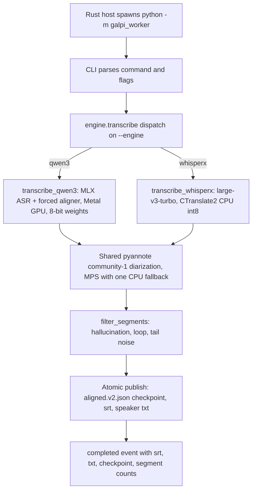
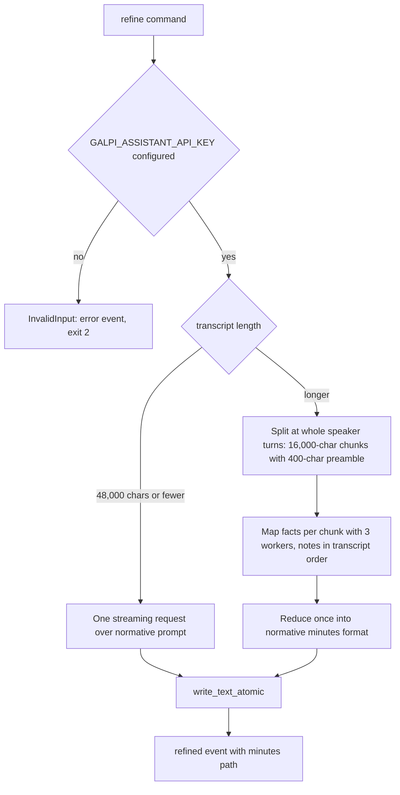

# Python Worker Architecture

The Python worker (`worker/galpi_worker`) is a sidecar process launched and
supervised by the Rust host. It runs Korean ASR, alignment, diarization,
hallucination filtering, and artifact publication (`transcribe`), warms
dependencies and models on first run (`prepare`), and turns a speaker-labelled
transcript into meeting minutes through an OpenAI-compatible assistant
(`refine`). Its stdout is a machine-readable JSONL protocol, not a log stream —
the host parses every line, so any stray `print` from a dependency would
corrupt the pipe. The worker's second defining boundary is purity: the domain
modules stay importable and testable on a bare interpreter with no ML stack
installed.

The host-facing protocol (event envelope, sequencing, cancellation) is
documented in [worker-protocol](worker-protocol.md); this page covers the
worker's own architecture. Engine selection and the two runtime environments
<!-- openwiki: broken internal link [engines-and-environment.md] file "engines-and-environment.md" does not exist. Fix the href or restore the target, then delete this comment. -->
are covered in [engines and environment](engines-and-environment.md).

## Role and supervision boundary

The host spawns the worker as `python -m galpi_worker <command>` with the
worker root on `PYTHONPATH`, and selects the interpreter per engine: the
WhisperX preset runs on the pinned WhisperX virtualenv, while the Qwen3
candidate preset runs in its own isolated virtualenv so the two stacks never
share dependency versions. For Qwen3 transcription the host additionally sets
`HF_HUB_OFFLINE=1` and `TRANSFORMERS_OFFLINE=1`, because transcription only
runs after the readiness gate, so the stack must load exclusively from the
prepared cache. The host hands large or sensitive inputs (ASR context,
roster/glossary JSON) through temporary 0600 files it deletes afterwards,
never through the argument vector.

## CLI surface and exit contract

`build_parser()` defines exactly three subcommands (`__main__.py`):

| Command | Flags |
|---|---|
| `prepare` | `--manifest`, `--engine-bin`, `--engine` (`whisperx` \| `qwen3`) |
| `transcribe` | `--input`, `--output`, `--asr-context` (optional), `--engine`, mutually exclusive `--num-speakers` / `--speaker-range MIN MAX` |
| `refine` | `--transcript`, `--output`, optional `--background`, `--participants`, `--glossary`, `--model`, `--meeting-date` |

Exit codes are part of the contract with the host:

- `0` — success (the final `completed`/`prepared`/`refined` event carries the
  result payload).
- `2` — `INVALID_INPUT`: the worker refuses the caller-supplied argument or
  payload before or during work.
- `1` — `ENGINE_ERROR`: anything else that went wrong.

Every abnormal exit emits exactly one protocol error event before dying:
`main()` catches `InvalidInput` and calls `events.fail("INVALID_INPUT", ...)`,
and a catch-all handler emits `ENGINE_ERROR` with the exception type name —
the comment in the source is explicit that an unlisted exception type would
otherwise die silently on stderr where the host never sees it.

`InvalidInput` deliberately subclasses `ValueError`: existing callers keep
working, but `__main__` can tell Galpi's own validation apart from a
`ValueError` raised deep inside a model library, which is an engine failure
(exit 1), not bad input (exit 2).

## stdout: machine-readable protocol only

`EventWriter` (`protocol.py`) is the only thing allowed on stdout. Each event
is one flushed JSON object carrying protocol version `v: 1`, a monotonically
increasing `seq`, and a `type` (`phase`, `log`, `completed`, `prepared`,
`refined`, `error`). A thread lock keeps `seq` monotonic and stops two events
from interleaving mid-line, because map-phase refinement workers emit
concurrently. `fail()` emits the `error` event and then mirrors
`CODE: message` to stderr for a human watching the raw process.

Two mechanisms keep dependency noise off the protocol stream:

- The entire pipeline runs inside `with redirect_stdout(sys.stderr)` in
  `main()`, so a third-party `print` lands on stderr instead of the protocol.
  A pure test proves this: it prints under `redirect_stdout` next to an
  `EventWriter.emit` and asserts only the event reached the protocol stream.
- Hugging Face's `snapshot_download` tqdm bars are converted into `phase`
  events by `DownloadReporter` (`preparation.py`), which sums every bar's
  progress into one honest GB figure and throttles to one update per second.

The standing rule: no `print`, progress bar, or logging handler on stdout
outside `EventWriter`. Related pages: [worker protocol](worker-protocol.md)
<!-- openwiki: broken internal link [verification-gates.md] file "verification-gates.md" does not exist. Fix the href or restore the target, then delete this comment. -->
consumes this stream; [verification gates](verification-gates.md) runs the
tests that enforce it.

## The purity boundary

`core.py`, `artifacts.py`, the `minutes_*.py` trio, `assistant_stream.py`,
`protocol.py`, and `runtime.py` import no ML stack at module scope. Torch,
WhisperX, pyannote, MLX, and imageio-ffmpeg are imported inside runtime
functions (`engine.transcribe_whisperx`, `qwen3.recognize_words`,
`preparation.prepare_*_models`, …). The consequence is the worker's testing
posture: `bun run check:worker` runs ruff plus
`python3 -m unittest discover -s worker/tests -t .` on the system interpreter
with nothing ML installed, and the whole suite passes because no test imports
a heavy library.

Typing keeps the same discipline. The root `pyrightconfig.json` includes only
`worker` in strict mode with `stubPath: worker/stubs`, where hand-written
`.pyi` stubs exist for the untyped or partially typed dependencies
(`whisperx`, `pyannote.audio`, `torchaudio`, `huggingface_hub`). Untyped
library payloads (MLX aligner word dicts, Hugging Face JSON, pyannote
annotations) are converted with explicit `cast(...)` into local `TypedDict`
contracts such as `Segment`, `Transcription`, `WordSpan`, and `SpeakerTurn`.
Stub realism is a rule, not a nicety: do not weaken a stub merely to hide an
installed-library mismatch.

## Engine dispatch

`engine.transcribe()` is a one-line router on the `--engine` value:

```python
if engine == "qwen3":
    from .qwen3 import transcribe_qwen3
    transcribe_qwen3(...)
    return
transcribe_whisperx(...)
```

The argparse default is `whisperx`, but the decision belongs to the host: the
Rust `EnginePreset` defaults to `Qwen3` and the transcription adapter always
passes `--engine` explicitly. Note the asymmetry — the bundled CLI default is
the legacy engine while the product default is the candidate stack.

Both engines share the surrounding architecture even though their ASR cores
differ: speaker-hint validation, ffmpeg decode, the same pyannote
`speaker-diarization-community-1` model, the same `filter_segments`, and an
identical published artifact set. Each writes an `engine` tag into the
checkpoint it publishes (`<name>.aligned.v2.json`), and each only reuses a
checkpoint carrying its own tag: WhisperX accepts `engine` values of `None`
(files written before the tag existed) or `"whisperx"`; Qwen3 requires exactly
`"qwen3"`. Without the tag, a run that switched presets would read word
timings produced by the other stack.



Engine dispatch and the shared diarization, filtering, and publication stages.

## WhisperX pipeline: ASR on CPU on purpose

`transcribe_whisperx` loads `large-v3-turbo` through WhisperX onto CPU with
`compute_type="int8"` (CTranslate2), `language="ko"`, batch size 8,
`no_speech_threshold: 0.75`, `condition_on_previous_text: False`, and VAD
onset/offset 0.6/0.4. This is a deliberate runtime decision, not an
oversight: ASR stays on CTranslate2 CPU int8 and is never moved to MPS.

Everything downstream prefers MPS. Alignment loads the Korean align model on
`select_torch_device(...)`'s answer (MPS when `torch.backends.mps.is_available()`,
else CPU), and diarization builds `DiarizationPipeline` on the same device.
Both wrap their work in exactly one retry: if the device was `mps` and the
call fails, the worker logs an event explaining the fallback
("MPS 문장 정렬에 실패해 CPU로 다시 시도합니다." / the diarization equivalent)
and re-runs on CPU. There are no further retries, and on a CPU-only machine a
failure propagates. `prepare` mirrors the identical fallback while warming, so
the manifest records which device each stage actually landed on. Between
stages the ASR model is deleted and `gc.collect()` runs before the aligner
loads, keeping peak memory down.

The speaker hint maps onto diarization directly: `--num-speakers N` →
`num_speakers=N`, `--speaker-range MIN MAX` → `min_speakers`/`max_speakers`,
and no flag → automatic. `validate_speaker_hint` rejects zero/negative counts
and inverted ranges as `InvalidInput` before any model work starts.

Checkpoint reuse skips only ASR and alignment. When a valid engine-tagged
checkpoint exists, the worker emits a 100% transcribing phase and loads it;
diarization, filtering, and output publication always run, because the speaker
hint changes far more often than the audio does.

## Qwen3 pipeline: MLX ASR with silence-aligned chunking

The Qwen3 stack runs `Qwen3-ASR-1.7B` through `mlx_qwen3_asr.Session` on the
Metal GPU with 8-bit converted weights, and the native MLX forced aligner
produces word timestamps in the same pass (the "aligning" phase is therefore
emitted as already complete when the ASR pass finishes). The session loads
from `<HF_HOME parent>/mlx/qwen3-asr-1.7b-8bit`; a missing
`weights.safetensors` raises a `RuntimeError` naming that directory, because a
missing conversion means `prepare` was skipped. After the pass the session is
dropped and both the MLX and torch MPS caches are released before diarization
loads — unified-memory hygiene, not decoration.

Two preparatory steps shape the whole pipeline:

- Every input is decoded through the bundled ffmpeg binary into 16 kHz mono
  WAV inside a temporary directory (the stack's libsndfile decoder rejects
  compressed containers such as m4a/AAC), and duration is read from the wave
  header without loading samples.
- `plan_audio_chunks` cuts the audio into chunks with a **25 s target and a
  30 s maximum**, preferring the latest silence midpoint inside each window.
  The limit exists because `mlx-qwen3-asr` re-splits anything longer than 30 s
  at an energy minimum that can land mid-word, discarding Galpi's cut; keeping
  chunks at or under the limit makes Galpi's own silence-aligned boundary the
  one that survives. Silences are detected with `ffmpeg silencedetect`
  (-35 dB floor, 0.6 s minimum) and parsed from its stderr. A stretch with no
  usable silence falls back to a hard cut at the maximum. **Changing these
  constants is a pipeline-behavior change**, and a test pins
  `CHUNK_MAX_SECONDS <= 30.0` to make the invariant visible.

Per chunk, the worker transcribes a raw sample slice (the runtime treats a
bare array as 16 kHz mono, so no per-slice file is needed) with
`language="Korean"`, the biasing context, and `return_timestamps=True`;
chunk-local word timestamps are offset onto the full-meeting clock. A chunk
that stops for any reason other than finishing its text (`length`, meaning the
tail was never emitted, or `repetition`) emits a log event so the resulting
hole is visible to the operator.

`build_word_spans` then lays the model's punctuated text over the aligner's
bare words: matchable characters are Unicode letters/numbers plus apostrophes
(the aligner's own rule), each span takes the raw slice of text its word
consumed plus any trailing punctuation, and text the aligner never reached is
appended to the last span rather than silently dropped.
`group_word_spans` merges timed words into speaker-labelled segments that
break at terminal punctuation (a mark only ends a sentence when whitespace
follows, so "3.14" survives), at a speaker change, after a ≥0.8 s pause, or
once a segment has run past 12 s — breaking on the speaker is what keeps one
long unpunctuated stretch from collapsing several people into whoever spoke
longest.

Diarization uses `pyannote.audio.Pipeline.from_pretrained` with the shared
community-1 model and reads `exclusive_speaker_diarization` — the exclusive
variant drops overlapping speech, which maps cleaner onto ASR segments. Each
word takes the turn covering most of it, or the nearest turn when
diarization's trimming left it uncovered (a better guess than `UNKNOWN`).

## ASR context biasing

The host serializes glossary terms, participant names, and spoken aliases as
one JSON object (`{"terms": [...], "names": [...], "aliases": [...]}`) into a
file passed as `--asr-context`; the keys and list order are a wire contract
with `parse_asr_context` on the worker side, which trims entries and rejects
malformed payloads with `TypeError`.

The two engines consume it differently:

- **WhisperX** packs the lists into the model's `hotwords` option via
  `build_asr_hotwords`: glossary terms outrank names, names outrank aliases
  (rare domain words gain the most), entries are deduplicated, and the packer
  is first-fit under `ASR_HOTWORDS_CHAR_BUDGET = 200` characters — sized
  because the model's hotwords slot keeps roughly the first 223 prompt tokens
  and Korean syllables average about one token each. The front of the string
  is what survives truncation, so whole entries drop once the budget runs out
  rather than being cut mid-word.
- **Qwen3** renders a freeform Korean context ("도메인 용어: …", "참석자
  이름: …", "별칭: …") capped at `BIAS_CONTEXT_CHAR_BUDGET = 500` characters,
  because the hotword slot is finite and a runaway roster would crowd out the
  audio itself.

## Filtering and atomic publication

`should_filter_segment` removes three failure families before anything is
written: known hallucination phrases (a regex over Korean subscription/
credits/credits-roll patterns), single-token repetition loops (≥6 tokens with
one token covering ≥80% — the "person's name dozens of times" Whisper failure
on silence that confidence rules never catch), and phrase loops (a repeated
2–4 token n-gram covering ≥60% of a ≥8-token segment, for decoders that stall
on a whole phrase like "네 알겠습니다" forever). `filter_segments` adds tail
noise cleanup: after a ≥120 s silence beyond the audio's midpoint, segments
with low `avg_logprob` or ultra-short high-rate speech are dropped.

All outputs are written atomically: a sibling `.tmp` file followed by
`Path.replace`/`os.replace` covers the checkpoint (`write_json_atomic`), the
SRT and speaker text pair (`write_outputs_atomic`), refinement output, the
prepare manifest, and the converted MLX weights. The final names —
`<stem>.aligned.v2.json`, `<stem>.srt`, `<stem>_화자별.txt` — are external
behavior; the host and the app's artifact opening depend on them, so they are
never renamed. The final `completed` event carries the `srt`, `txt`, and
`checkpoint` paths plus kept/filtered segment counts.

## prepare: dependency and model warmup

`prepare_models` first links the imageio-ffmpeg binary into `--engine-bin` (a
symlink, falling back to a copy where symlinks fail) so the bundled decoder is
on the worker's PATH, then warms the selected engine's models and writes a
manifest JSON atomically (`protocol: 1` plus package versions, model ids, and
the per-stage devices) followed by a `prepared` event.

The Qwen3 prepare does the most work, in order:

1. Snapshot-downloads `Qwen/Qwen3-ASR-1.7B` and
   `Qwen/Qwen3-ForcedAligner-0.6B` concurrently (two workers — more would
   compete for the same link), with `DownloadReporter` mapping summed tqdm
   bytes onto the 10–40% band.
2. Converts the ASR snapshot into quantized MLX weights (8 bits, group size
   64) in a `<name>.partial` staging directory that is `os.replace`d into
   `cache/mlx/qwen3-asr-1.7b-8bit` only when complete — a crash can never
   leave a half-built model the readiness gate would mistake for a finished
   one. Tokenizer/config sidecar files and a `quantization_config.json`
   accompany the weights.
3. Warms the gated `pyannote/speaker-diarization-community-1` pipeline once,
   passing the `HF_TOKEN` from the prepare environment so the first real
   transcription never pays the download cost.
4. Runs `verify_qwen3_session`: loads the converted weights and transcribes
   one second of silence. Preparation used to end at "the files are on disk",
   which let a bad conversion surface only during a real meeting; the
   verification moves that failure into the step whose job is to report it.

The WhisperX prepare is the same shape: load the ASR model (CPU int8), the
alignment model, and the diarization pipeline once each — with the same
single MPS-to-CPU fallback and log event per stage — then write the manifest.

## refine: transcript to minutes

`refine` requires `GALPI_ASSISTANT_API_KEY` in the environment and raises
`InvalidInput` (exit 2) without it. It reads the transcript, then the optional
context files: background text, participants JSON, and glossary JSON, parsed
into typed `Participant`/`GlossaryEntry` records (name/term required). Empty
or absent context renders as explicit "(없습니다…)" placeholder blocks rather
than blanks, so the model is told to rely on transcript evidence only. The
meeting date comes from `--meeting-date`, which the host derives from the
audio file's mtime — a recording is written when the meeting ends, so its
timestamp is the meeting's day, unlike the transcript's, which is whenever
transcription ran. Without the flag the worker falls back to the transcript
file's own mtime.

Routing is a pure function on transcript length
(`minutes_pipeline.refinement_strategy`):

- **Single pass** — transcripts of 48,000 characters or fewer go through one
  streaming request whose prompt is built by `minutes_prompt.build_messages`
  over the normative format.
- **Map/reduce** — longer transcripts are split by `split_transcript`, which
  packs whole speaker-turn lines into chunks of at most 16,000 characters and
  never cuts mid-turn; each chunk carries the last 400 characters of the
  previous chunk as a read-only preamble (`<이전구간끝>`) so a decision stated
  just before the cut is not misread as an unattributed follow-up. Fact
  extraction (`MAP_SYSTEM_PROMPT`: decisions, actions, topics, follow-ups,
  risks, correction candidates — no guessing, no invented names) runs with
  three concurrent workers; because chunks are independent, notes are
  reassembled in transcript order and progress is reported per completed
  chunk rather than by streamed characters. One reduce request then composes
  the final document with the normative system prompt.

Progress stays monotonic on `phase`: map fills the 35–68% band (per chunk),
reduce 70–88%, and single-pass streaming maps accumulated characters onto
35–88%.



Refinement routing: single pass up to the proven 48,000-character limit, map/reduce beyond it.

### The assistant transport

`assistant_stream.py` implements OpenAI-compatible streaming chat completions
with stdlib `urllib` — no SDK. The base URL comes from
`GALPI_ASSISTANT_BASE_URL` (default `https://api.z.ai/api/coding/paas/v4`),
the model defaults to `glm-5.3`, and `GALPI_ASSISTANT_REASONING_EFFORT` is
included in the request body only when set to a known effort, so other
providers see a clean OpenAI-compatible body. GLM models on the default
endpoint get 131,072 max output tokens (the z.ai budget covers reasoning plus
the document); everything else gets 32,768. Temperature is fixed at 0.2.

The SSE consumer distinguishes `content` from `reasoning_content`: while only
reasoning has arrived, the progress message reports the live reasoning length
at the band start. An error payload inside the stream raises immediately. An
empty document is turned into an actionable error naming the finish reason —
`length` (output cap hit with no body produced) and `content_filter` get
Korean operator-facing messages — and a whole-document code fence is stripped
from the result. Output is written via `write_text_atomic` and the `refined`
event names the path.

### The normative minutes format

`minutes_template.py`'s `SYSTEM_PROMPT` is the single source of truth for the
minutes Markdown structure: a status header line, TL;DR, meeting purpose,
decisions with content/evidence/impact/decider/status fields, an action board,
per-topic discussion, follow-ups, risks/open questions, and a correction
appendix (term and speaker mappings with confidence). Missing sections keep
their titles with "해당 없음", sensitive strings are masked, and speaker labels
are never promoted to real names without evidence. Both the single-pass prompt
and the reduce prompt use this structure, which is what keeps short and long
meetings' minutes interchangeable downstream. See
<!-- openwiki: broken internal link [ai-minutes.md] file "ai-minutes.md" does not exist. Fix the href or restore the target, then delete this comment. -->
[AI minutes](ai-minutes.md) for the product workflow around it.

## Failure semantics across the boundary

The worker's error model is "one event, then die": `EventWriter.fail` emits
the protocol `error` event and `main()` maps the exception class to the exit
code. The host mirrors this contract in `domain/worker.rs`, parsing each
stdout line into a `WorkerEnvelope` whose `v` must equal 1 and rejecting any
other version. This is why protocol changes (version, event names, fields)
must change `protocol.py`, `worker.rs`, and the frontend event schema
together — changing Python alone breaks the host's parser. Cancellation and
process-group supervision belong to the host side and are described in
[worker protocol](worker-protocol.md).

## Configuration and operations

The worker reads almost all of its configuration from the environment the
host builds:

- `HF_HOME` / `TORCH_HOME` point into the app's cache directory, which also
  determines where `mlx_asr_model_dir()` resolves the converted Qwen3 weights
  (`<HF_HOME parent>/mlx/qwen3-asr-1.7b-8bit`).
- `HF_TOKEN` is set only during prepare, for the gated pyannote model;
  telemetry variables (`DO_NOT_TRACK`, `HF_HUB_DISABLE_TELEMETRY`) are always
  set. Qwen3 transcription runs with `HF_HUB_OFFLINE=1` /
  `TRANSFORMERS_OFFLINE=1`.
- `GALPI_ASSISTANT_API_KEY` (required for `refine`), with optional
  `GALPI_ASSISTANT_BASE_URL` and `GALPI_ASSISTANT_REASONING_EFFORT` overrides.
- Locale is pinned to `ko_KR.UTF-8` with `PYTHONUTF8=1`, and `PYTHONPATH` is
  the worker root with `PYTHONSAFEPATH=1`.

Dependency pins live in two files, one per virtualenv: `requirements.txt`
(WhisperX 3.8.6, torch 2.8.0, pyannote.audio 4.0.7, imageio-ffmpeg 0.6.0) and
`requirements-qwen3.txt` (`mlx-qwen3-asr[aligner]` 0.3.5, mlx 0.32.1, torch
kept only because pyannote imports torchaudio at module scope). Each has a
resolved `.lock` the app installs from, regenerated with `uv pip compile`.

## Focused tests

`bun run check:worker` runs the suite with stdlib `unittest discover` on a
bare interpreter — the purity boundary's executable proof. The tests that
actually matter:

- `tests/test_core.py` — speaker-hint validation, ASR context parsing and
  hotword packing (ordering, dedup, whole-entry budget drops), the
  hallucination/repetition/phrase filters against realistic Korean meeting
  speech and known loops, SRT timestamp rounding, protocol isolation of
  stdout under `redirect_stdout`, warning suppression, device selection, and
  the download reporter's progress band and throttle.
- `tests/test_qwen3.py` — the chunk limit pinned against the runtime's 30 s
  re-split, silencedetect parsing (including unparseable lines), chunk
  planning at silence midpoints and hard cuts, word-span alignment and
  segmentation rules, checkpoint round-trip with cross-engine rejection, and
  the bias-context cap.
- `tests/minutes_prompt_cases.py` and `tests/refine_stream_cases.py` —
  participant/glossary parsing and prompt rendering, long-meeting chunking,
  SSE parsing (keep-alives, error payloads, done markers), and progress-band
  monotonicity.

Everything that requires the ML stack — actual model loads, real ASR quality,
diarization behavior — is deliberately outside this suite; it is verified by
running the product against real recordings (see
<!-- openwiki: broken internal link [transcription.md] file "transcription.md" does not exist. Fix the href or restore the target, then delete this comment. -->
[transcription](transcription.md) and
<!-- openwiki: broken internal link [verification-gates.md] file "verification-gates.md" does not exist. Fix the href or restore the target, then delete this comment. -->
[verification gates](verification-gates.md)).
