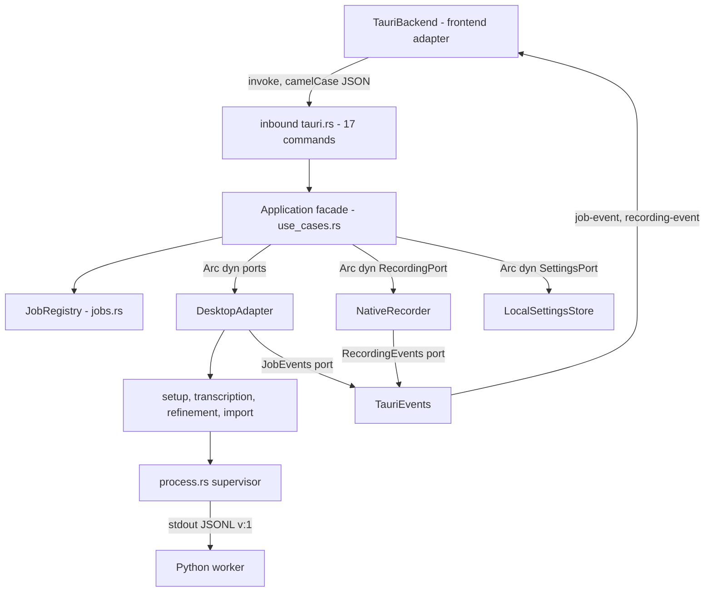
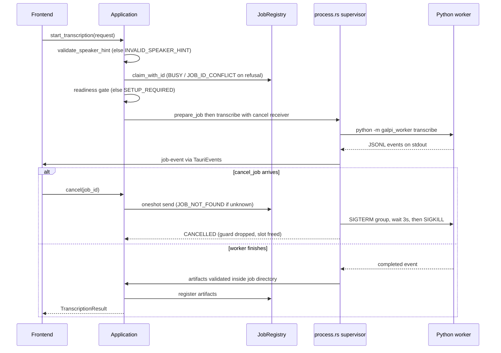

# Rust Host Architecture (Tauri)

The Rust host is the native half of Galpi: it owns the window, persists settings
and secrets, orchestrates jobs, supervises the Python worker, and captures
microphone audio through CPAL. The crate (`galpi`, lib `galpi_lib`) is organized
as a hexagon — `domain/` holds framework-free value objects and the worker
protocol parser, `application/` holds ports and the `Application` use-case
facade, `adapters/inbound/tauri.rs` is the only place `#[tauri::command]`s live,
`adapters/outbound/` implements the ports against macOS/Tauri/tokio, and
`composition.rs` is the single composition root. The entry chain is two lines:
`main.rs` calls `galpi_lib::run()`, which calls `composition::run()`.

The webview counterpart of this boundary is covered in
[frontend](frontend.md); the supervised sidecar is covered in
[python worker](python-worker.md) and [worker protocol](worker-protocol.md);
job lifecycle semantics are elaborated in
[jobs and cancellation](../concepts/jobs-and-cancellation.md), and the
settings-and-secrets story (what is stored where, and why the key is not just
another settings field) continues in
[settings and secrets](../concepts/settings-and-secrets.md).

## Layer map and the dependency fence

| Layer | Location | Contents |
|---|---|---|
| domain | `src-tauri/src/domain/` | Request types and `validate_speaker_hint` (`job.rs`), `Artifacts` aggregate + `minutes_path` (`artifact.rs`), `EnginePreset` (`engine.rs`), roster value objects with trimming rules (`roster.rs`), worker protocol parser and `AsrContext` (`worker.rs`) |
| application | `src-tauri/src/application/` | Nine port traits plus the `RefinementJob` parameter struct (`ports.rs`), `Application` facade (`use_cases.rs`), `JobRegistry` (`jobs.rs`), `AppError` (`error.rs`), serialization DTOs only (`model.rs`), port-fake test suite (`tests.rs`) |
| inbound adapter | `src-tauri/src/adapters/inbound/tauri.rs` | All 17 `#[tauri::command]`s and the `TauriEvents` bridge for `job-event` / `recording-event` |
| outbound adapters | `src-tauri/src/adapters/outbound/` | `DesktopAdapter`, `NativeRecorder` (CPAL), `LocalSettingsStore`, the `process.rs` supervisor, setup/transcription/refinement/import modules, readiness and path policy |
| composition root | `src-tauri/src/composition.rs` | The only place concrete wiring, `.manage`, `.plugin`, and `generate_handler!` live |

`scripts/check-architecture.ts` makes the dependency rule executable. For the
Rust side it enforces that `domain/` and `application/` never import
`crate::adapters`, `crate::composition`, or `tauri::` (domain additionally
cannot import `crate::application`), that `#[tauri::command]` appears only in
`adapters/inbound/tauri.rs`, that `generate_handler!` / `.manage(` / `.plugin(`
appear only in `composition.rs`, and that `tokio::process` and `nix::` process
primitives appear only inside `adapters/outbound/process.rs` and its `process/`
submodule. Note that `application/` is allowed `tokio::sync` primitives
(oneshot channels, mutexes) — only process spawning and signal delivery are
quarantined to the process adapter. The fence runs as part of `bun run check`;
layering changes that cannot pass it are not safe.

*Everything crosses the hexagon through ports: commands enter through the
inbound adapter, events leave through `JobEvents`/`RecordingEvents`, and only
`composition.rs` knows the concrete types.*

## The Application facade: one method per user intent

`Application` (`application/use_cases.rs`) holds the seven capability ports as
`Arc<dyn ...>` fields — `EnginePort`, `TranscriptionPort`, `TranscriptImportPort`,
`ArtifactPort`, `RecordingPort`, `SettingsPort`, `RefinementPort` — plus two
pieces of state it owns outright: the `JobRegistry` slot and an
`active_recording: tokio::sync::Mutex<Option<Uuid>>`. Every public method is
one user intent and nothing more; larger intents (transcribe, refine) are
compositions of port calls ordered by the use case, not by the adapters.

The inbound adapter maps the IPC surface 1:1 onto these methods. All seventeen
commands are thin: deserialize the camelCase payload, call `Application`,
return the mapped error.

| IPC command | `Application` method | What it composes |
|---|---|---|
| `diagnose_environment` | `diagnose` | loads the saved preset, probes readiness |
| `prepare_environment` | `prepare` | fills a missing token from settings, claims the job slot, runs engine/model setup |
| `hugging_face_token_stored` | `hugging_face_token_stored` | boolean probe; the value never leaves the host |
| `save_hugging_face_token` | `save_hugging_face_token` | trims; an all-whitespace token clears the secret |
| `load_assistant_settings` | `load_assistant_settings` | settings without the API key value |
| `save_assistant_api_key` | `save_assistant_api_key` | trims; an all-whitespace key clears the secret |
| `save_assistant_settings` | `save_assistant_settings` | persists `AssistantSettings::trimmed()`, never touching the key |
| `save_engine_preset` | `save_engine_preset` | settings write |
| `start_transcription` | `transcribe` | hint validation, readiness gate, job claim, worker run, artifact registration |
| `import_transcript` | `import_transcript` | job claim, file copy into a meeting folder, artifact registration |
| `refine_transcript` | `refine_transcript` | target artifacts, assistant settings, key read, refinement, minutes registration |
| `cancel_job` | `cancel` | synchronous oneshot send into the running job |
| `open_artifact` | `open_artifact` | registry lookup + contained open via `ArtifactPort` |
| `reveal_output_directory` | `reveal_output` | registry lookup + `open_directory` |
| `start_recording` | `start_recording` | mints a UUIDv7 recording id, single-slot check |
| `stop_recording` | `stop_recording` | id verification, finalize WAV |
| `cancel_recording` | `cancel_recording` | id verification, discard partial |

The mirror of this surface on the frontend side is `BackendPort` in
`src/domain/backend.ts`, whose methods correspond to these commands (plus
frontend-local capabilities like file dialogs); the Tauri adapter implements it
with Zod parsing at the edge. Adding a command therefore spans one change set:
the `#[tauri::command]` in `tauri.rs`, the `generate_handler!` entry in
`composition.rs`, a `BackendPort` method, a Zod schema (or invoke call) in
`src/adapters/tauri-backend.ts`, and — if the table above grows — a row in
`docs/ARCHITECTURE.md` §2.

### Job lifecycle: the single-job invariant

The `JobRegistry` (`application/jobs.rs`) is the host's only form of job
scheduling. `active: Mutex<Option<ActiveJob>>` is a single slot: a prepare,
transcription, import, or refinement must claim it, so only one long-running
job can exist at a time.

- `claim_with_id(id)` fails with `BUSY` when the slot is held and with
  `JOB_ID_CONFLICT` when the requested id already has registered artifacts —
  the frontend picks fresh UUIDv7 ids per attempt, so reuse means a stale
  caller.
- Claiming returns a `JobGuard` plus the receiving end of a oneshot cancel
  channel. The guard's `Drop` releases the slot, which is what makes the slot
  safe: an early `?`, a cancelled future, or a panic cannot leave the registry
  believing a job is still running.
- `cancel(id)` matches the active id and takes the cancel sender. Wrong id →
  `JOB_NOT_FOUND`, second cancel → `ALREADY_CANCELLING`, sender dropped
  (job already finished) → `JOB_FINISHED`.
- A per-id `artifacts` map is the conceptual repository of finished work:
  `register` inserts completed `Artifacts`, `register_minutes` appends the
  minutes path to an existing entry, and lookups fail with
  `ARTIFACT_NOT_FOUND`. Poisoned locks surface as `STATE_ERROR` rather than a
  panic.

*Transcription end to end: hint validation precedes the claim, the readiness
gate runs between the claim and the worker spawn, and cancellation interrupts
the supervisor's select loop rather than polling a flag.*

Cancellation crosses the application boundary synchronously:
`Application::cancel` just forwards to `JobRegistry::cancel`. The wait happens
in the supervisor, which `tokio::select!`s on the cancel receiver while reading
the child's pipes, then escalates `SIGTERM → 3 s → SIGKILL` against the whole
process group (`ProcessGroupGuard`, which also `SIGKILL`s on `Drop` if still
armed) and returns `CANCELLED`. Because the guard is dropped when the use case
returns, the slot frees even though the caller that started the job has long
since moved on.

### Recording is a second, independent single-slot resource

Recording does not claim the job slot. `Application` keeps its own
`active_recording` mutex: `start_recording` mints a `Uuid::now_v7()` and fails
with `RECORDING_BUSY` if one is active; `stop_recording`/`cancel_recording`
verify the id — a different id fails `RECORDING_ID_MISMATCH`, an empty slot
fails `RECORDING_NOT_ACTIVE` — and clear the slot regardless of the port call's
outcome. This is why a user can record while a transcription grinds, but never
record twice.

## Errors: stable codes in, Korean copy out

Every IPC failure is `AppError { code, message }` (`application/error.rs`),
serialized camelCase. The `code` is a stable ASCII token the frontend can
branch on; the `message` is user-facing Korean copy. `AppError::io` wraps raw
`std::io::Error`s as `IO_ERROR` with Korean context. Codes the application
layer itself owns include `BUSY`, `JOB_ID_CONFLICT`, `JOB_NOT_FOUND`,
`ALREADY_CANCELLING`, `JOB_FINISHED`, `STATE_ERROR`, `ARTIFACT_NOT_FOUND`,
`CANCELLED`, `SETUP_REQUIRED`, `ASSISTANT_KEY_MISSING`, `INVALID_SPEAKER_HINT`,
and the recording trio `RECORDING_BUSY` / `RECORDING_ID_MISMATCH` /
`RECORDING_NOT_ACTIVE`; adapters add their own (`WORKER_PROTOCOL_ERROR`,
`PROCESS_FAILED`, `PATH_ERROR`, `SETTINGS_INVALID`, `EVENT_ERROR`, …). The
frontend's `errorMessage()` only trusts the message when an object carries both
a string `code` and a string `message`; anything else is rendered as generic
unexpected-error copy with the raw detail kept for the log.

Three gates are decided in the use case, before any adapter work:

- `transcribe` validates the speaker hint first and maps failure to
  `INVALID_SPEAKER_HINT` — the fake-port test asserts no workspace access
  happened on rejection.
- `transcribe` refuses to run unless `EnginePort::diagnose` reports the saved
  preset ready (`SETUP_REQUIRED`).
- `refine_transcript` reads the assistant API key at the moment refinement
  needs it; absence is `ASSISTANT_KEY_MISSING`.

## Domain value objects

Value objects with business rules live in `domain/`, never in
`application/model.rs` (which holds serialization DTOs such as
`EnvironmentStatus`, `TranscriptionResult`, `RecordingStatus`, and
`RecordingFailure` — camelCase `Serialize` types mirroring the IPC wire).

- **`AssistantSettings`, `Participant`, `GlossaryEntry`** (`domain/roster.rs`)
  each carry a `trimmed()` rule: every string field is trimmed and
  blank-becomes-`None`; a participant without a name is dropped (it cannot
  label a speaker), blank aliases vanish, termless glossary rows vanish, and
  `reasoning_effort` is lowercased and kept only if it is one of
  `low|medium|high|max`. `Application::save_assistant_settings` persists the
  trimmed form, and both the refinement path and the ASR-context builder read
  through `trimmed()` as well. Inline tests pin each rule.
- **`SpeakerHint`** (`domain/job.rs`) is a `mode`-tagged enum (`auto`, exact
  count, min/max range) validated by `validate_speaker_hint`: zero counts and
  inverted ranges are rejected. The transcription adapter translates the
  variants into `--num-speakers` / `--speaker-range` worker flags.
- **`EnginePreset`** (`domain/engine.rs`) is `Qwen3` (default) or the legacy
  `WhisperX`, serialized as `"qwen3"`/`"whisperx"`; unknown names are rejected
  at deserialization. The saved preset decides which virtualenv, readiness
  markers, and ffmpeg binary the adapters use.
- **`Artifacts`** (`domain/artifact.rs`) is the aggregate for finished work —
  optional `srt`, `checkpoint`, `minutes`, `source_audio`, plus the required
  `txt` and `output_directory`. `path_for(kind)` is the only accessor; the
  domain service `minutes_path` derives `<stem>_회의록.md` from the
  speaker-labeled transcript (stripping the `_화자별` suffix). Imported
  transcripts carry no srt/checkpoint/audio, so opening those kinds fails with
  `ARTIFACT_NOT_FOUND`.
- **Worker protocol types** (`domain/worker.rs`) keep the parse boundary in the
  domain: `WorkerEvent` is a `snake_case`-tagged enum with six variants
  (`phase`, `completed`, `prepared`, `refined`, `error`, `log`) flattened into
  a versioned envelope `{v, seq}`. `parse_worker_event` rejects malformed JSON
  (`InvalidJson`) and any version other than 1 (`UnsupportedVersion`).
  `AsrContext` is the write side of the same contract: glossary terms,
  participant names, and spoken aliases serialized under the exact
  `terms`/`names`/`aliases` keys the worker's `parse_asr_context` reads, or
  `None` when all three lists are empty.

The `Application::asr_context` helper builds that context from the trimmed
assistant settings — terms first, then names, then aliases — and the
transcription adapter hands the JSON to the worker through a `0600` temporary
file (`--asr-context`) that is deleted after the run, never through the
argument vector. The refinement adapter uses the same `write_private_file`
mechanism for background, participants, and glossary.

## Outbound adapters

### DesktopAdapter: five ports, one facade

`DesktopAdapter` implements `EnginePort`, `TranscriptionPort`,
`TranscriptImportPort`, `RefinementPort`, and `ArtifactPort`, each by
delegating to a module under `adapters/outbound/` (`setup.rs`,
`transcription.rs`, `import.rs`, `refinement.rs`). One type implementing five
ports is deliberate: the sole consumer is `Application`, and splitting it would
only add boilerplate to the composition root. Its `ArtifactPort` implementation
is the containment policy for opening results: both the artifact path and the
trusted output directory are canonicalized, the artifact must remain inside the
directory and be a regular file, and only then is it opened through
tauri-plugin-opener.

The worker-facing modules enforce containment the same way in the other
direction: every path the *worker* returns (artifacts, minutes) is
canonicalized and must start with the job directory, or the run fails with
`WORKER_PROTOCOL_ERROR`. Transcription additionally selects the interpreter by
preset (the Qwen3 candidate stack runs from its own venv so the pinned
WhisperX environment never shares dependency versions) and, for Qwen3, sets
`HF_HUB_OFFLINE=1` and `TRANSFORMERS_OFFLINE=1` because transcription only
runs after the readiness gate.

### process.rs: the only supervisor

`run_process` is the single place a child is spawned in the host. The spawn is
hardened by contract: `env_clear` plus the explicit environment built by
`environment.rs`, null stdin, `kill_on_drop`, and its own process group (Unix
`process_group(0)`) so signals reach the whole worker tree — `uv`-installed
grandchildren included. stdout is read as bounded lines (64 KiB cap →
`WORKER_PROTOCOL_ERROR`); protocol lines are parsed with the domain parser and
a second `completed`/`refined` event is rejected. stderr is *not* protocol: it
is batched (at most one log event per 100 ms or 32 lines — a `uv pip install`
printing thousands of lines must not flood the webview) while a 20-line tail is
kept so that a non-zero exit can report `PROCESS_FAILED` with the last stderr
line as detail.

The fixed environment is itself policy: `ko_KR.UTF-8` locale, `PYTHONUTF8` /
`PYTHONSAFEPATH`, `PYTHONPATH` pointed at the worker root, `HF_HOME` /
`TORCH_HOME` / uv caches inside the app's data directory, telemetry disabled,
and only uv-managed Pythons permitted. Assistant refinement extends it with
`GALPI_ASSISTANT_API_KEY` / `_BASE_URL` / `_REASONING_EFFORT` — the API key
travels by environment, while bulk context travels by private temp file.

### Readiness, paths, and prepare

`AppPaths` (`paths.rs`) resolves the app-local-data root and derives two
parallel engine layouts — the pinned WhisperX venv and the Qwen3 venv — each
with its own interpreter path, readiness marker, models manifest, and `bin`
directory (bundled ffmpeg). Readiness (`environment.rs`) for a preset means:
interpreter present, marker file content matching
`<version>+<requirements-hash>` (editing a requirements pin invalidates the
installed venv), a valid models manifest, the expected Hugging Face cache
directories, and the preset's ffmpeg present. `diagnose` returns this as the
flat-boolean `EnvironmentStatus` DTO; `prepare` claims a job slot and, only for
the missing pieces, installs the engine via the bundled `uv` and runs the
worker's `prepare` subcommand, failing `SETUP_INCOMPLETE` if the post-run
status still is not ready. The default output root reported to the UI is
`~/Documents/Galpi`. Debug builds use the repo's `binaries/` and `worker/`
paths; release builds use the bundle's side-by-side `uv` and packaged
`resources/worker`.

### Settings and secrets

`LocalSettingsStore` implements `SettingsPort` over one `settings.json` in the
app data directory. It keeps two invariants that matter:

- **Whole-document saves are serialized.** A `tokio::Mutex` is held across each
  read-modify-write cycle and the parsed document is cached, so two concurrent
  saves (the settings sheet autosaves on every keystroke) cannot silently drop
  each other's fields. A failed write invalidates the cache.
- **An empty document is deleted.** Storing only defaults removes the file, so
  a settings file's existence means "the user changed something".

The store deliberately returns assistant settings *without* the API key value —
`load_assistant` fills `api_key: None` and only the boolean `api_key_stored`,
composing that flag from the keychain-derived secret state with the file's
plain fields; the key itself is read by `load_assistant_api_key` exactly when
refinement needs it. Writing goes the other way: `save_assistant` never
touches the key — `save_assistant_api_key` is its only entry point, and the
settings sheet autosaves the whole document on every keystroke, so a key
carried in that payload would be one absent field away from being erased.
Both secrets (Hugging Face token, assistant key) flow through the `SecretStore`
trait. Production currently wires `SettingsFile` — plaintext inside
`settings.json` — because macOS ties Keychain items to the code signature that
created them and the app ships ad-hoc signed; the compiled `Keychain`
implementation is a one-line swap in `LocalSettingsStore::new` once a stable
Developer ID signature exists. Secret reads are cached per launch (each
keychain access can prompt the user), values unchanged from the cache are not
rewritten, and legacy plaintext found in the settings file is migrated to the
store and scrubbed from the file on first read.

### NativeRecorder: CPAL capture

`NativeRecorder` implements `RecordingPort`. All CPAL and filesystem work runs
through `spawn_blocking`; `start` creates a meeting folder named after the
recording so the `.wav` and every later artifact share one predictable name,
and writes to `<name>.wav.part` with the final `.wav` published only by atomic
rename after finalize and duration validation. The audio callback only converts
samples and `try_send`s bounded chunks (saturation is `AUDIO_OVERRUN`, channel
loss `WAV_WRITER_FAILED`); the writer thread owns the Hound encoder, periodic
flushing, and the RIFF 4 GiB guard. Failures follow first-failure-wins: one
`RecordingFailure` is stored and emitted through `RecordingEvents`, later ones
are ignored, and every failure path removes the partial file.

## The inbound adapter and the event bridge

`adapters/inbound/tauri.rs` holds all seventeen commands (thin wrappers, no
logic) and `TauriEvents`, the one bridge to the webview. A single
`TauriEvents` instance implements both event ports: `JobEvents::emit` publishes
a `job-event` whose payload is `{ jobId, ...workerEvent }` (the domain event
flattened under a camelCase job id), and `RecordingEvents::emit_failure`
publishes a `recording-event` carrying the `RecordingFailure`. Emit failures
map to `EVENT_ERROR`. No other component emits to the webview — the outbound
adapters receive `Arc<dyn JobEvents>` / `Arc<dyn RecordingEvents>` and stay
Tauri-blind.

## Composition root

`composition.rs` is the only file allowed to know concrete types. It registers
the two Tauri plugins (`dialog`, `opener`), creates one `TauriEvents` and hands
it to the app twice (as `Arc<dyn JobEvents>` and `Arc<dyn RecordingEvents>`),
constructs `DesktopAdapter` and clones it into five port trait objects,
wraps `NativeRecorder` and `LocalSettingsStore` behind their ports, and
`app.manage`s the assembled `Application`. The `invoke_handler` lists the
seventeen commands. A failed `run` prints and exits with status 1 — there is no
UI to show an error in. Two build-level facts back this up: Cargo lints deny
`unwrap_used` / `expect_used` / `panic` across the crate, and the release
profile deliberately keeps `panic = "unwind"` so a panic in the audio writer
thread fails one recording instead of aborting the process.

## Adding capabilities: the two change sets

- **New IPC command**: `#[tauri::command]` in `adapters/inbound/tauri.rs` +
  registration in `composition.rs`'s `generate_handler!` + `BackendPort`
  method in `src/domain/backend.ts` + Zod schema in
  `src/adapters/tauri-backend.ts` + the `docs/ARCHITECTURE.md` §2 table.
- **New external capability**: trait in `application/ports.rs` → outbound
  implementation → `composition.rs` wiring → extend `FakePort` in
  `application/tests.rs`. `FakePort` implements every port and is the only
  harness the application tests use — no adapter internals are mocked.

## Tests that matter

- `application/tests.rs` drives the real `Application` against `FakePort` and
  pins use-case behavior end to end: hint validation happens before workspace
  access; glossary/roster reach the worker as ASR context (and nothing is sent
  when both are empty); a failed transcription releases the job slot;
  cancellation reaches a running port (`CANCELLED`); refinement sends the
  saved key/model/background, filters attendees to the selection in roster
  order, and publishes minutes addressable as an artifact; imported transcripts
  refine without transcription and expose no srt/checkpoint; the engine preset
  defaults to Qwen3 and follows saves.
- `application/jobs.rs` inline tests pin the registry: one job at a time
  (`BUSY`), guard drop frees the slot, double cancel is `ALREADY_CANCELLING`,
  unknown cancel is `JOB_NOT_FOUND`.
- `domain/roster.rs`, `domain/worker.rs`, `domain/engine.rs`, `domain/job.rs`,
  `domain/artifact.rs` inline tests pin the trimming rules, protocol parsing
  and version rejection, ASR wire format, preset round-trip, speaker-hint
  validation, and minutes naming.
- `application/tests/recording.rs` pins the recording slot: reentry is
  `RECORDING_BUSY`, a foreign id is `RECORDING_ID_MISMATCH`, and the full
  start/stop/cancel cycle works.
