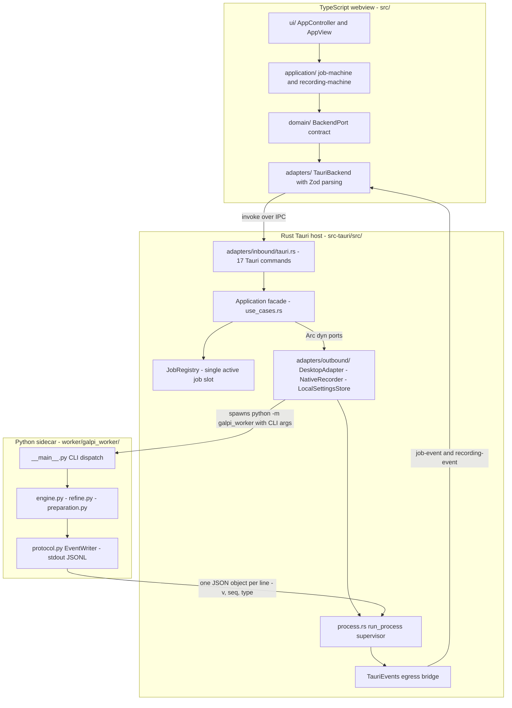

# System Overview: Three Runtimes, One Dependency Rule

Galpi is one product spread across three runtimes: a TypeScript webview that
renders the UI, a Rust/Tauri host that owns the window, settings, secrets,
audio capture, and process supervision, and a bundled Python sidecar that runs
the WhisperX/Qwen3 transcription and refinement stack. Each runtime repeats
the same internal shape — a framework-free `domain` at the center, an
`application` layer that declares ports, and adapters at the edge — so a
developer can move between runtimes without relearning the layering.
`docs/ARCHITECTURE.md` is the normative document for layering questions; this
page maps the whole and points at the pages that go deep.

## The three runtimes

| Runtime | Root | Inner layers | Edge (adapters) | Entry |
|---|---|---|---|---|
| TypeScript webview | `src/` | `domain/` (contracts: `job.ts`, `speaker.ts`, `backend.ts`), `application/` (`job-machine.ts`, `recording-machine.ts`), `ui/` (controllers, view) | `adapters/tauri-backend.ts` — `TauriBackend` + Zod parsing | `src/main.ts` |
| Rust Tauri host | `src-tauri/src/` | `domain/` (requests, value objects, artifacts, worker protocol parser), `application/` (ports, `Application` facade, `JobRegistry`) | `adapters/inbound/tauri.rs` (commands), `adapters/outbound/` (desktop, process, recording, settings) | `composition.rs` via `main.rs` → `galpi_lib::run()` |
| Python sidecar | `worker/galpi_worker/` | pure modules: `core.py`, `artifacts.py`, `minutes_*.py` | `__main__.py` CLI, `engine.py`/`preparation.py`/`refine.py` use cases, `protocol.py` stdout writer, `assistant_stream.py` HTTP | `__main__.py` (`python -m galpi_worker`) |

The runtimes are connected by exactly two channels: the Tauri IPC boundary
(`invoke` in, `job-event`/`recording-event` out) between webview and host, and
a versioned JSONL-over-stdout protocol between host and worker subprocess.

## One dependency rule

All dependencies point inward, toward the domain. Concretely:

- `domain` imports nothing outward. Rust `domain/` may use only the standard
  library plus serde/thiserror/uuid (serde annotations are allowed — serde is
  a data library, not a framework). TypeScript `domain/` imports no other
  top-level directory.
- `application` knows only `domain` and declares its external needs as ports.
  Rust ports are traits consumed through `Arc<dyn Trait>`; the frontend
  injects a `BackendPort`; the worker injects an `EventWriter`.
- `adapters` implement ports. Framework code — Tauri, Zod, CPAL,
  `tokio::process`, `nix` — lives only here.
- Only `composition`/`main` constructs concrete implementations and wires
  them together.

The rule is uniform across all three runtimes; only the vocabulary differs
(traits and `Arc<dyn …>` in Rust, interfaces and constructor injection in TS,
injected writer objects in Python).

## How the rule is enforced

`scripts/check-architecture.ts` is the executable fence, run as
`bun run architecture:check` (the first step of `bun run check`). It defines
eight per-layer fences — four for Rust, four for TypeScript — that forbid the
outward imports by literal string match:

| Layer | Forbidden |
|---|---|
| Rust `domain/` | `crate::application`, `crate::adapters`, `crate::composition`, `tauri::` |
| Rust `application/` | `crate::adapters`, `crate::composition`, `tauri::` |
| Rust `adapters/inbound/` | `adapters::outbound`, `crate::composition` |
| Rust `adapters/outbound/` | `adapters::inbound`, `crate::composition` |
| TS `domain/` | `../application/`, `../ui/`, `../adapters/` |
| TS `application/` | `../ui/`, `../adapters/`, `@tauri-apps/` |
| TS `ui/` | `../adapters/`, `@tauri-apps/` |
| TS `adapters/` | `../ui/`, `../application/` |

A second pass, framework locality, keeps platform code in its one home:
`#[tauri::command]` may appear only in `adapters/inbound/tauri.rs`;
`generate_handler!`, `.manage(`, and `.plugin(` only in `composition.rs`; and
`tokio::process` / `nix::` process primitives only inside
`adapters/outbound/process.rs` and its `process/` submodule. Any violation
raises an `ArchitectureError` listing every offending file, which fails the
gate. Note that `application/` may still use `tokio::sync` primitives (oneshot
channels, mutexes) — only process spawning and signal delivery are
quarantined.

Layering changes that cannot pass this script are not safe to make; the fence,
not the prose documents, is the authority on where code may live.

## Hexagonal port ownership (DIP)

A port belongs to the layer that consumes it, and adapters implement it:

- Rust: nine traits in `src-tauri/src/application/ports.rs` — `EnginePort`,
  `TranscriptionPort`, `ArtifactPort`, `TranscriptImportPort`,
  `RefinementPort`, `RecordingPort`, `SettingsPort`, plus the event ports
  `JobEvents` and `RecordingEvents`.
- TypeScript: `BackendPort` is defined in `src/domain/backend.ts` — the inner
  layers own the contract — and `TauriBackend` in `src/adapters/` implements
  it. This placement is deliberate: the contract originally lived in the
  adapter module, which let `ui/` and `application/` import an adapter; the
  2026-08-21 refactoring moved it into `domain/`.
- Python: the worker's only outbound capability besides files is the stdout
  event stream; `__init__`-time injection hands each use case its
  `EventWriter`, keeping `protocol.py` the single writer of protocol lines.

Events also cross boundaries only through ports: the host emits through
`JobEvents`/`RecordingEvents` without knowing Tauri is underneath, and the
frontend subscribes through `BackendPort.listenToJobs` /
`listenToRecordingFailures`, whose `() => void` unlistener return keeps
Tauri's `UnlistenFn` type out of the UI.

## The request chain, end to end

*The request chain: TypeScript `invoke` enters through the 17 Tauri commands;
worker events return through the `TauriEvents` bridge; the JSONL protocol
connects the host to the Python sidecar.*

A transcription request walks the chain like this: `AppController` calls
`backend.transcribe(...)` → `TauriBackend` invokes the `start_transcription`
command → the thin command handler calls `Application::transcribe` → the
facade validates the speaker hint, claims the single job slot, gates on engine
readiness, then calls `TranscriptionPort` → `DesktopAdapter` resolves paths,
writes the optional ASR-context file, and assembles `python -m galpi_worker
transcribe --input … --output … --engine … [--num-speakers|--speaker-range]
[--asr-context …]` → `run_process` spawns and supervises the subprocess.
Results return through the same call stack; progress and logs travel the event
path instead (below).

## Three composition roots

Each runtime has exactly one place where concrete implementations meet
abstractions.

**Frontend — `src/main.ts`.** The whole graph is one line:
`new AppController(new TauriBackend(), new AppView(root))`, followed by
`controller.start()` and a `beforeunload` hook calling `controller.stop()`.
This is the only file that names the adapter implementation; everything
downstream sees `BackendPort`.

**Host — `src-tauri/src/composition.rs`.** `run()` builds the `TauriEvents`
bridge, then a single `DesktopAdapter` whose `Arc`s are upcast to five port
handles, adds `NativeRecorder` and `LocalSettingsStore`, registers
`Application` with `.manage(...)`, loads the dialog and opener plugins, and
lists all seventeen commands in `generate_handler!`. It is the only file
allowed to do any of this.

**Worker — `worker/galpi_worker/__main__.py`.** An argparse parser defines the
three subcommands (`prepare`, `transcribe`, `refine`); `main()` constructs one
`EventWriter`, redirects stdout to stderr for the duration of the run, and
dispatches to `prepare_models`, `refine`, or `transcribe` with the writer
injected. CLI flags carry the request: `--num-speakers` and `--speaker-range`
are mutually exclusive and map onto the `SpeakerHint` value object; an absent
flag means `auto`.

## The ingress boundary: seventeen Tauri commands

Every command in `adapters/inbound/tauri.rs` is a one-line delegation from
`State<'_, Application>` to a facade method — no business logic, no port
knowledge, just translation of the wire call:

| Command | Application method |
|---|---|
| `diagnose_environment` | `diagnose` |
| `prepare_environment` | `prepare` |
| `hugging_face_token_stored` | `hugging_face_token_stored` |
| `save_hugging_face_token` | `save_hugging_face_token` |
| `load_assistant_settings` | `load_assistant_settings` |
| `save_assistant_api_key` | `save_assistant_api_key` |
| `save_assistant_settings` | `save_assistant_settings` |
| `save_engine_preset` | `save_engine_preset` |
| `refine_transcript` | `refine_transcript` |
| `start_transcription` | `transcribe` |
| `import_transcript` | `import_transcript` |
| `cancel_job` | `cancel` |
| `open_artifact` | `open_artifact` |
| `reveal_output_directory` | `reveal_output` |
| `start_recording` | `start_recording` |
| `stop_recording` | `stop_recording` |
| `cancel_recording` | `cancel_recording` |

The readiness gate is part of the facade, not the command:
`Application::transcribe` refuses to run when `diagnose` reports the selected
engine not ready (`SETUP_REQUIRED`), and Qwen3 transcription runs from its own
venv with `HF_HUB_OFFLINE=1` because it may only start after preparation has
populated the cache.

Secrets never round-trip through this boundary. The frontend can only ask
*whether* a Hugging Face token is stored (a boolean — the sheet shows a mask
either way, and reading it would trigger a keychain prompt on every open), the
assistant key has its own `save_assistant_api_key` command so the settings
autosave never carries it, and the assistant API key is read from the keychain
at the single moment a refinement actually needs it (`ASSISTANT_KEY_MISSING`
otherwise).

## The egress bridge: TauriEvents

`TauriEvents` is one struct implementing both event ports. `JobEvents::emit`
wraps a `WorkerEvent` plus its `job_id` into a `JobEvent{jobId, …}` payload on
the `job-event` channel; `RecordingEvents::emit_failure` publishes a
`RecordingFailure` on `recording-event`. Emitter failures map to
`AppError("EVENT_ERROR", …)`. Downstream of the bridge, the webview's listener
hands each payload through Zod (`rawJobEventSchema`) before it becomes a
domain `JobEvent` for the reducer.

## The JSONL protocol to the worker

The worker's stdout is machine-readable and carries one JSON object per line:
`{"v": 1, "seq": N, "type": …, …}`. `EventWriter` guards a monotonic `seq`
with a `threading.Lock` so concurrent phases cannot interleave mid-line, and
prints with `ensure_ascii=False` and an explicit flush. There are six event
types — `phase`, `log`, `completed`, `prepared`, `refined`, `error`.

On the host side, `run_process` is the supervisor that makes this protocol
safe in practice:

- The child runs with a cleared environment plus an explicit allowlist, stdin
  closed, stdout/stderr piped, `kill_on_drop`, and its own Unix process group
  (pgid 0).
- Output lines are bounded at 64 KiB; an over-long line fails the job with
  `WORKER_PROTOCOL_ERROR` rather than growing a buffer forever.
- stderr lines are batched — 32 lines or 100 ms, whichever first — into single
  `Log` events, because a `uv pip install` printing thousands of lines must
  not flood the webview with one IPC event per line. A rolling tail of the
  last 20 stderr lines becomes the `PROCESS_FAILED` detail.
- Stdout lines are parsed with the domain parser `parse_worker_event`
  (`src-tauri/src/domain/worker.rs`), which rejects malformed JSON and
  unsupported protocol versions; a duplicate `completed` event is also a
  protocol error.
- Cancellation flushes pending logs, sends `SIGTERM` to the process group,
  waits 3 s, then insists with `SIGKILL`, always reaps the child, and returns
  `AppError("CANCELLED", …)`.
- The JSONL protocol is only negotiated when `ProcessSpec.worker_protocol` is
  set: a transcription/prepare/refine run parses stdout through
  `parse_worker_event`, while any other child has its stdout forwarded
  verbatim as `Log{stream:"stdout"}` events.

The protocol is a **one-commit change set**: `worker/galpi_worker/protocol.py`
↔ `src-tauri/src/domain/worker.rs` ↔ `src/domain/job.ts` (with the Zod schemas
in `tauri-backend.ts`) ↔ the `job-machine` reducer. Changing one side without
the others fails at runtime, so they move together. The ASR-context wire
format follows the same ownership rule: `AsrContext::into_wire_json` lives in
the same Rust domain module as the parser, and the host passes the packed
glossary/participant context to the worker as a private 0600 file via
`--asr-context`, deleted after the run.

The frontend side is defensive: `toJobEvent` maps snake_case wire fields
(`engine_version` → `engineVersion`) and, crucially, converts a payload the
current build does not recognize into a frontend log line instead of a thrown
error — a throw inside Tauri's own listener callback would be swallowed and
the event would vanish silently, so surfacing it in the job log keeps a
host/window version mismatch visible.

## Job lifecycle: JobRegistry and the single slot

`JobRegistry` is in-memory state owned by the application layer: a single
active-job slot (`Mutex<Option<ActiveJob>>`) and a map of completed
`Artifacts` per job id. `claim_with_id` refuses a second concurrent job with
`BUSY` and refuses a reused id with `JOB_ID_CONFLICT`; it returns a
`JobGuard` plus the receiving end of a cancel oneshot. The guard's `Drop`
releases the slot, which is what makes the slot safe: an early `?`, a
cancelled future, or a panicking task cannot leave the registry believing a
job is still running. `cancel` sends on the oneshot exactly once — a second
attempt reports `ALREADY_CANCELLING`, an unknown id `JOB_NOT_FOUND`.

Recording has the same single-slot discipline through a separate
`active_recording` mutex: a second `start_recording` is refused with
`RECORDING_BUSY`, and `stop`/`cancel` verify the recording id
(`RECORDING_ID_MISMATCH`, `RECORDING_NOT_ACTIVE`).

On the frontend, `job-machine.ts` mirrors this lifecycle as a pure reducer:
events for a different `jobId` are ignored, `phase` events after a settled
status are ignored, the log buffer is capped at 200 lines, and cancellation is
its own `cancelled` status that a later `failJob` does not overwrite — the
process-death error that follows a user cancellation is a consequence, not a
new failure.

## Naming conventions: Korean copy, ASCII identifiers

User-facing copy — commands' Korean messages, reducer strings, dialog filter
names, the generic failure copy `예기치 못한 오류가 발생했습니다.` — is Korean.
Protocol and error identifiers stay stable ASCII: event types (`phase`,
`completed`, `refined`, …), `AppError` codes (`BUSY`, `CANCELLED`,
`WORKER_PROTOCOL_ERROR`, `SETUP_REQUIRED`, `ASSISTANT_KEY_MISSING`, …), and
the JSON keys of the wire format. The frontend's `errorMessage` surfaces an
`AppError`'s Korean message directly and substitutes the stable Korean
fallback for anything else, while `errorDetail` keeps the raw diagnostic for
logs. A consequence worth knowing when reading old text: `docs/ARCHITECTURE.md`
(dated 2026-08-21) still cites 14 commands and 8 port traits, while the
current source has 17 commands and nine traits. Treat the document as
normative for *principles* and change-set rules, and the code plus the
architecture fence as authoritative for counts and boundaries.

## Deliberate non-refactors — do not "fix" these

`docs/ARCHITECTURE.md` §6 records choices that look like layering violations
but are deliberate cost/benefit calls. An agent that "cleans them up" adds
code without adding a boundary:

- **One `DesktopAdapter`, several ports.** A single adapter object implements
  five consumer-specific ports (`EnginePort`, `TranscriptionPort`,
  `TranscriptImportPort`, `RefinementPort`, `ArtifactPort`); composition
  upcasts one instance into five `Arc<dyn …>` handles. Every port's consumer
  is the same `Application`, so splitting the adapter would only add
  boilerplate in the composition root. The consumer-specific *contracts*
  remain separate traits (ISP is preserved at the type level).
- **`JobRegistry` is not hidden behind a port.** It is in-memory state; until
  a second storage medium exists, a repository abstraction is cost with no
  payoff.
- **`BackendPort` is one integrated interface.** Its single consumer is the
  `AppController`; the 23-method interface — 17 IPC calls, two event
  subscriptions, and dialog/opener conveniences (`chooseAudio`,
  `chooseTranscript`, `chooseOutputDirectory`, `openModelAccessPage`) — is one
  cohesive contract, so an ISP split would buy nothing. The frontend has no
  driven ports at all; browser and plugin APIs are handled inside
  `TauriBackend`.
- **Python has no layer split.** For a single-entry CLI sidecar, directory
  hierarchy is movement without value. The real boundary is purity: `core.py`,
  `artifacts.py`, and `minutes_*.py` are pure modules testable without the ML
  stack, while `engine.py`, `preparation.py`, and `qwen3.py` lazily import
  torch/WhisperX and `assistant_stream.py` is the HTTP egress for refinement.

## Extension paths

`docs/ARCHITECTURE.md` §7 fixes the mandatory companions for common changes:

- **New worker event or field:** touch the whole protocol change set in one
  commit — `protocol.py`, `domain/worker.rs`, `src/domain/job.ts` + Zod
  schemas, `job-machine.ts` reducer.
- **New IPC command:** add the `#[tauri::command]` in `tauri.rs`, register it
  in `composition.rs`'s `generate_handler!`, extend `BackendPort` plus the
  Zod schema, and update the architecture doc's command table — exactly the
  path `save_assistant_api_key` took.
- **New external capability:** declare a trait in `application/ports.rs`,
  implement it in an outbound adapter, wire it in `composition.rs`, and extend
  the `FakePort` doubles in `application/tests.rs`.

## Verification gates

The fence runs first in every check: `bun run check` =
`architecture:check` + Biome + `tsc --noEmit`. `bun run check:all` adds
`bun test`, the Rust gate (`cargo fmt --check`, clippy `-D warnings`,
`cargo test`), and the worker gate (ruff check/format plus
`python3 -m unittest discover -s worker/tests -t .`). An architecture
violation is a gate failure by construction — `check-architecture.ts` throws —
so the dependency rule is not a convention that can rot silently. The testing
depth behind these gates is covered in
[verification gates](../testing/verification-gates.md).

## Related pages

- [Frontend architecture](frontend.md) — webview layers, state machines, controller.
- [Rust host architecture](rust-host.md) — crate layout, ports, adapters in depth.
- [Python worker](python-worker.md) — sidecar modules, ML pipeline, purity rules.
- [Worker protocol](worker-protocol.md) — the JSONL contract, event by event.
- [Jobs and cancellation](../concepts/jobs-and-cancellation.md) — the single-slot lifecycle, cancellation flow, and error codes.
- [Verification gates](../testing/verification-gates.md) — every check and what it proves.
