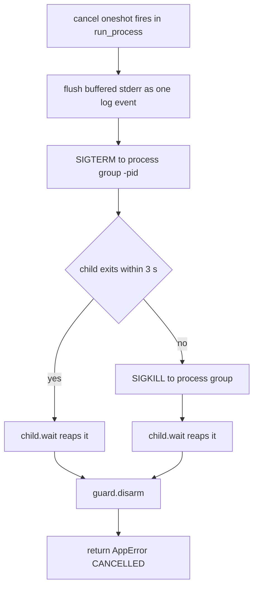
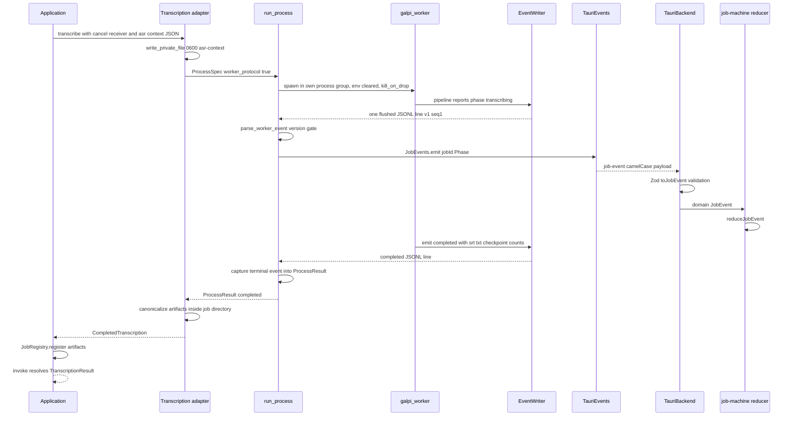

# Worker Protocol & Process Supervision

Galpi runs transcription, model preparation, and minutes refinement in a Python
sidecar that the Rust host spawns and supervises. The two processes share
exactly one channel: the worker's stdout, which carries a versioned JSONL
protocol — every line is one machine-readable event, never a log message. The
host parses each line, re-publishes it to the webview as a Tauri event, and the
frontend reduces it into UI state. Three runtimes therefore touch one contract:
`worker/galpi_worker/protocol.py` writes it, `src-tauri/src/domain/worker.rs`
parses it, and `src/domain/job.ts` (with the Zod schemas in
`src/adapters/tauri-backend.ts` and the reducer in
`src/application/job-machine.ts`) consumes it.

The supervision half of this page is
`src-tauri/src/adapters/outbound/process.rs` — the single place in the host
where a child process is spawned, read, and killed. The worker's internal
pipeline is covered in [python worker](python-worker.md), the host's layers in
[rust host](rust-host.md), job lifecycle semantics in
[jobs and cancellation](../concepts/jobs-and-cancellation.md), the prepare flow
in [engine setup](../workflows/engine-setup.md), and the refine flow in
[AI minutes](../workflows/ai-minutes.md).

## The envelope and its four coupled definitions

Every event the worker emits is one flushed JSON object of the shape:

```json
{"v": 1, "seq": 7, "type": "phase", "phase": "aligning", "percent": 42.5, "message": "…"}
```

- `v` — protocol version, pinned to `1` on both sides
  (`PROTOCOL_VERSION` in `protocol.py`, `PROTOCOL_VERSION` in `worker.rs`).
- `seq` — monotonically increasing per `EventWriter` instance (incremented
  before each emit, so the first event is 1). The Rust envelope parses `seq`
  but `run_process` never reorders or checks it: monotonicity is what the
  worker's emit lock guarantees, so a raw transcript can be read in emission
  order even when map-phase chunks emit concurrently.
- `type` — one of the six event names, serialized as the Rust enum's
  `snake_case` tag and as the TS union's discriminant.

The six event types and where each is produced:

| Type | Payload | Emitted by |
|---|---|---|
| `phase` | `phase`, `percent`, `message` | pipeline progress in `engine.py`, `qwen3.py`, `preparation.py`, `refine.py`, `assistant_stream.py`; also by the host's own `emit_phase` (setup) |
| `completed` | `srt`, `txt`, `checkpoint`, `segments`, `filtered` | final artifact publication in `engine.py` / `qwen3.py` |
| `prepared` | `engine_version` | `preparation.py` after model warm-up |
| `refined` | `minutes` | `refine.py` after minutes are written |
| `error` | `code`, `message` | `EventWriter.fail` on any abnormal exit |
| `log` | `stream`, `message` | `EventWriter.log` (`stream: "worker"`), the host's stderr batching, and non-protocol stdout lines (`stream: "stdout"`) |

**The change-set rule.** These four files form one contract and one commit:
`worker/galpi_worker/protocol.py` ↔ `src-tauri/src/domain/worker.rs` ↔
`src/domain/job.ts` plus the Zod schemas ↔ `src/application/job-machine.ts`.
Changing a protocol version, event, or field in the Python side alone leaves the
host unable to parse the stream and the UI unable to render it; `docs/ARCHITECTURE.md`
§7 makes the single-commit rule mandatory. The Rust side has two safety nets: a
deserialization failure of an unexpected shape fails the run as
`ProtocolError::InvalidJson`, and a changed enum variant breaks every
non-wildcard `match` over `WorkerEvent` at compile time. The same rule extends
to the emit sites listed above: a new payload field must appear in the
`events.emit(...)` call, the Rust enum variant, the TS union member, its Zod
schema, and the reducer in the same change.

## Python side: `EventWriter` and the stdout boundary

`EventWriter` (`worker/galpi_worker/protocol.py`) is the only writer allowed on
the worker's stdout. Its `emit` bumps `seq` under a `threading.Lock`, then
prints one `json.dumps` line with `flush=True`. The lock exists because
map-phase refinement chunks emit concurrently (`refine.py` runs a
`ThreadPoolExecutor`); it keeps `seq` monotonic and stops two events from
interleaving mid-line, which would corrupt every subsequent parse. `log()`
emits a `log` event with `stream="worker"`. `fail()` emits an `error` event and
then mirrors `CODE: message` on stderr for a human watching the raw process.

Two mechanisms in `__main__.py` protect the protocol stream:

- The whole pipeline runs under `with redirect_stdout(sys.stderr)`, so a stray
  `print` from a third-party dependency lands on stderr — which the host treats
  as log noise — instead of landing a corrupt line in the protocol pipe.
- Every abnormal exit still reaches the host as exactly one `error` event:
  `InvalidInput` becomes `fail("INVALID_INPUT", …)` with exit code 2, and a
  catch-all handler emits `fail("ENGINE_ERROR", …)` with the exception type name
  and exit code 1. Without the catch-all, an unlisted exception type would die
  silently on stderr and the host would report only a generic non-zero exit.

Exit codes are part of the contract: `0` success (the final
`completed`/`prepared`/`refined` event carries the result), `2` invalid input,
`1` engine failure.

## Rust side: the supervisor

### Spawn hardening

`run_process` (`adapters/outbound/process.rs`) is the only spawn site in the
host, and the architecture fence enforces that: `scripts/check-architecture.ts`
fails the build if `tokio::process` or `nix::` primitives appear outside
`process.rs` and its `process/` submodule. The spawn is hardened by contract:

- `env_clear()` plus the explicit environment the caller builds —
  `process_environment` in `environment.rs`, extended per run where a step needs
  it (the Qwen3 transcription pass adds the Hugging Face offline flags). The
  child never inherits the parent's environment, and `run_process` itself adds
  nothing.
- `stdin(Stdio::null())`, piped stdout and stderr.
- `kill_on_drop(true)` on the tokio child.
- `process_group(0)` on Unix, putting the child in its own process group so
  signals reach the whole worker tree — `uv`-spawned grandchildren included.

Callers describe a run with a `ProcessSpec { program, current_dir, args, env,
worker_protocol }`. `worker_protocol: true` marks a galpi-worker invocation
whose stdout is protocol; `false` marks raw installs (the `uv` steps in
`setup.rs`) whose stdout is ordinary log text.

### The select loop: protocol lines, batched stderr, cancellation

The body of `run_process` is a `tokio::select!` over four arms, run while either
pipe is still open: a bounded line from stdout, a bounded line from stderr, the
stderr flush timer, and the cancel oneshot. When both pipes close, it awaits
`child.wait()` with the cancel receiver still selected.

On the stdout side, `worker_protocol` decides the treatment. With the protocol
on, every line goes through `parse_worker_event`; a parse failure is fatal
(`WORKER_PROTOCOL_ERROR` aborts the run). Every parsed event is forwarded
through the `JobEvents` port to the webview, and `completed`/`refined` events
are additionally captured into `ProcessResult.completed` — a second one fails
with `WORKER_PROTOCOL_ERROR` rather than silently overwriting the first. With
the protocol off, each stdout line becomes a `Log { stream: "stdout" }` event.

On the stderr side, lines are never protocol. They are buffered and delivered as
batched `Log { stream: "stderr" }` events: a batch flushes when it reaches 32
lines (`LOG_BATCH_LINES`), when 100 ms elapse with a partial batch
(`LOG_BATCH_INTERVAL`), when stderr closes, and before any early return. The
reason is webview load — a `uv pip install` printing thousands of lines would
otherwise flood the UI with one IPC event per line. In parallel, a 20-line
`error_tail` remembers the most recent stderr lines so that a non-zero exit can
report `PROCESS_FAILED` with the last stderr line as its detail (or
`exit status {status}` when stderr said nothing). Both bounds are pinned by
tests.

### Bounded lines

`read_bounded_line` caps one line at 64 KiB (`MAX_LINE_BYTES`). A longer line
fails immediately with `WORKER_PROTOCOL_ERROR` instead of buffering without
bound — a run-away worker cannot exhaust host memory through its stdout — and
the test asserts the buffer itself never exceeds the cap. Non-UTF-8 output is
likewise rejected: the protocol is UTF-8 JSON or the run fails.

### Cancellation: the escalation ladder

Cancellation crosses the application boundary as a oneshot, not a flag.
`JobRegistry::cancel(id)` takes the `cancel` sender stored with the active job
and sends once; a wrong id is `JOB_NOT_FOUND`, a second cancel is
`ALREADY_CANCELLING`, and a dropped sender (job already finished) is
`JOB_FINISHED`. `run_process` holds the receiving end and selects on it in two
places: inside the read loop and around the final `child.wait()`.

When the oneshot fires, `run_process` first flushes any buffered stderr so no
log line is lost, then hands off to `terminate_on_cancel`, which implements the
kill ladder and always returns `AppError::new("CANCELLED", …)`:

1. `SIGTERM` to the process group — the guard signals `-pid`, not the bare pid,
   so grandchildren die too.
2. A 3-second grace: `tokio::time::timeout(3 s, child.wait())`.
3. On timeout, `SIGKILL` to the group.
4. A final `child.wait()` — the child is always reaped, so no zombie survives.
5. `guard.disarm()`.



*The cancellation ladder in `terminate_on_cancel`: polite signal, bounded grace,
forced kill, unconditional reap.*

The `ProcessGroupGuard` is the backstop for every path that does not reach the
ladder. While armed, its `Drop` sends `SIGKILL` to the group; normal completion
and cancellation disarm it first. If a `run_process` future is dropped mid-flight
— a protocol error aborting the run, a cancelled task, a panic — the guard fires
on the way down and the worker tree does not survive its supervisor.

### Terminal events become the host's result

The value captured into `ProcessResult.completed` is the only channel through
which the worker hands back results. The transcription adapter requires a
`completed` event (its absence is `WORKER_PROTOCOL_ERROR`), treats an empty
`checkpoint` string as "no checkpoint" (the Qwen3 stack publishes srt/txt
only), and canonicalizes every returned path, rejecting any artifact outside
the job directory. The refinement adapter likewise requires `refined` and
containment-checks the minutes path. The worker cannot point the host at
arbitrary filesystem locations through its protocol.

## One transcribe run, end to end



*One transcribe run: the worker's phase events stream to the webview while the
run is still going, the `completed` line is captured as the run result and
canonicalized, and only after `JobRegistry.register` does the original invoke
resolve. Every event crosses three language boundaries (JSONL → Rust enum →
Tauri payload → TS union) before it changes UI state.*

## Delivery to the webview

Outbound adapters never touch Tauri. They receive an `Arc<dyn JobEvents>` and
call `emit(job_id, event)`; the single `TauriEvents` instance in
`adapters/inbound/tauri.rs` implements the port by publishing a Tauri
`job-event` whose payload is `{ jobId, ...event }` — the domain event flattened
under a camelCase job id. The composition root hands the same instance to
`DesktopAdapter` (as `JobEvents`) and to `NativeRecorder` (as
`RecordingEvents`), so no other component emits to the webview.

Subscription ordering is part of the contract: AGENTS.md states that a frontend
must subscribe to Tauri events before invoking the operation that emits them,
because Tauri does not replay an event published before its listener existed.
`AppController.start` follows it — controls bind, `listenToJobs` and
`listenToRecordingFailures` are awaited, and only then does the first
`diagnose` fire.

On the frontend, `TauriBackend.listenToJobs` pipes every payload through
`toJobEvent`, which validates it against `rawJobEventSchema` — a Zod
discriminated union on `type` mirroring `domain/job.ts`. Two deliberate
behaviors live at this edge:

- The host forwards the worker's `prepared` payload as-is, so the field arrives
  as `engine_version`; `toJobEvent` renames it onto the domain's
  `engineVersion`. Everything else passes through unchanged.
- An unrecognized payload — a host newer than this window — becomes a visible
  `log` event with `stream: "frontend"` instead of a thrown error. The listener
  runs inside Tauri's own callback, where a throw is swallowed and the event
  would vanish; degrading to a log line keeps the version mismatch on screen.

The validated events feed `reduceJobEvent` in `src/application/job-machine.ts`,
a pure `(state, event) → state` reducer with the semantics the protocol's
batching and cancellation behavior depend on:

- Events whose `jobId` differs from the state's are ignored — the window mints
  the job id (`crypto.randomUUID()`) before invoking, so trailing events of a
  just-cancelled job cannot leak into a new run.
- `phase` events are dropped once the status is settled
  (`completed`/`failed`/`cancelled`), and within one phase `percent` only moves
  forward (`Math.max`), so a checkpoint-skip jumping to 100 is not undone.
- `log` messages are split on `\n` — undoing the host's stderr batching — and
  each line is prefixed with `[stream]`; the log is capped at 200 lines.
- `completed`, `prepared`, and `refined` set status `completed` at 100%;
  `error` sets `failed` with the message in the alert slot.
- `cancelJob` records a polite notice with `error: null`, and `failJob` is a
  no-op on an already-cancelled state: whatever error the dying process produced
  is the consequence of the user's decision, not a new failure to report.

## The ASR context side-channel

Recognition biasing data travels beside the protocol, not through it. The
`Application::asr_context` helper builds an `AsrContext` from the trimmed
assistant settings — glossary terms, participant names, spoken aliases. When all
three lists are empty, `AsrContext::new` returns `None` and nothing is sent.

`AsrContext::into_wire_json` serializes `{"terms": […], "names": […],
"aliases": […]}` in that exact key order. The key names and list order are a
wire contract with `parse_asr_context` in `worker/galpi_worker/core.py`, which
reads exactly those keys, trims entries, drops non-string and blank entries,
treats missing keys as empty lists, and raises `TypeError` for a non-object
payload or a non-array value. This is the fifth coupled pair with the same
one-commit discipline as the event protocol: moving or renaming a key in
`into_wire_json` means changing `parse_asr_context` in the same change, and the
Rust-side test pins the serialization against the same keys the worker parses.

The JSON string is handed to the worker through a private temporary file, not
the argument vector or the protocol: the transcription adapter calls
`write_private_file(job_id, "asr-context", …)` — a `create_new` file created
with mode `0600`, so it is never briefly world-readable — passes the path as
`--asr-context`, and deletes the file after the run. The refinement path reuses
the same mechanism for `--background`, `--participants`, and `--glossary`.

Each engine consumes the lists differently: WhisperX packs them into the model's
`hotwords` option via `build_asr_hotwords` — glossary terms outrank names, names
outrank aliases, deduplicated, first-fit under a 200-character budget because
the front of the string is what survives model truncation. Qwen3 renders a
freeform Korean context ("도메인 용어: …", "참석자 이름: …", "별칭: …") capped at
500 characters. The application-layer tests pin both directions: glossary and
roster reach the worker as context, and nothing is sent when both are empty.

## Focused tests that pin the contract

- `src-tauri/src/domain/worker.rs` (inline): a phase event parses with its
  fields; `v: 2` is rejected as `UnsupportedVersion`; malformed JSON is
  `InvalidJson`; `into_wire_json` produces exactly the keys
  `parse_asr_context` reads; an all-empty context stays `None`.
- `src-tauri/src/adapters/outbound/process/tests.rs`: an oversized line is
  rejected before the buffer grows past the cap; a `refined` line is captured as
  the process result; cancelling a `/bin/sleep 30` child returns `CANCELLED`
  promptly with the child reaped; a failing child's error detail is its *last*
  stderr line.
- `src/adapters/tauri-backend.test.ts`: `engine_version` is renamed onto
  `engineVersion`; a batched log passes through untouched; an unknown event type
  and a non-object payload both degrade to visible frontend log lines.
- `src/application/job-machine.test.ts`: refined completes the job; percent
  never moves backwards within a phase; logs are bounded at 200 with the oldest
  dropped; a foreign `jobId` is ignored; `failJob` after `cancelJob` keeps the
  job cancelled without an alert.
- `src-tauri/src/application/tests.rs`: glossary terms, participant names, and
  aliases all reach the transcription port as ASR context, and with an empty
  roster and glossary no context is sent at all.
- `worker/tests/test_core.py`: `parse_asr_context` trims and filters entries,
  accepts missing keys as empty lists, and rejects non-object payloads and
  non-array values with `TypeError`; `build_asr_hotwords` orders terms before
  names before aliases and deduplicates.

## Related pages

- [Python worker](python-worker.md) — the worker's own architecture and the
  pipelines that emit these events.
- [Rust host](rust-host.md) — the hexagonal layers around `process.rs` and the
  `JobRegistry` that owns the cancel oneshot.
- [Jobs and cancellation](../concepts/jobs-and-cancellation.md) — job lifecycle
  semantics in depth.
- [Workflow: Engine Setup & First Run](../workflows/engine-setup.md) — the
  prepare job whose uv installs and model downloads flow through this protocol.
- [Workflow: AI Meeting Minutes (Refine)](../workflows/ai-minutes.md) — the
  refine job, its private context files, and the terminal `refined` event.
