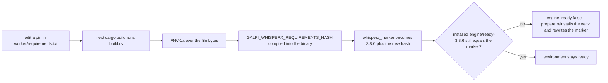
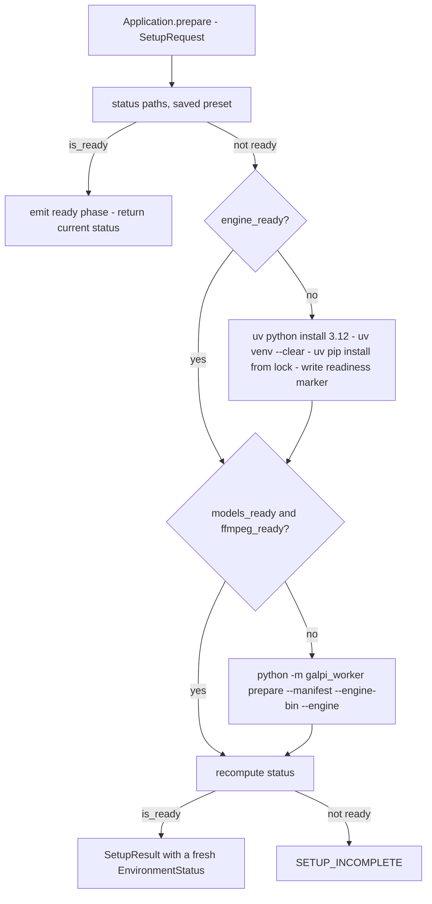

# Engine Presets & Environment Readiness

Galpi runs its transcription through one of two selectable **engine presets**.
`qwen3` is the product default: an MLX-based candidate stack that executes
`Qwen3-ASR-1.7B` on the Metal GPU with 8-bit converted weights. `whisperx` is
the legacy, pinned stack (WhisperX 3.8.6, CPU int8 CTranslate2 ASR). Both
presets share the surrounding pipeline — bundled ffmpeg decode, pyannote
speaker-diarization-community-1, hallucination filtering, atomic artifact
publication — but they live in **separate virtualenvs** inside the app data
directory so their pinned dependency versions never interact.

This page documents the preset type, the app data layout, the requirements
fingerprint mechanism that invalidates stale installs, the marker-file and
manifest readiness checks, the prepare orchestration, the worker's runtime
environment, and how the webview reflects all of it. The engine internals
themselves are covered in [python worker](../architecture/python-worker.md);
the setup workflow walkthrough is in
[engine setup](../workflows/engine-setup.md).

## EnginePreset: one enum decides the engine

`EnginePreset` (`src-tauri/src/domain/engine.rs`) is a two-value enum with
lowercase serde wire names: `qwen3` (the `Default`) and `whisperx`. The saved
preset is the single decision input for every engine-touching command:

- `Application::diagnose` loads the preset from settings, then probes
  readiness for it.
- `Application::prepare` loads the preset and hands it to the setup adapter.
- `Application::transcribe` loads the preset for the readiness gate and passes
  it down so the worker is spawned with the matching interpreter.

```rust
pub enum EnginePreset {
    #[default]
    Qwen3,
    WhisperX,
}
```

The preset persists in `settings.json` inside the app data root
(`LocalSettingsStore` implements `load_engine_preset` / `save_engine_preset`;
a missing file or field falls back to `EnginePreset::default()`, i.e. Qwen3).
A unit test pins both the default wire value (`"qwen3"`) and the rejection of
unknown names, and the application-level tests verify that a fresh store
transcribes on Qwen3 and follows a saved WhisperX preset afterwards.

Note the deliberate asymmetry: the worker CLI's argparse default for
`--engine` is `whisperx` (the bundled CLI predates the candidate stack), but
the host always passes `--engine` explicitly — for prepare and transcription
alike — so the saved preset, never the CLI default, decides the engine.

## App data layout: one root, two engines

`AppPaths::resolve` (`src-tauri/src/adapters/outbound/paths.rs`) derives the
entire layout from Tauri's `app_local_data_dir()`:

```text
<app_local_data_dir>/                # AppPaths.root (also reported as dataDirectory)
├── settings.json                    # LocalSettingsStore (engine preset, roster, …)
├── engine/                          # WhisperX preset root
│   ├── .venv/bin/python             # AppPaths.python — WhisperX interpreter
│   ├── ready-3.8.6                  # engine marker: "<version>+<requirements hash>"
│   ├── bin/ffmpeg                   # link to the imageio-ffmpeg binary
│   └── qwen3/                       # Qwen3 preset root — a separate venv on purpose
│       ├── .venv/bin/python         # AppPaths.qwen3_python
│       ├── ready-qwen3-2            # Qwen3 marker
│       └── bin/ffmpeg
├── models/
│   ├── ready.json                   # WhisperX models manifest
│   └── qwen3-ready.json             # Qwen3 models manifest
├── cache/
│   ├── huggingface/                 # HF_HOME — hub dirs (models--Org--Name), MLX conversion
│   ├── torch/                       # TORCH_HOME
│   └── uv/                          # UV_CACHE_DIR — several GB of wheels stay app-local
└── python/                          # UV_PYTHON_INSTALL_DIR — uv-managed CPython 3.12
```

Two path decisions matter operationally:

- **Isolation.** `engine/qwen3/` exists so the candidate stack never shares a
  dependency set with the pinned WhisperX environment (`requirements-qwen3.txt`
  states this in its header). Preparing or reinstalling one venv cannot disturb
  the other's pins. The transcription adapter picks the interpreter by preset:
  `paths.qwen3_python` or `paths.python`.
- **Reclaimability.** Interpreter downloads (`UV_PYTHON_INSTALL_DIR`), the uv
  wheel cache, and the Hugging Face model cache all sit inside the app data
  folder, so deleting Galpi's folder actually reclaims the gigabytes.

The worker code itself is not installed anywhere: `worker_root()` switches on
build profile. Debug builds run the worker straight from the repo checkout
(`../worker` next to the crate); release builds run the staged copy in Tauri
resources (`resources/worker`, declared in `tauri.conf.json` alongside
`externalBin: ["binaries/uv"]`). `scripts/stage-sidecars.ts` performs that
staging before every dev/build: it downloads `uv` 0.12.5 for
`aarch64-apple-darwin`, verifies the SHA-256 of both the release archive and
the extracted binary against pinned checksums, and copies `galpi_worker` plus
the four requirements/lock files into `src-tauri/resources/worker`. `uv` is
therefore a checksum-verified bundled aarch64 binary, resolved by `uv_binary()`
from `src-tauri/binaries/` in debug and from beside the executable in release.

## The requirements fingerprint: build-time invalidation

Every installed engine carries a readiness marker of the form
`<version>+<requirements-hash>`. The hash half is computed at **compile time**
by `src-tauri/build.rs`, which runs FNV-1a over the bytes of
`worker/requirements.txt` and `worker/requirements-qwen3.txt` and exposes the
results as compile-time environment variables
(`GALPI_WHISPERX_REQUIREMENTS_HASH`, `GALPI_QWEN3_REQUIREMENTS_HASH`). The
build also emits `cargo::rerun-if-changed` for both files, and a missing
requirements file fails the build rather than fingerprinting nothing.

`environment.rs` composes the markers:

- `whisperx_marker()` → `3.8.6` (`ENGINE_VERSION`) `+` whisperx requirements hash
- `qwen3_marker()` → `2` (`QWEN3_ENGINE_VERSION`) `+` qwen3 requirements hash

The consequence is the mechanism's whole point: **editing a pinned dependency
invalidates every existing virtualenv on its own.** The next build compiles a
new hash, the marker comparison fails, the engine reports not ready, and the
next prepare reinstalls the venv and rewrites the marker — no version bump and
no human memory required. FNV-1a is adequate here because the question is
"did this file change", not "can an attacker forge this".



How an edited requirements pin flows into marker invalidation. The same loop applies to the Qwen3 stack via `requirements-qwen3.txt` and `ready-qwen3-2`.

### Version coupling across the fingerprint

The fingerprint covers the *requirements* half; the *version* half is coupled
across files and must be moved together when bumped:

- WhisperX: `ENGINE_VERSION` ("3.8.6") appears in `environment.rs`, and the
  marker file name `ready-3.8.6` is hardcoded in `paths.rs`. The models
  manifest check also requires `whisperx == ENGINE_VERSION`, while the worker
  writes `version("whisperx")` — true only while the pin stays at 3.8.6.
- Qwen3: `QWEN3_ENGINE_VERSION` ("2") appears in `paths.rs` (marker file name
  `ready-qwen3-2`), and the worker's manifest payload hardcodes
  `"qwen3": "2"`, which the host compares against the same constant.

So bumping an engine version means touching the version constant, the marker
file name (for WhisperX), and the worker's manifest payload in one change set,
or readiness never turns true again.

## Readiness: what each check actually inspects

`status()` in `environment.rs` computes, per preset:

| Check | WhisperX | Qwen3 |
|---|---|---|
| `engine_ready` | `engine/.venv/bin/python` is a file **and** `engine/ready-3.8.6` equals `whisperx_marker()` | `engine/qwen3/.venv/bin/python` is a file **and** `engine/qwen3/ready-qwen3-2` equals `qwen3_marker()` |
| `models_ready` | `models/ready.json` parses with `protocol == 1` and `whisperx == "3.8.6"`, plus hub dirs for `faster-whisper-large-v3-turbo`, `kresnik/wav2vec2-large-xlsr-korean`, and pyannote community-1 | `models/qwen3-ready.json` parses with `protocol == 1` and `qwen3 == "2"`, plus hub dirs for `Qwen/Qwen3-ASR-1.7B`, `Qwen/Qwen3-ForcedAligner-0.6B`, the same pyannote model, **and** `cache/mlx/qwen3-asr-1.7b-8bit/weights.safetensors` |
| `ffmpeg_ready` | `engine/bin/ffmpeg` is a file | `engine/qwen3/bin/ffmpeg` is a file |

Hub directory names are derived mechanically from repo ids
(`cache_dir_name`: `Org/Name` → `models--Org--Name`), which is why a setup
test pins that the aligner id keeps the `Qwen/…` repo-id shape.

`status()` assembles these into an `EnvironmentStatus`
(`application/model.rs`): the requested preset's three booleans, **both**
presets' summary booleans (`qwen3Ready`, `whisperxReady` — computed
independently so the settings sheet can badge both engines), `dataDirectory`
(the app data root), `defaultOutputDirectory` (`$HOME/Documents/Galpi`,
falling back to `/tmp` when `HOME` is unset), and a display `engineVersion`
string such as `Qwen3-ASR-1.7B · 2` or `WhisperX 3.8.6`.

`EnvironmentStatus::is_ready()` is the conjunction
`engine_ready && models_ready && ffmpeg_ready`, and it gates two things:

1. **Prepare short-circuit.** If the selected preset is already ready,
   `prepare` emits a `ready` phase at 100% and returns the current status
   without touching uv or the worker.
2. **Transcription gate.** `run_transcription` re-diagnoses first and fails
   with `SETUP_REQUIRED` ("먼저 엔진과 모델 준비를 완료해 주세요.") when the
   selected preset is not ready.

## Preparing an environment

`setup.rs::prepare` orchestrates the whole flow for the saved preset:



The prepare decision tree in `setup.rs`; each stage re-runs `status()` so every skipped stage is a readiness verdict, not an assumption.

1. **Engine install** (only when `engine_ready` is false). Three uv
   invocations under `process_environment`: `uv python install 3.12` (into
   `UV_PYTHON_INSTALL_DIR`), `uv venv --clear` (replacing a partial venv from
   a failed attempt, so retries stay idempotent), and
   `uv pip install --python <venv python> -r <lock>` — WhisperX from
   `requirements.lock` with `--require-hashes`, Qwen3 from
   `requirements-qwen3.lock`. `UV_PYTHON_PREFERENCE=only-managed` guarantees
   only interpreters uv installed itself are candidates; a system 3.12 on
   `PATH` is not a known quantity. The marker file is written only after pip
   succeeds, using the current version+hash marker string.
2. **Standard cache import** (WhisperX only). `model_cache.rs` copies the
   three known model directories from `~/.cache/huggingface/hub` into the app
   cache so a machine that already ran WhisperX outside Galpi does not
   re-download gigabytes. Files are hard-linked with a copy fallback;
   symlinks are recreated only when their canonical target stays inside the
   source repo (an escaping link is an error). The import is best-effort: a
   failure is logged as an event and treated as zero imported.
3. **Offline mode.** `can_use_offline_cache(imported, token)` is true only
   when **all three** directories imported and no (non-blank) Hugging Face
   token is configured. When true, the model environment gains
   `HF_HUB_OFFLINE=1` and `TRANSFORMERS_OFFLINE=1` — with a complete,
   tokenless cache the network cannot improve anything, and a token would
   suggest the user intends gated access.
4. **Worker prepare** (only when models or ffmpeg are missing): spawn
   `<preset python> -m galpi_worker prepare --manifest <models manifest>
   --engine-bin <bin dir> --engine <preset>` and stream its protocol events.
5. **Final verdict.** The host recomputes `status()`; anything short of
   `is_ready()` fails with `SETUP_INCOMPLETE` ("준비 프로세스가 종료됐지만
   필수 파일이 확인되지 않았습니다."). Marker files and manifests — not
   worker exit codes — are the source of truth for readiness.

## What the worker does during prepare

`galpi_worker prepare` (`preparation.py`) first links ffmpeg into the engine
bin dir — a symlink to the imageio-ffmpeg binary, falling back to a copy with
`0o755` when symlinking fails. This link is exactly what `ffmpeg_ready`
inspects and what the transcription path uses to decode audio.

**WhisperX** (`prepare_whisperx_models`) loads `large-v3-turbo` on CPU int8,
then the Korean alignment model and the pyannote diarization pipeline on the
selected torch device (MPS when available), each wrapped in exactly one
MPS→CPU retry. Every model is dropped and `gc.collect()` runs between stages.
It writes `models/ready.json` (protocol 1, installed distribution versions,
device record) and emits the `prepared` event with the whisperx version.

**Qwen3** (`prepare_qwen3_models`) is heavier:

- The ASR and aligner snapshots (`Qwen/Qwen3-ASR-1.7B`,
  `Qwen/Qwen3-ForcedAligner-0.6B`) download **concurrently** with two workers;
  `DownloadReporter` sums every tqdm bar into one honest GB figure and
  throttles to one `phase` event per second (progress mapped onto 10–40%).
- The ASR snapshot is converted to 8-bit MLX weights (group size 64) into a
  `.partial` staging directory that is `os.replace`d into
  `cache/mlx/qwen3-asr-1.7b-8bit`, so a crash can never leave a half-built
  model that the readiness gate would mistake for a complete one. Sidecar
  tokenizer/config files and a `quantization_config.json` travel with the
  weights so `Session(model=<dir>)` loads fully offline.
- The gated pyannote community-1 model downloads using the token from
  settings (`HF_TOKEN` travels through the prepare environment), and the
  diarization pipeline is warmed once.
- `verify_qwen3_session` then loads the converted weights and transcribes one
  second of silence. Preparation used to end at "the files are on disk", which
  let a bad conversion surface only during a real meeting; the verification
  moves that failure into the step whose job is to report it.
- Finally it writes `models/qwen3-ready.json` (`"qwen3": "2"` plus installed
  versions) and emits `prepared`.

## The worker runtime environment

`process_environment` (`environment.rs`) builds the spawned worker's entire
environment deterministically rather than inheriting the shell's:

- `HOME` resolved from the process (fallback `/tmp`), locale pinned to
  `ko_KR.UTF-8` via `LANG`/`LC_ALL`.
- Python hygiene: `PYTHONUTF8=1`, `PYTHONSAFEPATH=1`,
  `PYTHONDONTWRITEBYTECODE=1`, and `PYTHONPATH` set to the worker root.
- Model caches inside app data: `HF_HOME=cache/huggingface`,
  `TORCH_HOME=cache/torch`, `UV_CACHE_DIR=cache/uv`,
  `UV_PYTHON_INSTALL_DIR=python/`.
- Telemetry off: `HF_HUB_DISABLE_IMPLICIT_TOKEN`,
  `HF_HUB_DISABLE_TELEMETRY`, `PYANNOTE_METRICS_ENABLED=false`,
  `DO_NOT_TRACK=1`.
- `PATH` prepends the preset's engine bin dir (so the linked `ffmpeg`
  resolves) ahead of the fixed system paths, and `TMPDIR` is preserved.
- An optional `HF_TOKEN` (trimmed, non-empty) from settings.

`assistant_environment` extends the same base with `GALPI_ASSISTANT_API_KEY`,
optionally `GALPI_ASSISTANT_BASE_URL` and `GALPI_ASSISTANT_REASONING_EFFORT`
for the refinement path.

Two consumers tighten this environment further. Setup adds
`HF_HUB_OFFLINE`/`TRANSFORMERS_OFFLINE` when the imported cache qualifies (see
step 3 above). And **Qwen3 transcription always forces both offline flags**:
transcription only runs after the readiness gate, so the stack must load
exclusively from the prepared cache — no network round trip can occur mid-meeting.

## Webview reflection: EnvironmentStatus and preset switching

`EnvironmentStatus` crosses IPC as a flat camelCase object
(`src/domain/job.ts`); the shape mirrors the wire contract one-to-one so the
frontend can parse it with Zod and nothing else. `TauriBackend.diagnose`
invokes `diagnose_environment` and parses through `environmentSchema` (the
`enginePreset` enum is `z.enum(["qwen3", "whisperx"])`). The worker's
`prepared` event carries `engine_version` in protocol spelling, which
`toJobEvent` renames onto the domain field `engineVersion`.

The controller keeps the setup panel truthful by **re-diagnosing after every
state change that could alter readiness**:

- `start()` diagnoses once at launch, seeds the output path from
  `defaultOutputDirectory`, and renders the environment.
- `switchEngine` (fired by the engine-preset radios in the settings sheet)
  calls `saveEnginePreset` then immediately `diagnose`s — no Apply step — and
  re-renders, so the panel reflects the *switched* preset's readiness, not the
  previous one's.
- `prepare()` renders `result.status` from the completed setup job.

`AppView.setEnvironment` syncs the radio inputs to `enginePreset`, badges both
engines (`qwen3Ready` → "기본", `whisperxReady` → "이전 엔진"), fills the
three status rows (engine / models / ffmpeg), toggles the setup panel between
"준비 완료" and "설정 필요", relabels the prepare button ("준비 상태 다시
확인" vs. "로컬 엔진 준비"), and shows `engineVersion`. A DOM test pins the
whole flow: switching the radio persists the preset, re-diagnosis re-renders
the panel for WhisperX, and the picker survives inside the settings dialog
even when the setup panel hides itself because the newly selected engine is
ready.

## Focused tests

- `src-tauri/src/domain/engine.rs` — default wire value round-trips; unknown
  preset names are rejected.
- `src-tauri/src/application/tests.rs` — transcription defaults to Qwen3 and
  follows the saved preset; prepare prepares the selected preset.
- `src-tauri/src/adapters/outbound/setup.rs` (tests) — Qwen3 model ids keep
  the Hugging Face repo-id shape that `cache_dir_name` relies on.
- `src-tauri/src/adapters/outbound/model_cache.rs` (tests) — import uses hard
  links and preserves safe symlinks; offline mode requires the complete,
  tokenless cache.
- `src/ui/controller.test.ts` — switching the preset saves it and
  re-diagnoses the environment.
- `src/ui/app-view.dom.test.ts` — the preparation panel gates on readiness
  and the stage rail follows `setEnvironment`.

## Related pages

- [Python worker architecture](../architecture/python-worker.md) — the prepare
  and transcribe pipelines these environments run.
- [Rust host architecture](../architecture/rust-host.md) — the hexagonal layer
  that owns `EnginePort`, `SettingsPort`, and the setup adapter.
- [Engine setup workflow](../workflows/engine-setup.md) — the user-facing
  setup walkthrough.
<!-- openwiki: broken internal link [../workflows/transcription.md] file "../workflows/transcription.md" does not exist. Fix the href or restore the target, then delete this comment. -->
- [Transcription workflow](../workflows/transcription.md) — what happens after
  the readiness gate passes.
- [External services](../integrations/external-services.md) — Hugging Face
  access, gating, and offline behavior.
