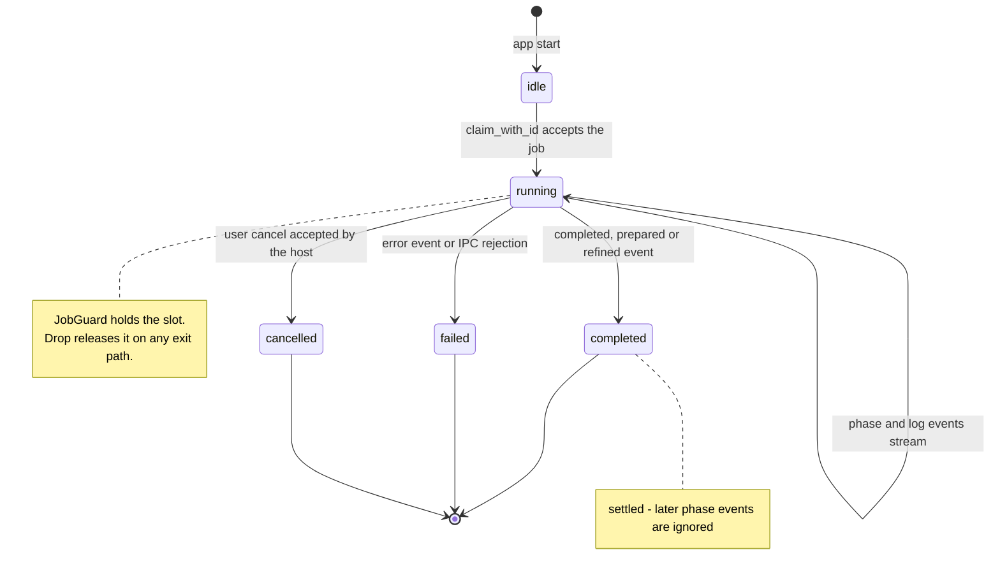
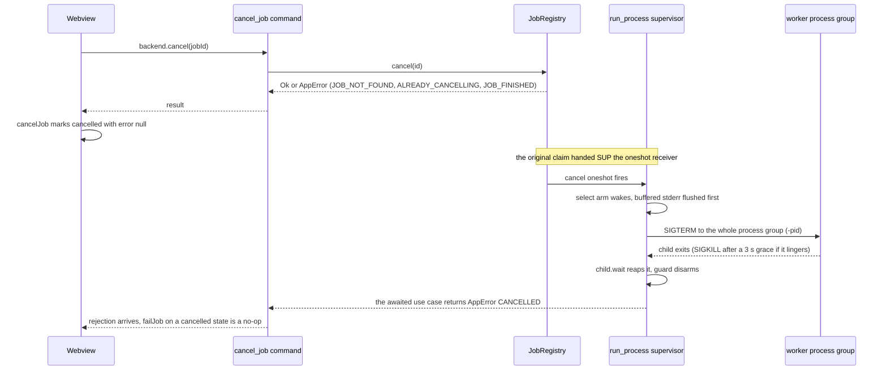
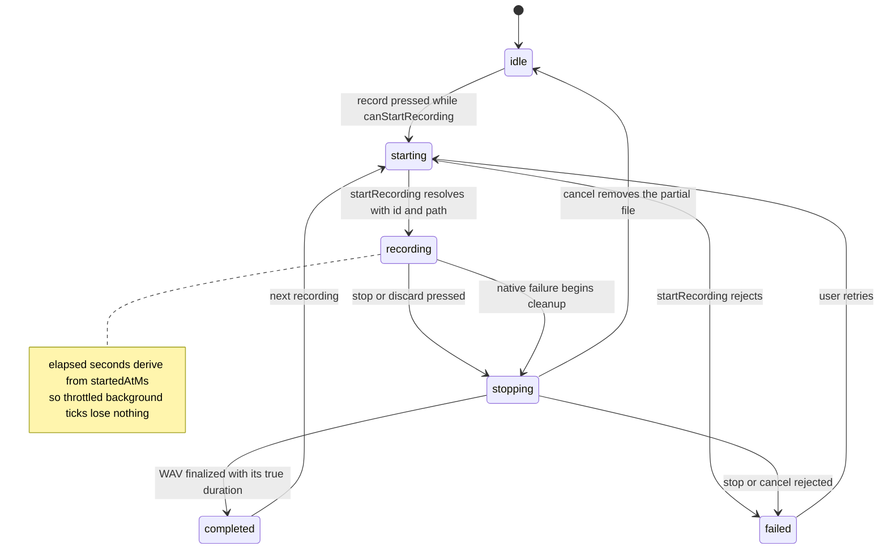

# Jobs, Cancellation & State Machines

Galpi runs at most one long job at a time. Setup, transcription, transcript
import, and refinement all pass through one registry slot on the Rust host;
microphone recording passes through a second, independent slot. Cancellation is
not a flag polled anywhere: it is a oneshot channel whose firing end the
process supervisor `tokio::select!`s on, and it ends with a graded
`SIGTERM → 3 s → SIGKILL` against the worker's whole process group. The webview
mirrors both lifecycles as small pure state machines (`job-machine.ts`,
`recording-machine.ts`) whose rules — settled states ignore late events,
percent only moves forward, logs are bounded — are what make cancellation feel
instant and progress feel honest.

This page documents the registry and its guard, the end-to-end cancellation
path, the error-code contract, and both frontend machines. The wire format the
worker uses to report progress lives in
[worker protocol](../architecture/worker-protocol.md); the prepare and
refinement run walkthroughs are in
[engine setup](../workflows/engine-setup.md) and
[AI minutes](../workflows/ai-minutes.md).

## One job at a time: the JobRegistry

`JobRegistry` (`src-tauri/src/application/jobs.rs`) is the host's only form of
job scheduling. It holds exactly two pieces of state:

- `active: Mutex<Option<ActiveJob>>` — the single slot, holding the job's id
  and the `oneshot::Sender` used to cancel it.
- `artifacts: Mutex<HashMap<Uuid, Artifacts>>` — the conceptual repository of
  finished work, keyed by job id.

Every long-running `Application` method claims the slot through
`claim_with_id(id)`:

- A second concurrent job is refused with `BUSY`.
- A reused id is refused with `JOB_ID_CONFLICT` — but only when that id already
  has **registered artifacts**. The window mints a fresh `crypto.randomUUID()`
  per attempt, so a conflicting id means a stale caller, not a retry.
- Success returns `(JobGuard, oneshot::Receiver<()>)`: the slot lease and the
  cancellation receiver that travels down into the adapters.

Which commands claim, and what they do first:

| Use case | Order of operations |
|---|---|
| `prepare` | fill missing Hugging Face token from settings, load preset, **claim**, run engine/model setup |
| `transcribe` | validate speaker hint (`INVALID_SPEAKER_HINT`), **claim**, then readiness gate (`SETUP_REQUIRED`), then run |
| `import_transcript` | **claim** (cancel receiver deliberately unused — imports are a file copy), copy, register artifacts |
| `refine_transcript` | look up target artifacts, load assistant settings and API key (`ASSISTANT_KEY_MISSING`), **claim** with the *new* job id, run, register minutes under the *target* id |

The ordering is deliberate: validations that can fail cheaply run before the
claim, so a bad speaker hint or a missing API key never occupies the slot even
for a moment.

### JobGuard: the slot survives early exits

The guard is what makes the single slot safe to hand out. Its `Drop`
implementation calls `finish(id)`, which clears the slot only if the id still
matches. Because the guard is a plain value inside the async use case, the slot
is released on *every* exit path — the happy return, an early `?`, a future
dropped by cancellation, or an unwinding panic. Without this, the first failure
would leave the registry believing a job is running and every later request
would be refused as `BUSY`. Callers never release the slot manually and never
bypass the guard; the inline test `dropping_the_guard_frees_the_slot_without_an_explicit_finish`
and the application test `failed_transcription_releases_active_job` pin both
directions of this guarantee.

### The artifacts map: results outlive jobs

On success, `transcribe` and `import_transcript` call `register(job_id,
artifacts)`; `refine_transcript` claims a fresh job id for its own slot but
calls `register_minutes(target, …)` to attach the produced minutes to the
*target transcription's* entry — which is why "open minutes" and "reveal
output" keep working from the original result. Lookups (`artifacts(id)`,
`register_minutes`, `open_artifact`, `reveal_output`) fail with
`ARTIFACT_NOT_FOUND` for unknown ids or missing minutes. A poisoned lock is
surfaced as `STATE_ERROR` rather than panicking the command thread.

## The job lifecycle

The frontend `job-machine` is the authoritative statement of the visible
lifecycle; host events drive every transition.

*The job lifecycle as reduced by `job-machine.ts`. `completed`, `failed`, and
`cancelled` are terminal on the frontend even though the host may still be
draining the worker's pipes.*

Two host-side details sit behind the diagram. First, the transition into
`running` happens when the window mints the job id — before the IPC call — so
the very first worker event already belongs to this job; a job that adopted
whatever id arrived first could inherit the trailing events of a job the user
just cancelled. Second, the settled states are reached through the reducer's
`completed`/`prepared`/`refined`/`error` events or through the controller's
local `cancelJob`/`failJob` calls; the host keeps running briefly afterwards
while the supervisor reaps the child, and any phase events it still emits are
dropped.

## Cancellation end to end

Cancellation crosses the application boundary synchronously and interrupts the
supervisor's `select` loop — there is no polling and no timing wait anywhere on
the path.

*The cancellation path. `JobRegistry::cancel` sends once on the oneshot stored
with the active job; `run_process` holds the receiving end and selects on it in
two places.*

The mechanics, in order:

1. **IPC.** `cancel_job` (`src-tauri/src/adapters/inbound/tauri.rs`) is a thin
   synchronous command: it forwards to `Application::cancel` →
   `JobRegistry::cancel` and returns. It does not wait for the worker to die.
2. **Send once.** `JobRegistry::cancel` matches the active id, `take()`s the
   cancel sender (so a second attempt is `ALREADY_CANCELLING`), and sends. A
   wrong id is `JOB_NOT_FOUND`; a send failure means the receiver was dropped
   because the job already finished — `JOB_FINISHED`.
3. **Select.** `run_process` (`src-tauri/src/adapters/outbound/process.rs`)
   selects on the cancel receiver inside its stdout/stderr read loop and again
   around the final `child.wait()`, so cancellation lands whether the worker is
   chatty or silent.
4. **Flush, then kill.** On firing, the supervisor first flushes any buffered
   stderr as one final log event (no log line is lost), then
   `terminate_on_cancel` sends `SIGTERM` to the **process group** — the guard
   signals `-pid`, not the bare pid, so `uv`-spawned grandchildren die too —
   waits at most 3 seconds, sends `SIGKILL` on timeout, always reaps the child
   (no zombie), disarms the guard, and returns `AppError::new("CANCELLED", …)`.
5. **Slot freed.** The use case returns the error, the `JobGuard` drops, and
   the slot is immediately claimable again.

The same receiver arms every cancellable adapter: `EnginePort::prepare`,
`TranscriptionPort::transcribe`, and `RefinementPort::refine` all take
`&mut oneshot::Receiver<()>` and pass it into `run_process`. This is why
cancellation works identically while setup installs a Python runtime, while
WhisperX transcribes, and while the assistant streams minutes.

### The backstop: ProcessGroupGuard

Children are spawned hardened by contract: `env_clear` plus an explicit
environment, null stdin, `kill_on_drop(true)`, and their own Unix process group
(`process_group(0)`). `ProcessGroupGuard` wraps the pid; while **armed**, its
`Drop` sends `SIGKILL` to the group. Normal completion and cancellation disarm
it first. If a `run_process` future is dropped mid-flight — a protocol error
aborting the run, a cancelled task, a panic — the guard fires on the way down
and the worker tree does not survive its supervisor.

### What cancellation does not cover

`import_transcript` claims the job slot but binds the cancel receiver to
`_unused_cancel`: an import is a local file copy with no child process to kill,
and the UI never shows a cancel button for it. Sending a cancel during an
import would succeed silently and change nothing. The recording path has its
own cancellation (below) because it shares nothing with the job slot.

## Cancellation is always exposed

The UX contract: while setup, transcription, or refinement runs, a cancel
button is visible and works — and progress never promises more than the last
phase event.

- Each progress card carries its own button — `#setup-cancel-button`,
  `#cancel-button`, `#augment-cancel-button` — and `AppView.setBusy` shows
  exactly the one matching the active job kind. All three bind to the same
  `data-action="cancel"`, which the controller maps to
  `backend.cancel(jobId)` followed by a local `cancelJob` transition.
- Because the job-machine treats `cancelled` as settled and ignores later
  phase events, the click settles the UI immediately; the backend rejection
  that arrives seconds later (the `CANCELLED` error as the worker dies) is
  absorbed by `failJob`'s no-op on cancelled states. The user's decision is
  never re-reported as a failure.
- Progress reports phase completion, not invented estimates. Percentages and
  messages always mirror the most recent `phase` event: setup emits fixed
  stage markers (5% Python runtime, 22% venv, 35% engine install, 45–50%
  models, 100% ready), and the worker emits its own per-phase percentages —
  refinement reports *completed chunks*, not streamed characters, precisely so
  concurrent chunk streams cannot make the bar jump backwards. No ETA is
  computed anywhere in the webview.

## Stable error codes

Both sides of the IPC speak stable ASCII codes with user-facing Korean copy in
the message (`AppError { code, message }`, camelCase on the wire). The
frontend's `errorMessage` only trusts the message when the rejected object
carries both a string `code` and a string `message`; anything else is rendered
as generic unexpected-error copy while `errorDetail` keeps the raw diagnostic
for the log disclosure.

| Code | Raised by | Meaning |
|---|---|---|
| `BUSY` | `JobRegistry::claim_with_id` | another job holds the single slot |
| `JOB_ID_CONFLICT` | `claim_with_id` | the id already has registered artifacts |
| `JOB_NOT_FOUND` | `JobRegistry::cancel` | no active job with that id |
| `ALREADY_CANCELLING` | `JobRegistry::cancel` | the cancel sender was already taken |
| `JOB_FINISHED` | `JobRegistry::cancel` | the job ended before the cancel landed |
| `CANCELLED` | `terminate_on_cancel` | the user cancelled; the child was terminated and reaped |
| `ARTIFACT_NOT_FOUND` | artifacts lookups, `register_minutes` | unknown id or no minutes yet |
| `RECORDING_BUSY` | `start_recording` (use case and recorder) | a recording already holds the recording slot |
| `RECORDING_ID_MISMATCH` | `stop_recording` / `cancel_recording` | the id is not the active recording's |
| `RECORDING_NOT_ACTIVE` | `stop_recording` / `cancel_recording` | the recording slot is empty |

(`STATE_ERROR` covers poisoned registry locks, and `SETUP_REQUIRED`,
`INVALID_SPEAKER_HINT`, and `ASSISTANT_KEY_MISSING` are the three pre-flight
gates the use cases decide themselves.)

When a job fails on its own — the child exits non-zero rather than being
cancelled — `run_process` reports `PROCESS_FAILED` with the worker's *last*
buffered stderr line as the message (falling back to the exit-status text when
stderr stayed empty), so the cause the user sees is the worker's own final
diagnostic, not a generic exit code. A pinned test asserts the tail, not the
first line, is what surfaces.

## The frontend job-machine

`src/application/job-machine.ts` is a pure reducer, `(state, event) → state`,
over `JobViewState { status, jobId, phase, percent, message, logs, error }`.
Its rules are small but load-bearing:

- **Identity.** Events whose `jobId` differs from the state's are ignored —
  the guard against a stale job's trailing events.
- **Settled states are terminal.** `phase` events are dropped once the status
  is `completed`, `failed`, or `cancelled`. This is the property that lets
  `cancelJob` work at any point: the UI settles on click and stays settled.
- **Monotonic percent.** Within one phase the percent only moves forward
  (`Math.max`); entering a new phase adopts that phase's value. A
  checkpoint-skip jumping to 100 cannot be undone by a late low number.
- **Bounded logs.** `log` messages are split on newlines — undoing the host's
  stderr batching — each line prefixed `[stream]`, and the buffer keeps only
  the last 200 lines.
- **Terminal events.** `completed`, `prepared`, and `refined` set status
  `completed` at 100%; `error` sets `failed` with the cause in the alert slot
  while the message slot keeps a stable status line — the two-slot split means
  the cause is announced exactly once, never duplicated into the polite
  status line.

The controller (`src/ui/controller.ts`) wraps the reducer: `begin` clears the
error banner, applies `beginJob`, and marks the busy kind; IPC rejections flow
through `failJob`; and `cancel` refuses politely if no job id has been minted
yet.

## Recording: a second single-slot resource

Recording does **not** claim the job slot — the host happily runs a capture
and a transcription at the same time — but it has the same single-slot
discipline.

On the host, `Application` guards `active_recording: tokio::sync::Mutex<Option<Uuid>>`.
`start_recording` mints a `Uuid::now_v7()` and fails with `RECORDING_BUSY` if a
recording is active; `stop_recording` and `cancel_recording` verify the id —
`RECORDING_ID_MISMATCH` for a different session, `RECORDING_NOT_ACTIVE` for an
empty slot — and clear the slot regardless of the port call's outcome. The
`NativeRecorder` adapter enforces the same slot again under its own lock, so a
second start is refused even if the use-case mutex were bypassed. `stop`
finalizes the partial `.wav.part` into the meeting folder's final `.wav` and
derives `duration_seconds` from the frames actually written; `cancel` discards
the partial file (and the folder if it is left empty). A `NativeRecorder` drop
also cleans up any still-active recording, so app shutdown cannot leave a
dangling capture.

One presentational nuance sits on top: the webview itself serializes the two
resources more strictly than the host does. `AppView.refreshActions` disables
`#record-button` while any job is busy (`jobBusy`) and disables the transcribe,
refine, and file-picker controls while a recording is active — so in the UI the
buttons, not the underlying slots, are what keep actions from overlapping.

*The recording lifecycle as reduced by `recording-machine.ts` and driven by
`RecordingController`. Every stop, discard, and native failure converges on
`stopping` because all three must cancel the writer and remove the partial
file.*

### Why elapsed time is wall-clock derived

The webview throttles or suspends interval callbacks while the window sits in
the background, so counting ticks loses every skipped second for good. The
machine stores `startedAtMs` at session start and `tickRecording` recomputes
`elapsedSeconds = floor((nowMs - startedAtMs) / 1000)` — one tick landing a
minute late still shows 60 seconds, and a clock that steps backwards clamps at
the previous value. `RecordingController` subscribes to `visibilitychange` and
`focus` because those are the first moments the frozen counter can catch up,
and a tick that changed nothing but the clock updates only the time element,
leaving buttons and status text untouched.

### Recording failures

The native recorder reports failures both by return value (checked at `stop`)
and by pushing a `RecordingFailure` event to the window. `RecordingController`
handles the race where a failure is emitted while `startRecording` is still
pending by parking it in `pendingFailures` and cleaning up once start resolves.
For the active recording, `cleanupFailure` moves to `stopping`, cancels the
recording (the writer thread is stopped and the partial file removed), and only
then surfaces the failure — with the cleanup failure appended if even the
discard failed. `dispose()` cancels any active recording when the page unloads,
so closing the window stops the microphone.

## What the tests pin

- `src-tauri/src/application/jobs.rs` (inline): slot exclusivity (`BUSY`),
  drop-frees-slot without an explicit `finish`, double cancel
  (`ALREADY_CANCELLING`), cancelling an unknown id (`JOB_NOT_FOUND`).
- `src-tauri/src/application/tests.rs`: a failed transcription releases the
  slot (two consecutive runs, neither `BUSY`); cancellation reaches a blocked
  fake port via the oneshot with no timing waits and yields `CANCELLED`.
- `src-tauri/src/adapters/outbound/process/tests.rs`: cancelling a
  `/bin/sleep 30` child returns `CANCELLED` promptly with the child reaped; a
  failing child's error detail is its *last* stderr line; oversized lines are
  rejected before the buffer grows.
- `src-tauri/src/application/tests/recording.rs`: the recording lifecycle
  refuses re-entry (`RECORDING_BUSY`) and mismatched ids
  (`RECORDING_ID_MISMATCH`) and allows restart after stop and cancel.
- `src/application/job-machine.test.ts`: percent never moves backwards within a
  phase; logs are bounded at 200 with the oldest dropped; a foreign `jobId` is
  ignored; `failJob` after `cancelJob` keeps the job cancelled without an
  alert.
- `src/application/recording-machine.test.ts` and
  `src/ui/recording-controller.test.ts`: wall-clock elapsed time after dropped
  background ticks, monotonic clamp on backwards clocks, controls locked while
  cancellation is pending, and cleanup of a native failure that raced ahead of
  start.

## Related pages

- [Worker protocol](../architecture/worker-protocol.md) — the JSONL events and
  stderr batching that feed the job-machine.
- [Engine setup workflow](../workflows/engine-setup.md) — the prepare run,
  whose job slot, progress phases, and cancellation behave exactly like
  transcription's.
- [AI minutes workflow](../workflows/ai-minutes.md) — refinement, whose job
  slot and cancellation behave exactly like transcription's.
- [Recording workflow](../workflows/recording.md) — capture, writer, and the
  partial-file cleanup behind the recording machine.
- [Rust host](../architecture/rust-host.md) — the hexagonal layers around the
  registry and the inbound commands.
