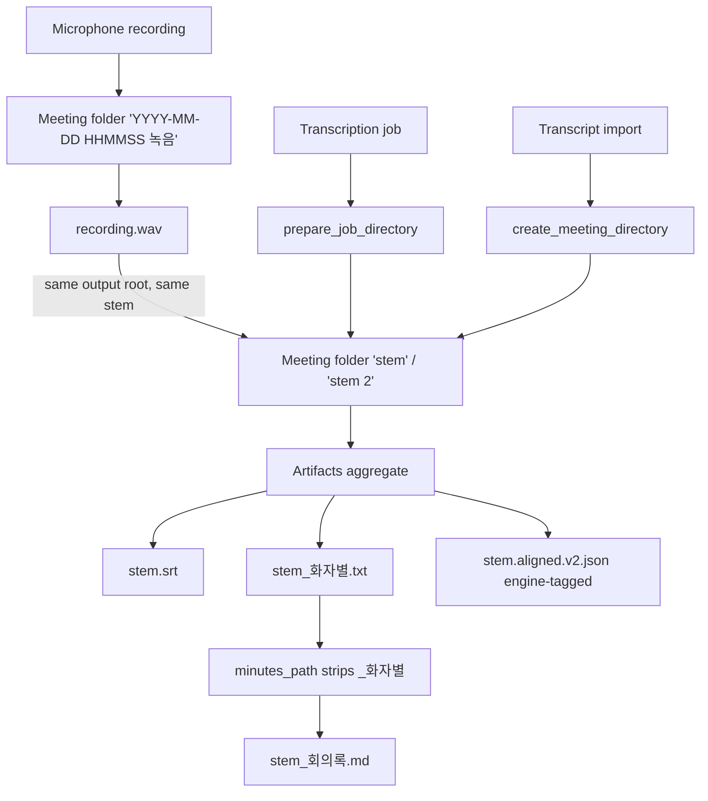
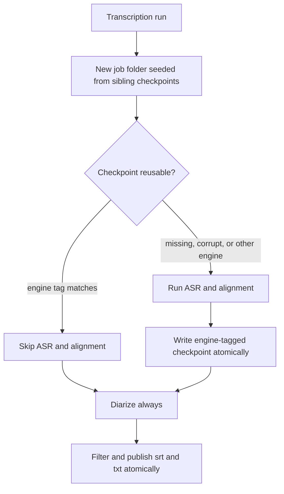
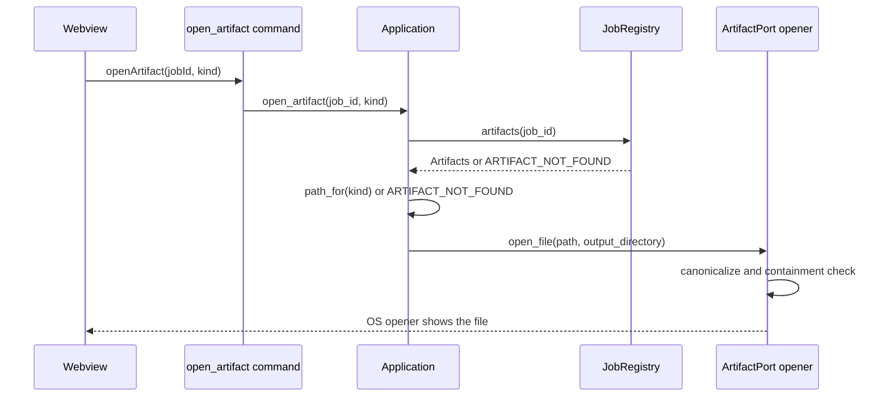

# Meetings & Artifacts

Every Galpi job owns exactly one **meeting directory** under the output root
the user picked. Recordings create a folder named after the recording,
transcriptions get one from `prepare_job_directory`, and imported transcripts
are copied into one — so refinement, reveal, and minutes naming behave
identically no matter how the meeting came into existence. The finished work is
held by the **`Artifacts` aggregate** (`src-tauri/src/domain/artifact.rs`), and
every artifact path the UI or the host touches goes through
`Artifacts::path_for(kind)`; `srt`, `speaker_text`, `checkpoint`, and `minutes`
are the only kinds.

Two rules sit above the code. First, **output names are external behavior**:
`<name>.wav`, `<name>.srt`, `<name>_화자별.txt`, `<name>.aligned.v2.json`, and
the derived `<base>_회의록.md` are what the user sees in Finder and what the
roadmap's library scans, so they must not change. Second, the `JobRegistry`
artifact map is **in-memory only** — closing the app drops every artifact
handle — so "open minutes" works within a session, and durability is a
`docs/ROADMAP.md` concern, not an accident to fix here.

This page documents the folder model, the aggregate, the naming contract,
checkpoint reuse across engines and runs, and the import path. The single-slot
registry that hands out the job ids is covered in
[jobs and cancellation](jobs-and-cancellation.md), the engine presets the
pipelines run under in
[engines and environment](engines-and-environment.md), and the run
walkthroughs in [AI minutes](../workflows/ai-minutes.md) and
[recording](../workflows/recording.md).

## Three producers, one folder rule

*All three producers converge on one meeting folder whose sanitized stem is the
shared base of every artifact name inside it.*

The common rule lives in `create_meeting_directory`
(`src-tauri/src/adapters/outbound/paths.rs`): the folder is named after the
recording's sanitized stem, and when a folder of that name already exists a
fresh one is deduplicated with ` 2`, ` 3`, … — up to 100 attempts before
`OUTPUT_PATH_ERROR`. One exception is deliberate: a Galpi recording already
sits at `{stem}/{stem}.wav` inside its own folder, so when the input's parent
*is* the target folder, that folder is adopted rather than duplicated. Every
created folder is canonicalized and must remain inside the output root
(`canonical_job_directory`), mirroring the containment discipline used for
worker-reported artifact paths.

The shared stem comes from `meeting_stem` → `sanitize_name`: alphanumeric
characters (Hangul included), `-`, `_`, and space are kept, anything else
becomes `-`, leading/trailing `-` and spaces are trimmed, and an empty result
falls back to `meeting`. This one sanitized string is the meeting folder's name
*and* the base name of every artifact inside it, which is why "reveal output"
and the artifact rows always agree with the folder.

## Recording: the folder exists from the first sample

`recording_folder_name()` (`paths.rs`) formats `YYYY-MM-DD HHMMSS 녹음`.
`NativeRecorder.start_sync` creates that folder under the output root
immediately and writes the capture into
`<folder>/<folder>.wav.part`; `stop_sync` finalizes by renaming the partial to
`<folder>/<folder>.wav` and returns the canonical final path. Cancel removes
the partial and the folder if it is left empty. The consequence is the adoption
rule above: transcribing a finished Galpi recording lands its `.srt`,
`_화자별.txt`, and checkpoint **next to the `.wav` in the folder it already
owned**, and the meeting date for the minutes comes from that `.wav`'s mtime.

## The Artifacts aggregate

`Artifacts` (`src-tauri/src/domain/artifact.rs`) is the domain's value object
and aggregate root for one meeting's outputs (`docs/ARCHITECTURE.md` §3 pins
the rule: path access only through `path_for`):

| Field | Present when | Notes |
|---|---|---|
| `txt` | always | the speaker-labeled transcript, `<name>_화자별.txt` |
| `srt` | transcriptions only | `<name>.srt` |
| `checkpoint` | transcriptions only | `<name>.aligned.v2.json`, engine-tagged |
| `minutes` | after refinement | `<base>_회의록.md`, registered post-hoc |
| `output_directory` | always | the meeting folder, canonicalized |
| `source_audio` | transcriptions only | the audio this meeting was transcribed from (typically a Galpi recording); its mtime is the meeting date |

`ArtifactKind` is the four-value enum `Srt`, `SpeakerText`, `Checkpoint`,
`Minutes` (serde snake_case on the wire — the same four values the frontend's
`ArtifactKind` type carries into the `open_artifact` command); `path_for`
returns `None` for kinds the meeting does not have, and the use case turns that
into `ARTIFACT_NOT_FOUND` rather than guessing a path. The transcript slot is
mandatory — every meeting has one, imported or transcribed — which is what
makes refinement target-able in all three flows.

The registry side (`src-tauri/src/application/jobs.rs`) is two mutexes:
the single active-job slot and `artifacts: Mutex<HashMap<Uuid, Artifacts>>`.
`transcribe` and `import_transcript` call `register(job_id, artifacts)` on
success; `refine_transcript` claims a *fresh* job id for its own slot but calls
`register_minutes(target, …)` so the produced minutes attach to the **target
transcription's** entry — which is why "open minutes" keeps working from the
original result. Because the map lives only in memory, closing the app drops
every handle; `docs/ROADMAP.md` plans a per-folder `galpi-meeting.json`
manifest as the durable source of truth, and any earlier persistence must
revisit this page and that roadmap together.

## Output naming is external behavior

These names are user-visible, fixable only by a deliberate contract change, and
both engines plus the host already agree on them:

| File | Written by | Rule |
|---|---|---|
| `<name>.wav` | `NativeRecorder.stop_sync` | partial `.wav.part` renamed on stop |
| `<name>.srt` | worker publication (`write_outputs_atomic`) | `output_dir / f"{base_name}.srt"` in both pipelines |
| `<name>_화자별.txt` | worker publication | speaker-labeled text, `[SPEAKER_N] text` lines |
| `<name>.aligned.v2.json` | worker, atomically after alignment | carries the `engine` tag |
| `<base>_회의록.md` | host derives via `minutes_path`, worker writes | sibling of the transcript |

The minutes derivation (`minutes_path`) is a pure domain function: strip a
trailing `_화자별` from the transcript stem (keeping the stem when the suffix
is absent) and append `_회의록.md`. `refine_transcript` calls it against the
target's `txt`, so an imported `notes.md` produces `notes_회의록.md` exactly
like a transcribed `meeting_화자별.txt` produces `meeting_회의록.md`.

## Checkpoint reuse: engine-tagged, seeded, and narrow

Both engines publish the same `<name>.aligned.v2.json`, so the file carries an
`engine` tag and each engine refuses to read the other's word timings:

- **WhisperX** (`worker/galpi_worker/engine.py`) accepts a checkpoint whose
  `engine` is its own tag or `None` — untagged files predate the tag and stay
  readable.
- **Qwen3** (`worker/galpi_worker/qwen3.py`) requires exactly `qwen3`
  (`QWEN3_ENGINE_TAG`); its checkpoint stores raw aligner word spans.
- A preset switch therefore **never** reads the other engine's word timings;
  the unreadable file is simply re-transcribed over.

A reusable checkpoint skips **only ASR and alignment**. Diarization, hallucination
filtering, and srt/txt publication always run afterward in both pipelines — the
checkpoint caches word timings, never speaker labels or the published files.

*The checkpoint shortens the ASR prefix of the pipeline only; diarization and
everything after it is recomputed every run.*

Reuse also works **across folders**: `prepare_job_directory` calls
`seed_checkpoint`, which scans the output root's other meeting folders for a
regular `<stem>.aligned.v2.json` (canonicalized, still inside the root), picks
the most recently modified, and copies it into the fresh job folder. So when a
second run of the same audio name gets a deduplicated `meeting 2` folder, the
alignment work from `meeting` is not lost. Imports do **not** seed a
checkpoint — nothing will run ASR on them. The host's Qwen3 path additionally
maps an empty `checkpoint` string in the worker's completion event to `None`,
keeping "no checkpoint" representable on the wire.

## Publication and containment

The worker publishes artifacts atomically: `write_json_atomic` and
`write_outputs_atomic` (`worker/galpi_worker/artifacts.py`) write sibling
`.tmp` files and `os.replace` them, and the minutes use the same
temp-then-replace discipline in `refine.py`. The host then treats every
reported path as untrusted: `validate_artifacts` /
`canonical_artifact` (`src-tauri/src/adapters/outbound/transcription.rs`) and
`canonical_minutes` (`refinement.rs`) canonicalize each path and require it to
stay inside the job directory, failing with `WORKER_PROTOCOL_ERROR` otherwise.

Opening artifacts repeats the containment check at the OS boundary.
`Application::open_artifact` looks the registry's `Artifacts` up, resolves
`path_for(kind)` (`ARTIFACT_NOT_FOUND` when absent), and `ArtifactPort`
(`desktop.rs`) re-canonicalizes the file against the meeting's output
directory before handing it to the Tauri opener (`ARTIFACT_PATH_ERROR` outside,
`OPEN_ERROR` on failure). `reveal_output` opens the meeting folder itself.

*The registry is the only source of artifact paths; the opener is the only
thing that touches them, and only after a fresh containment check.*

## The transcript-import path

`import_transcript` (`src-tauri/src/adapters/outbound/import.rs`) turns an
existing transcript file into a finished meeting without any engine:

1. Canonicalize and require a regular file (`INVALID_TRANSCRIPT` otherwise).
2. Accept only `.txt`/`.md` extensions (`INVALID_TRANSCRIPT`) — the same filter
   the transcript picker offers.
3. Cap the size at 20 MB (`TRANSCRIPT_TOO_LARGE`). Text transcripts sit far
   below this, so a larger file is a mistaken selection such as an audio file.
4. `prepare_output_root` + `meeting_stem` + `create_meeting_directory` — the
   same folder rule as transcription, including the adoption and dedup
   behavior; no checkpoint is seeded.
5. Copy the file into the folder (skipped when the input already *is*
   `<folder>/<name>`), canonicalize the copy, and require containment.
6. Return `Artifacts` with only the speaker text and output directory set —
   `srt`, `checkpoint`, `minutes`, and `source_audio` are all `None`.

The use case claims the job slot before the copy (the cancel receiver is
deliberately unused — an import is a file copy with no child process), and
registers the artifacts on success, so an import is mutually exclusive with a
transcription and can be refined, revealed, and opened immediately
(`ARTIFACT_NOT_FOUND` for the srt/checkpoint kinds it does not have). The
frontend mirrors the same shape: an imported transcript hides the srt and
checkpoint rows and enables the augment panel from the copy alone.

## source_audio and the meeting date

`source_audio` exists for one reason: it is the only artifact whose timestamp
is the day the meeting happened. A recording is written once, when the meeting
ends, so its mtime *is* the meeting date; the transcript's mtime is whenever
transcription ran, which can be days later. `refine_transcript` forwards
`source_audio` and the refinement adapter reads its mtime as `YYYY-MM-DD`
(`recorded_on`) and passes it to the worker as `--meeting-date`, where the
minutes prompt uses it as the estimated meeting date unless the transcript
states an explicit one.

An imported transcript has no audio, so the worker falls back to
`transcript_date` — the transcript file's own mtime. That is the day the
transcript was written, not the day people met; imported minutes therefore lose
meeting-date grounding, which is the accepted cost of the copy-based import
design.

## What the tests pin

- `src-tauri/src/adapters/outbound/paths/tests.rs`: folder named after the
  recording with no uuid suffix; a Galpi recording inside its own
  `… 녹음` folder is adopted, not duplicated; collisions deduplicate to
  `meeting 2`; a new job is seeded with the latest sibling checkpoint;
  `sanitize_name` keeps spaces and Hangul while replacing other punctuation.
- `src-tauri/src/adapters/outbound/import.rs` (inline): the copy lands at
  `<root>/<stem>/<name>` and non-text files are refused with
  `INVALID_TRANSCRIPT`.
- `src-tauri/src/domain/artifact.rs` (inline): `minutes_path` with and without
  the `_화자별` suffix; imported transcripts address only `SpeakerText` through
  `path_for`.
- `src-tauri/src/application/tests.rs`: a completed artifact opens from the
  registry; refinement publishes minutes openable from the transcription's job
  id; an imported transcript is refinable without transcription and has no srt
  or checkpoint (`ARTIFACT_NOT_FOUND`).
- `worker/tests/test_qwen3.py`: the Qwen3 checkpoint round-trips, carries the
  `qwen3` tag, and a `whisperx`-tagged checkpoint is never read back as Qwen3
  words.

## Related pages

- [Jobs, Cancellation & State Machines](jobs-and-cancellation.md) — the
  registry that owns the artifacts map and the slot every producer claims.
- [Engine Presets & Environment Readiness](engines-and-environment.md) — the
  two engine stacks whose presets share the checkpoint file but never each
  other's timings.
- [AI minutes workflow](../workflows/ai-minutes.md) — refinement, minutes_path,
  and meeting-date grounding.
- [Recording workflow](../workflows/recording.md) — capture, writer, and the
  partial-file lifecycle behind `<name>.wav`.
