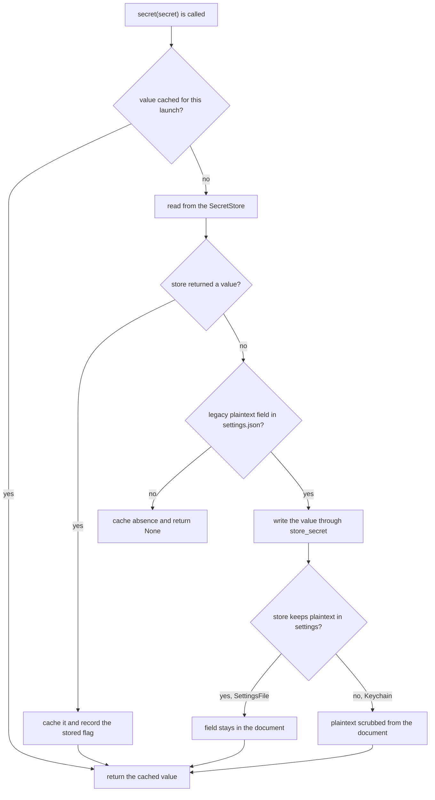
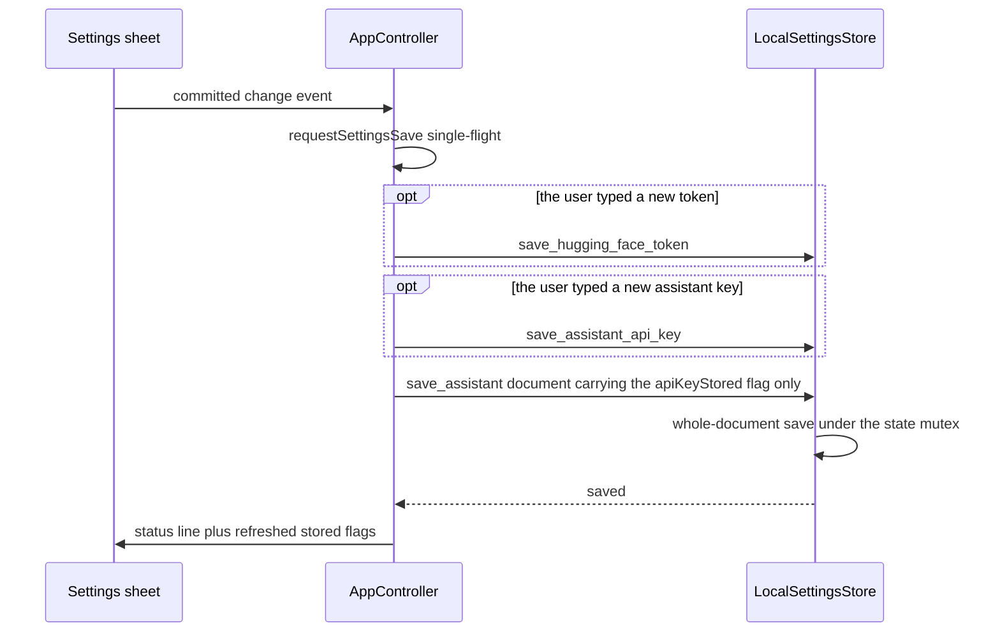

# Settings & Secret Storage

Galpi holds exactly two credentials: a Hugging Face token, required only when the
pyannote speaker-diarization model is downloaded for the first time, and the
assistant API key that AI-minutes refinement sends to the configured
OpenAI-compatible provider. Everything else the user configures — the
transcription engine preset, the assistant model/base URL/reasoning
effort/background text, the participant roster, and the glossary — is persisted
by one outbound adapter, `LocalSettingsStore`, as a single JSON document. The
design question this page documents is how that document stays consistent under
an autosave that fires on every committed edit, and how the two credentials stay
out of the settings payload while remaining available to the one feature that
needs them.

The threat model is stated plainly in the README privacy section: Galpi is
local-first. Recording, transcription, alignment, and diarization stay on the
Mac, and every setting — including both credentials — lives in an
Application Support file with `0600` permissions. Nothing leaves the machine
unless the user explicitly runs AI augmentation, at which point the transcript,
the participants selected for that meeting, the glossary, and the background
context are sent to the configured external API.

## The settings document and its file contract

`LocalSettingsStore` (`src-tauri/src/adapters/outbound/settings.rs`) owns one
file: `AppPaths::resolve(app)?.root.join("settings.json")`. The `AppPaths` root
is Tauri's `app_local_data_dir()` — Application Support on macOS — so the
document sits beside the engine and model caches, not in the user's documents.

Writes follow a fixed atomic recipe (`write_settings`):

1. Create the parent directory if needed.
2. Serialize the document and write it to `settings.json.part`.
3. Chmod the temporary file to `0600` before it can be renamed into place.
4. Atomically rename; on rename failure the temporary file is removed.

A document that contains only defaults is not written at all —
`store_settings` deletes the file instead (`is_empty()` treats the default
engine preset, absent secrets, unset assistant fields, and empty roster/glossary
as "nothing worth keeping"). A settings file's existence therefore means "the
user changed something", and a secret that lives only in a keychain-style store
may leave no settings file behind at all.

Reading is defensive in the other direction: a file that is not valid JSON
surfaces `SETTINGS_INVALID` to the caller and the corrupt file is left on disk —
the store never resets a file it could not parse, so a transient parse problem
cannot destroy the user's roster.

The document itself (`LocalSettings`) is `#[serde(default, rename_all =
"camelCase")]`, so a settings file written by an older build loads cleanly with
defaults for any field it predates. Its fields: `enginePreset`, the two secret
values (`huggingFaceToken`, `assistantApiKey`) plus their `*Stored` boolean
flags, `assistantModel`, `assistantBaseUrl`, `assistantReasoningEffort`,
`assistantBackground`, `participants`, and `glossary`.

## The port contract and the never-carry rule

The inner layer declares its needs as `SettingsPort`
(`src-tauri/src/application/ports.rs`): `hugging_face_token_stored`,
`load_hugging_face_token` / `save_hugging_face_token`, `load_assistant` /
`save_assistant`, `load_assistant_api_key` / `save_assistant_api_key`, and
`load_engine_preset` / `save_engine_preset`.

One rule shapes the whole design: **the assistant key never travels with the
assistant settings.** `AssistantSettings::api_key_stored` is a flag only — the
domain doc comment states that the sheet autosaves the whole document whenever
any field changes, so a secret carried in that payload is one absent field away
from being erased, and that reading the key is itself a keychain access that
macOS turns into a user prompt. Consequently:

- `save_assistant` writes only `assistant_model`, `assistant_base_url`,
  `assistant_reasoning_effort`, `assistant_background`, `participants`, and
  `glossary`. It cannot touch the key.
- `save_assistant_api_key` is the key's only way in or out.
- `load_assistant` composes `api_key_stored` from the secret-derived state and
  never includes the value.
- `refine_transcript` is the one place that calls `load_assistant_api_key` —
  "this is the one moment the key is actually needed, so it is the only moment
  worth asking the keychain — and the user — about it." A missing key fails with
  `ASSISTANT_KEY_MISSING` and Korean copy telling the user to save the token
  first.

The IPC surface preserves the rule. The `hugging_face_token_stored` command
returns a boolean only ("the value never leaves the host: the sheet shows a mask
either way, and reading it would put a keychain prompt on every open"), and
`save_assistant_api_key` exists as its own command precisely so the settings
autosave can never carry the key. The six settings commands are thin wrappers
over `Application`, wired in `composition.rs`, and the TypeScript
`TauriBackend` parses every response through Zod — the
`assistantSettingsSchema` carries `apiKeyStored` as a boolean, with no field a
key value could arrive in.

## Secret destinations: SettingsFile today, Keychain when signed

Both credentials flow through the `SecretStore` trait
(`src-tauri/src/adapters/outbound/secrets.rs`) — `read`, `write`, and one
informed default, `keeps_plaintext_in_settings()`: a store that holds the secret
itself wants the settings file scrubbed, while one that delegates elsewhere must
not erase the only copy.

Two implementations exist:

- **`SettingsFile` — what production wires.** Its read/write are deliberate
  no-ops; when it is the active store, the secret legitimately lives as a
  plaintext field inside the `0600` settings document, and
  `keeps_plaintext_in_settings()` returns `true` so `store_secret` keeps the
  field rather than scrubbing it.
- **`Keychain` — compiled but unwired.** The module comment explains why it is
  not active: macOS ties access to a Keychain item to the code signature that
  stored it, and Galpi's ad-hoc signature changes on every build, so each
  release would ask every user to re-authorize a token they never touched.
  Until the app ships a stable Developer ID signature, secrets stay in the
  settings file. The switch is the single line in `LocalSettingsStore::new`
  that constructs `SettingsFile` — swap it for `Keychain` and nothing else
  changes.

The `Keychain` implementation already handles the awkward edges for the day it
is wired: items are filed under service `com.m16khb.galpi` with accounts
`hugging-face-token` / `assistant-api-key`; any read failure (absent item or a
user who declined access) counts as "nothing stored" so the caller's own
missing-token message wins; and deleting an item that was never there is the
desired end state, not an error. Tests never touch the real login keychain:
`InMemorySecrets` is an in-process double that also counts reads and writes, so
suites can assert "the keychain was asked exactly once".

## The secret lifecycle inside LocalSettingsStore

`LocalSettingsStore` holds two pieces of state that do the real work:

- `cached_secrets: tokio::sync::Mutex<HashMap<Secret, Option<String>>>` — what
  each secret currently holds, once it has been read.
- `state: tokio::sync::Mutex<Option<LocalSettings>>` — the parsed document,
  cached after the first read.

### Reading a secret

`secret()` resolves a value in a fixed order: consult the launch cache; ask the
`SecretStore`; if the store has nothing, look for a legacy plaintext field in
the settings document; if such a legacy value exists, publish it through
`store_secret` (which migrates it) and return it. Because every keychain access
can prompt the user, the cache bounds the cost to **at most one prompt per
secret per launch**, no matter how many parts of the app ask.

*Resolution order of `LocalSettingsStore::secret`: cache, store, legacy
migration, with the scrub decision driven by `keeps_plaintext_in_settings`.*

The migration is what makes the future Keychain switch invisible: an install
that still carries its token in `settings.json` keeps working — the first read
moves the value into the store and, when the store is not the settings file,
scrubs the plaintext copy so the user never re-enters the token.

### Writing a secret

`store_secret` first compares against the cache and **does nothing at all** when
the value is unchanged. This matters because the settings sheet autosaves the
whole document on any edit — without the no-op, renaming a participant would
rewrite the API key and re-prompt for keychain authorization. When the value
does change, it writes through the `SecretStore`, updates the cache, then
updates the document: the plaintext field is either kept (`SettingsFile`) or
cleared (`Keychain`), and the `*Stored` flag records presence either way.

### The stored flag, and keeping the sheet off the keychain

`secret_stored()` answers "is a credential on file?" from the settings
document's flag or plaintext presence, which is what keeps merely *opening* the
settings sheet away from the keychain. The one exception — an install whose
secret was moved into a store before the flag existed — reads the store once;
`note_secret_present` then persists the flag, so the next launch answers from
the file and never reads the store again.

### Serialized whole-document saves

Every mutation goes through `update()`, which holds the `state` mutex across the
read-modify-write cycle and writes the entire document. The doc comment states
the invariant this buys: every save rewrites the whole document, so two
concurrent saves would each read the same starting state and the second would
drop the first's field — holding the lock across the cycle makes that
impossible. The cached parsed document spares a read and a parse on the
transcription path, and a failed write invalidates the cache so the next read
re-parses from disk instead of trusting a document that no longer matches.

## The frontend autosave contract

The settings sheet has no save button (DESIGN.md §5). Committed text edits
(blur or Enter), selects, and roster/glossary row edits fire
`requestSettingsSave` on `AppController`, which runs a single-flight loop:
`settingsSavePending` / `settingsSaveActive` coalesce every edit made while one
write is in progress into one latest-state write instead of racing or disabling
the sheet. On failure the sheet keeps the edited values, shows an actionable
message ending `수정 내용은 유지되며 다음 변경 때 다시 저장합니다.`, and the
next change retries.

*The autosave pipeline: each credential is sent on its own command only when
newly typed, and the settings document never contains a secret value.*

Within one save, `persistSettings` applies the pending-credential rule twice:

- `TokenSettingsView.pendingToken()` returns `null` once a token is stored (the
  host keeps the value and the field shows only a mask), so the controller
  calls `saveHuggingFaceToken` **only when the user actually typed one** — a
  roster edit never reaches the keychain, which on macOS means a prompt.
- `AssistantSettingsView.pendingKey()` follows the same pattern for the API
  key: `null` once stored, the field's trimmed value otherwise. Re-sending a
  stored key is what once erased it, because the window does not hold the
  value. A newly typed key travels on its own `saveAssistantApiKey` command,
  and the document handed to `saveAssistantSettings` derives
  `apiKeyStored` from host state or the typed key — never a key value.

The views enforce the window-blindness that makes this work. A stored
credential renders as the `••••••••••••` mask in a read-only input; the
visibility toggle exists only while the window holds a value it can show — and
`persistedToken` / `persistedKey` only ever hold one the user just typed, never
a host-returned value. Opening the sheet calls `huggingFaceTokenStored` and
`loadAssistantSettings` (the flag-carrying document) and never reads a secret.
Replacing a stored credential is therefore always two explicit actions — clear,
then type the new one — and clearing is a labeled button (`지우기`) that sends
an empty string, never an autosave side effect; `Application` trims the string
and maps empty to `None`, which the store treats as a deletion.

Both sides of the never-carry rule are pinned by tests. On the Rust side,
`an_autosave_cannot_erase_the_stored_assistant_key` saves a key, runs
`save_assistant` with a default `AssistantSettings`, and asserts the key is
intact in memory and after a simulated relaunch. On the DOM side,
`settings-autosave.dom.test.ts` asserts that editing the background field while
a key is stored produces `keyWrites == []` and a persisted document whose
`apiKeyStored` is still true, that a newly typed key is sent on its own command,
and that persistence, coalescing, and failure preservation all work without a
save button.

## Validation lives in the domain, not the adapter

`Application.save_assistant_settings` persists `settings.trimmed()`, and the
trimming rules live in `src-tauri/src/domain/roster.rs` with the value objects:

- `Participant::trimmed` drops a nameless entry (a participant without a name
  cannot label a speaker), trims every text field, and filters blank aliases.
- `GlossaryEntry::trimmed` drops a termless row (a glossary corrects terms, not
  prose) and blanks become `None` via `keep_filled`.
- `reasoning_effort` is lowercased and whitelisted to `low` / `medium` /
  `high` / `max`; anything else becomes `None`.

The adapter stores what the domain hands it; invalid shapes never reach the
file. Unit tests cover exactly these three rules: nameless participants and
blank aliases dropped, termless glossary rows dropped, and reasoning effort
normalized or rejected.

## Focused tests that pin the behavior

- `settings.rs` inline tests: a corrupted file is reported (`SETTINGS_INVALID`)
  and preserved; a token saved beside an ordinary preference reads back but the
  file on disk never carries it and the file is `0600`; an unchanged secret
  never reaches the keychain again across repeated saves; a secret is read from
  the store once per launch; a store-held secret from before the flag existed
  is found once and remembered by a fresh process; the shipping `SettingsFile`
  store keeps the value it is given and clearing removes it; a legacy plaintext
  token is migrated and scrubbed; clearing the Hugging Face token leaves
  assistant settings intact; the assistant key survives a relaunch and an
  autosave.
- `settings-autosave.dom.test.ts`: the frontend half — persistence without a
  save button, stored keys surviving unrelated edits, newly typed keys
  traveling on their own command, mid-write edits coalescing, and failed saves
  preserving the form.
- `roster.rs` unit tests: the trimming and whitelist rules above.
