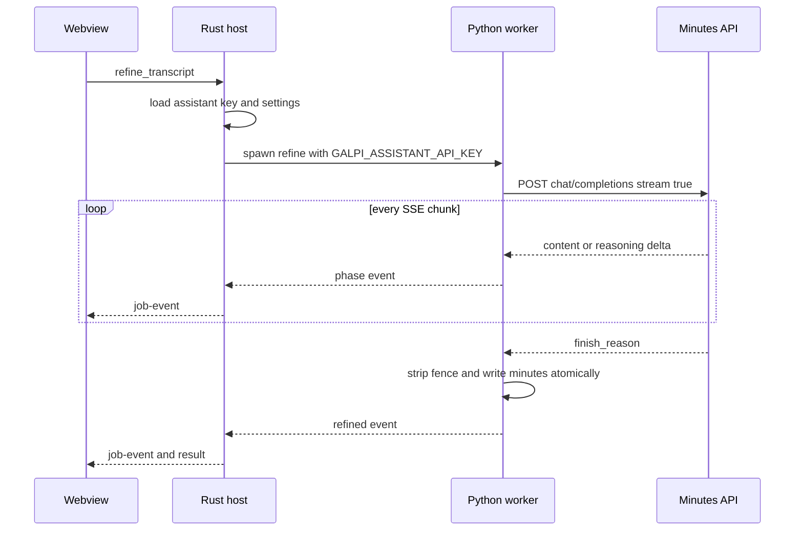
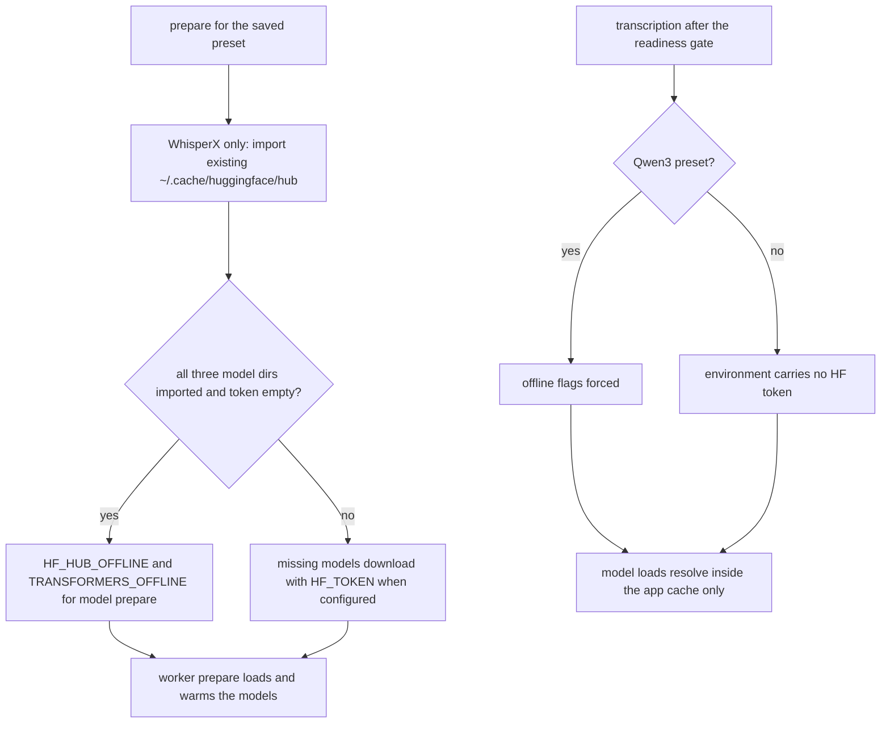

# External Services & Bundled Runtimes

Galpi is a local-first app: recording, transcription, alignment, and
diarization never leave the machine. Exactly two outside services are touched
at runtime — **Hugging Face** (model downloads, prepare-time only) and an
**OpenAI-compatible chat completions API** (minutes refinement only). Build
time adds two more: the pinned **uv** release that is staged into the bundle,
and the **PyPI** wheels uv installs into the app-private virtualenvs. This
page catalogs each touchpoint, the credential it needs, how failures surface,
and the boundaries that keep new integrations from leaking outside the
adapters.

## Inventory of outside touchpoints

| Touchpoint | When | Credential | Implemented in |
|---|---|---|---|
| Hugging Face model hub | first prepare per preset; cache import | optional fine-grained read token (`hf_…`) | `worker/galpi_worker/preparation.py`, `setup.rs`, `model_cache.rs` |
| OpenAI-compatible chat completions | AI minutes refinement only | assistant API key | `worker/galpi_worker/assistant_stream.py`, `refinement.rs` |
| astral-sh/uv GitHub release | every dev/build staging | none (checksum-pinned) | `scripts/stage-sidecars.ts` |
| PyPI wheels | engine install (`uv pip install`) | none (lock-pinned) | `setup.rs` via bundled uv |

The webview itself reaches none of these — see
[Network isolation](#network-isolation) below.

## Bundled runtimes

### uv: the checksum-pinned sidecar

`scripts/stage-sidecars.ts` runs before every dev and build (wired as
`beforeDevCommand` / `beforeBuildCommand` in `tauri.conf.json`) and stages the
`uv` binary for `aarch64-apple-darwin`:

- It downloads `uv` **0.12.5** from the astral-sh GitHub release URL with
  `curl -fsSL`, verifies the archive's SHA-256 against a pinned constant,
  extracts, and writes the binary to `src-tauri/binaries/uv-aarch64-apple-darwin`
  with mode `0755`.
- Staging is **idempotent**: if a previously staged binary exists and its
  SHA-256 still matches the pinned binary checksum, the download is skipped
  entirely; a mismatch deletes and re-fetches.
- The archive and the binary each have their own pinned checksum, so a
  compromised or corrupted download fails the staging step instead of
  shipping.

At runtime `uv_binary()` (`paths.rs`) resolves the sidecar: from
`src-tauri/binaries/` in debug builds, and from beside the executable in
release builds — the `externalBin: ["binaries/uv"]` entry in
`tauri.conf.json` is what places it there.

The same script stages the worker source: it wipes
`src-tauri/resources/worker` and copies `galpi_worker` (excluding
`__pycache__`/`.pyc`) plus the four requirements/lock files. The lock files
are what the installer actually reads; the loose requirements files travel so
the pins stay readable next to their source.

### App-private Python 3.12 virtualenvs

Neither system Python nor a global site-packages is ever consulted. `prepare`
builds each preset's interpreter with uv:

1. `uv python install 3.12` — the interpreter lands in
   `UV_PYTHON_INSTALL_DIR` (`python/` inside the app data root).
2. `uv venv --clear --python 3.12` — a failed first attempt leaves a partial
   venv behind, and `--clear` keeps retries idempotent.
3. `uv pip install -r <lock>` — WhisperX installs from `requirements.lock`
   **with `--require-hashes`** (that lock is generated with
   `--generate-hashes`); Qwen3 installs from `requirements-qwen3.lock`.

`UV_PYTHON_PREFERENCE=only-managed` is set in the worker environment, so a
system 3.12 that happens to be on `PATH` is never a candidate — only
interpreters uv installed itself are known quantities. The WhisperX venv
(`engine/.venv`) and the Qwen3 venv (`engine/qwen3/.venv`) are deliberately
separate so the two presets never share dependency versions; the resulting
install is validated by readiness markers, not by process exit codes (see
[Engine Presets & Environment Readiness](../concepts/engines-and-environment.md)).

The pins that drive all of this live in `worker/requirements.txt` and
`worker/requirements-qwen3.txt`, with resolved `.lock` files regenerated via
`uv pip compile`. `src-tauri/build.rs` fingerprints both requirements files
with FNV-1a at compile time; the hash is baked into each preset's readiness
marker (`ready-3.8.6`, `ready-qwen3-2`), so **editing a pin invalidates every
existing virtualenv on its own** and the next prepare reinstalls it.

Note that refinement (the only stage that talks to the minutes API) always
runs under the WhisperX venv interpreter (`paths.python`) because it needs
nothing beyond the standard library — the assistant client is stdlib
`urllib`.

### ffmpeg: linked per engine bin dir

ffmpeg is not a separate sidecar download. Both requirement sets pin
`imageio-ffmpeg`, and `prepare` links its binary into the preset's engine bin
dir (`link_ffmpeg` in `preparation.py`): a symlink to
`imageio_ffmpeg.get_ffmpeg_exe()`, falling back to a copy with `chmod 0o755`
when symlinking fails. This link is exactly what the `ffmpeg_ready` readiness
check inspects, and `process_environment` prepends the engine bin dir to
`PATH` so every ffmpeg invocation the worker makes — audio decode and
`silencedetect` alike — resolves to the bundled binary.

## Hugging Face

### Model roster, gating, and readiness

Two presets, one shared diarizer:

| Preset | Models (Hugging Face repo ids) |
|---|---|
| Qwen3 (default) | `Qwen/Qwen3-ASR-1.7B`, `Qwen/Qwen3-ForcedAligner-0.6B`, `pyannote/speaker-diarization-community-1` |
| WhisperX (legacy) | `mobiuslabsgmbh/faster-whisper-large-v3-turbo`, `kresnik/wav2vec2-large-xlsr-korean`, `pyannote/speaker-diarization-community-1` |

`pyannote/speaker-diarization-community-1` is a **gated** repository: the
user must accept its terms and needs a token for the first download only. The
settings sheet's token guide spells out the recipe — a **Fine-grained**,
read-only token whose read permission covers only that repository, whose
value starts with `hf_` — and notes that once access was approved, or the
model is already on the Mac, the token can be left empty. The "model access"
button opens the model page in the system browser (`openUrl`), the only
outbound action the webview performs itself.

Readiness is file-based, not history-based: `models_ready` for each preset
requires its manifest (`models/ready.json` / `models/qwen3-ready.json`,
`protocol == 1` plus the engine version string) **and** the presence of the
expected hub directories inside the app cache. Directory names are derived
mechanically from repo ids (`Org/Name` → `models--Org--Name` via
`cache_dir_name`), which is why a setup test pins the `Qwen/…` repo-id shape.

### Download mechanics

**Qwen3** (`prepare_qwen3_models`) downloads explicitly through
`huggingface_hub.snapshot_download`:

- The ASR and aligner snapshots download **concurrently** with two workers —
  sequential multi-gigabyte fetches would leave the link idle between files.
- A `DownloadReporter` — a `tqdm` subclass factory — sums every per-file bar
  into one honest GB figure and throttles to one `phase` event per second,
  mapped onto the 10–40% progress band. Without it the setup bar would sit
  frozen for the entire download and the app would look stalled.
- The ASR snapshot is then converted to **8-bit MLX weights** (group size 64)
  into `cache/mlx/qwen3-asr-1.7b-8bit`. Conversion builds a `.partial`
  staging directory and moves it into place with `os.replace`, so a crash can
  never leave a half-built model the readiness gate would mistake for a
  complete one; tokenizer/config sidecars and a `quantization_config.json`
  travel with the weights so `Session(model=<dir>)` loads fully offline.
- The gated pyannote pipeline is warmed once (`Pipeline.from_pretrained` with
  the token) so the first real meeting does not pay the download cost.
- Finally `verify_qwen3_session` loads the converted weights and transcribes
  one second of silence. Preparation used to end at "files on disk", which let
  a bad conversion surface only mid-meeting; the verification moves that
  failure into the step whose job is to report it.

**WhisperX** (`prepare_whisperx_models`) downloads implicitly through the
libraries: `whisperx.load_model("large-v3-turbo", "cpu", compute_type="int8")`
fetches the faster-whisper conversion, `whisperx.load_align_model` fetches the
Korean wav2vec2 aligner, and `DiarizationPipeline` fetches pyannote. The
aligner and diarizer each get exactly one MPS→CPU retry; every model is
dropped and `gc.collect()` runs between stages before the manifest and the
`prepared` event are written.

### Cache import and offline mode

A machine that already ran these models outside Galpi should not re-download
gigabytes. Before the WhisperX model step, `import_standard_cache`
(`model_cache.rs`) copies the three known hub directories from
`~/.cache/huggingface/hub` into the app cache:

- Files are **hard-linked** with a copy fallback, so the import is cheap.
- Symlinks are recreated only when their canonical target stays inside the
  source repository; an escaping link is an error.
- The import is **best-effort**: a failure is emitted as a log event and
  treated as zero imported, and prepare continues to the normal download path.

`can_use_offline_cache(imported, token)` is true only when **all three**
directories imported and no non-blank token is configured. When true, the
model environment gains `HF_HUB_OFFLINE=1` and `TRANSFORMERS_OFFLINE=1` —
with a complete tokenless cache the network cannot improve anything, and a
token would suggest the user intends gated access.

### Credential flow: HF token reaches only the prepare environment

The token is stored via settings (see [Credential storage](#credential-storage))
and `Application::prepare` fills a missing token from settings before running
setup. In `setup.rs`, only the **model** environment carries it:
`process_environment(paths, root, token)` inserts `HF_TOKEN` when the trimmed
value is non-empty, while the install environment and — critically — every
**transcription** environment are built with `None`. The token exists solely
so the gated download can authenticate; it never rides along to inference.

### Failure surfaces

Hugging Face problems never fail silently:

- Worker-side exceptions during prepare are caught by the worker's `main()`
  catch-all and emitted as a protocol `error` event (`ENGINE_ERROR`) before
  the process exits.
- The host batches worker stderr into log events, so uv/pip/tqdm output stays
  visible without flooding the webview.
- The final verdict is recomputed from markers and manifests: anything short
  of ready fails with `SETUP_INCOMPLETE`, regardless of the worker's exit
  code. Because every stage re-runs `status()` first, re-running prepare
  **retries only what is missing** — installed venvs are kept, partial
  conversions are rebuilt, and Hugging Face's own cache resumes interrupted
  downloads.

## Minutes API: OpenAI-compatible chat completions

`assistant_stream.py` implements the refinement transport with stdlib
`urllib` — no SDK, no dependency on any provider library:

- **Endpoint**: `POST {base_url}/chat/completions` with
  `Accept: text/event-stream`. The base URL comes from
  `GALPI_ASSISTANT_BASE_URL` and defaults to
  `https://api.z.ai/api/coding/paas/v4`; any OpenAI-compatible endpoint
  works (the UI suggests OpenRouter as `https://openrouter.ai/api/v1`).
- **Model**: defaults to `glm-5.3` (the worker CLI's `--model` default and the
  frontend's `DEFAULT_ASSISTANT_MODEL` agree).
- **Timeout**: 600 seconds (`REQUEST_TIMEOUT_SECONDS`).
- **Body**: `stream: true`, `temperature: 0.2`, and `max_tokens` of **131072**
  for GLM models on the default z.ai endpoint (the budget must cover
  reasoning plus the document) versus **32768** everywhere else.
- **Reasoning effort**: `GALPI_ASSISTANT_REASONING_EFFORT` is included as
  `reasoning_effort` only when it is one of `low`, `medium`, `high`, `max`;
  other providers receive a clean OpenAI-compatible body. The host validates
  the same four values when trimming `AssistantSettings`, and the settings
  sheet defaults GLM models to `max`.

### Streaming, reasoning, and progress

`consume_assistant_stream` folds SSE `data:` lines into a document while
keeping progress monotonic:

- `reasoning_content` deltas arrive before visible text for reasoning models;
  while only reasoning has appeared, the percent holds at the band start and
  the message reports the live reasoning length.
- Visible `content` deltas map accumulated characters onto a progress band
  (35–88% for a single-pass refine), throttled to one event per 4096
  characters or 1.5 seconds. Long meetings route through map/reduce instead
  (chunks of at most 16,000 characters, three concurrent map workers), where
  progress counts completed chunks — a character count would jump backwards
  as concurrent streams overtook each other.
- The `[DONE]` sentinel and non-content lines are ignored; a whole-document
  code fence is stripped from the final text.

### Failure surfaces

Every API failure reaches the UI as an error event with the provider's own
message preserved:

- An **error payload inside the stream** raises immediately:
  `RuntimeError("assistant stream failed: {provider error as JSON}")`.
- An **HTTP error** raises `RuntimeError` with the status code and the first
  500 characters of the response body, e.g.
  `assistant request failed (401): …`.
- A **connection-level failure** (`URLError`) raises with the underlying
  reason.
- An **empty document** raises with an actionable message naming the
  `finish_reason`: `length` (output cap exhausted with no body produced) and
  `content_filter` get dedicated operator-facing text.

These RuntimeErrors propagate through the worker's `main()` catch-all, which
emits one `ENGINE_ERROR` protocol event before exiting — the host re-emits it
as a job error event and the frontend renders it in the augment panel, so a
rejected key or a provider outage shows the provider's actual complaint.

### The key is read only at refine time

`assistant_environment` extends the worker's base environment with
`GALPI_ASSISTANT_API_KEY` (always) plus the optional base URL and effort
overrides — the credential travels by environment, never by argument vector.
The application layer deliberately keeps the key out of ordinary settings
reads: `load_assistant` returns `api_key: None` with only the boolean
`api_key_stored`, and `refine_transcript` calls `load_assistant_api_key` at
the one moment the key is actually needed, failing with `ASSISTANT_KEY_MISSING`
when it was never saved. If the worker is somehow launched without the
variable, `refine` still refuses with `InvalidInput` (protocol `INVALID_INPUT`,
exit 2).

Refinement context that is not secret but is sensitive — background text, the
selected participant roster, the glossary — is handed to the worker through
**0600 temporary files** created with `create_new` (so an existing file is
never written through) and deleted after the run, never through the argument
vector where it would be world-visible in a process listing.

## Credential storage

Galpi holds exactly two credentials: the Hugging Face token and the assistant
API key. Both flow through the `SecretStore` trait (`secrets.rs`):

- **`SettingsFile` is what production wires today.** Secrets live as fields in
  `settings.json` inside the app data root. The file is written atomically —
  a `.json.part` temporary is chmod'ed **0600** before the rename — so the
  plaintext is private to the user account, but it is weaker than a keychain
  and travels into backups.
- **`Keychain` is compiled but not wired.** macOS ties Keychain item access to
  the code signature that created the item, and Galpi ships ad-hoc signed
  (`signingIdentity: "-"`), so every build would invalidate every user's
  stored secret and re-prompt. Once a stable Developer ID signature exists,
  switching is the one line in `LocalSettingsStore::new` that swaps
  `SettingsFile` for `Keychain` (service `com.m16khb.galpi`, accounts
  `hugging-face-token` / `assistant-api-key`). The Keychain implementation
  already handles the awkward edges: any read failure counts as "nothing
  stored", and deleting an absent item is success.

Whatever the backing store, three invariants hold:

1. **Secret reads are cached per launch** — each real keychain access can
   prompt the user, and the settings sheet autosaves on every keystroke, so
   the cache bounds it to one prompt per secret per launch.
2. **Unchanged values are never rewritten** — the sheet resubmits the whole
   document, and a no-op write would re-prompt for authorization.
3. **Legacy plaintext is migrated on first read** — when a store that holds
   the secret itself is active, reading a value still sitting in the settings
   file moves it into the store and scrubs the file copy. (With today's
   `SettingsFile` store the value legitimately stays in the file, so the
   migration is a no-op until the Keychain switch flips.)

## Network isolation

The CSP in `tauri.conf.json` confines the webview to itself:

```text
default-src 'self'; img-src 'self' asset: data:; style-src 'self' 'unsafe-inline';
connect-src ipc: http://ipc.localhost; object-src 'none'; base-uri 'self';
form-action 'none'; frame-src 'none'
```

`connect-src` allows only the IPC bridge — the webview cannot open sockets to
`api.z.ai`, `huggingface.co`, or anywhere else. Every network call happens in
a spawned worker process inside an outbound adapter:

- Model downloads and inference loads run in the Python worker, whose entire
  environment the host constructs (`process_environment`); Qwen3 transcription
  additionally forces both offline flags because transcription only runs
  after the readiness gate — no network round trip can occur mid-meeting.
- Assistant calls run in the same worker under `assistant_environment`.
- Recording (CPAL) and the rest of the host never touch the network.

The extension rule follows directly: **new integrations live inside outbound
adapters, behind a port, with their credentials passed through the environment
or the `SecretStore`** — never from the webview, and never from domain or
application code.



The refinement request path: the key travels host → worker by environment, the transcript context by 0600 files, and only `phase`/`refined`/`error` protocol events travel back.



When Galpi talks to Hugging Face, and when it deliberately refuses to.

## Focused tests

- `src-tauri/src/adapters/outbound/model_cache.rs` — import uses hard links
  and preserves only safe symlinks; offline mode requires the complete,
  tokenless cache.
- `src-tauri/src/adapters/outbound/setup.rs` (tests) — Qwen3 model ids keep
  the Hugging Face repo-id shape that `cache_dir_name` relies on.
- `worker/tests/refine_stream_cases.py` — SSE parsing, error payloads raising
  with the provider message, the GLM budget applying only on the default
  endpoint, `reasoning_effort` included only when chosen, reasoning-only
  progress reporting, and finish-reason-specific empty-document errors.
- `src-tauri/src/application/tests.rs` — refinement sends the saved trimmed
  key/model/base URL/effort and only the selected attendees.
- `src-tauri/src/adapters/outbound/settings.rs` (tests) — assistant settings
  survive clearing the Hugging Face token; secrets round-trip through the
  `SecretStore`.
- `src/ui/app-view.dom.test.ts` — a refinement failure (e.g.
  `assistant request failed (401)`) surfaces in the augment panel and
  survives the busy reset.
- `src/ui/token-guide.dom.test.ts` — the HF token guide popover's open/close
  and focus behavior.

## Related pages

- [Engine Presets & Environment Readiness](../concepts/engines-and-environment.md)
  — the markers, manifests, and prepare orchestration these runtimes feed.
<!-- openwiki: broken internal link [../concepts/roster-and-assistant-settings.md] file "../concepts/roster-and-assistant-settings.md" does not exist. Fix the href or restore the target, then delete this comment. -->
- [Roster & Assistant Settings](../concepts/roster-and-assistant-settings.md)
  — what travels to the minutes API besides the transcript.
- [AI Minutes Workflow](../workflows/ai-minutes.md) — the product flow around
  refinement.
- [Engine Setup Workflow](../workflows/engine-setup.md) — the user-facing
  setup walkthrough.
- [Python Worker Architecture](../architecture/python-worker.md) — the
  prepare/refine pipelines this page's services serve.
