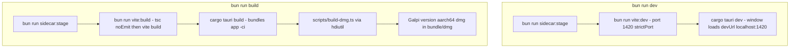
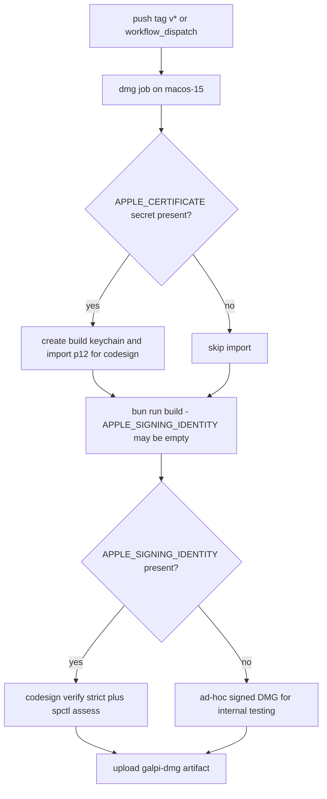

# Build, Staging & Packaging

Galpi ships as a single `.app` (and DMG) for macOS 14+ on Apple Silicon. Building
it means assembling four runtimes into one bundle: the Vite-built webview, the
Rust/Tauri host, a checksum-verified `uv` binary, and a staged copy of the
Python worker with its lock files. This page covers the command map, the sidecar
staging script, the Tauri bundle configuration, the compile-time requirements
fingerprint, DMG assembly, and the release workflow with its signing state.
The engine environments these artifacts feed at runtime are described in
[engine presets & environment readiness](../concepts/engines-and-environment.md);
the worker itself in [python worker](../architecture/python-worker.md); the local
and CI verification gates in [verification gates](../testing/verification-gates.md);
and the first-run setup that consumes the staged resources in
[engine setup](../workflows/engine-setup.md).

## The command map

`package.json` is the canonical entry point for every workflow; Bun (>= 1.3.0,
pinned via `packageManager: bun@1.3.14`) is the only supported driver:

| Command | What it runs |
|---|---|
| `bun run dev` | `cargo tauri dev` — whose `beforeDevCommand` stages sidecars, then starts `vite --port 1420 --strictPort`; the window loads `devUrl` `http://localhost:1420` |
| `bun run build` | `cargo tauri build --bundles app --ci` followed by `scripts/build-dmg.ts` (`dmg:build`) via `hdiutil` |
| `bun run sidecar:stage` | `scripts/stage-sidecars.ts` — refresh `src-tauri/binaries/` and `src-tauri/resources/worker/` |
| `bun run vite:dev` | Vite dev server on port 1420, strict port |
| `bun run vite:build` | `tsc --noEmit && vite build` — type check then emit `dist/` |
| `bun run check` | `architecture:check` (the `scripts/check-architecture.ts` fence), Biome lint, `tsc --noEmit` |
| `bun run check:rust` | `cargo fmt --check`, `cargo clippy --all-targets -- -D warnings`, `cargo test --all-targets` |
| `bun run check:worker` | `uvx ruff check worker`, `uvx ruff format --check worker`, `PYTHONPATH=. python3 -m unittest discover -s worker/tests -t .` |
| `bun run check:all` | `check` + `bun test` + `check:rust` + `check:worker` |

Both Tauri before-commands stage sidecars **first** — dev and release builds
alike never start without the pinned `uv` binary and the worker resources in
place, because the host resolves them at first use (see
[resolution at runtime](#resolution-at-runtime-debug-vs-release)).

*The two entry pipelines. Both begin with sidecar staging; only the build path
emits `dist/`, which `tauri.conf.json`'s `frontendDist` points at for the
bundled app.*

## Sidecar staging (`scripts/stage-sidecars.ts`)

The staging script has two independent jobs, run on every dev/build start.

### Pinned `uv` with SHA-256 verification

`stageUv()` guarantees `src-tauri/binaries/uv-aarch64-apple-darwin` matches
`uv` 0.12.5 for `aarch64-apple-darwin`:

- Two checksums are pinned in source: the release tarball's SHA-256 and the
  extracted binary's SHA-256.
- If the binary already exists and hashes to the pinned binary checksum,
  staging short-circuits — no network round trip.
- Otherwise the script downloads
  `https://github.com/astral-sh/uv/releases/download/0.12.5/uv-aarch64-apple-darwin.tar.gz`,
  verifies the **archive** checksum (mismatch raises `SidecarStageError` and the
  build stops), extracts it, writes the binary into `src-tauri/binaries/`, and
  `chmod`s it to `0755`.

This is the binary `tauri.conf.json` declares as `externalBin: ["binaries/uv"]`;
Tauri embeds it next to the executable in release builds.

### The staged worker copy

`stageWorker()` **wipes** `src-tauri/resources/worker/` and rebuilds it from
`worker/`:

- `worker/galpi_worker/` copied recursively, filtering out `__pycache__`
  directories and `.pyc` files.
- The four pin files travel together:
  `requirements.txt`, `requirements.lock`, `requirements-qwen3.txt`,
  `requirements-qwen3.lock`. The loose `.txt` files document the direct pins;
  the `.lock` files are what the installer actually reads (`uv pip install -r …
  --require-hashes` for WhisperX).

The staging targets are **generated output, not source**: `src-tauri/binaries/`
and `src-tauri/resources/worker/` are both gitignored. Never edit a staged copy
— worker changes go to `worker/` and are re-staged by the next dev/build run.
Editing a staged copy would be silently overwritten and never reaches a release.

## Tauri configuration (`src-tauri/tauri.conf.json`)

| Section | Decision |
|---|---|
| Identity | `productName: "Galpi"`, `version: "0.1.0"`, `identifier: "com.m16khb.galpi"` |
| Build | `beforeDevCommand` / `beforeBuildCommand` both start with `bun run sidecar:stage`; dev serves on port 1420 (`devUrl`), build runs `bun run vite:build`; `frontendDist: "../dist"` is what the bundled app loads |
| Window | Single window titled 갈피, 1240×820 (min 920×640), centered, resizable |
| CSP | Locked down: `default-src 'self'`, `img-src 'self' asset: data:`, `style-src 'self' 'unsafe-inline'`, `connect-src ipc: http://ipc.localhost`, `object-src 'none'`, `frame-src 'none'`, `form-action 'none'` |
| Bundle | `targets: ["app"]` only — Tauri's own DMG step never runs; `externalBin: ["binaries/uv"]`; `resources: ["resources/worker"]`; five icon files |
| macOS | `minimumSystemVersion: "14.0"`, `entitlements: "Entitlements.plist"`, `signingIdentity: "-"` (ad-hoc) |

Three of these decisions have direct operational consequences:

1. **`frontendDist` is a build-order constraint.** The `tauri::generate_context!`
   macro in `composition.rs` expands against the `dist/` output, so any Rust
   build or `cargo test` requires `bun run vite:build` to have run first. The CI
   Rust job encodes this ordering explicitly.
2. **`targets: ["app"]` routes DMG work to the custom script.** Tauri produces
   only `Galpi.app`; `scripts/build-dmg.ts` turns it into a DMG afterward.
3. **`signingIdentity: "-"` is the always-valid fallback.** Ad-hoc signing
   requires no certificate, so every checkout can produce a runnable `.app`;
   a real identity arrives only through the `APPLE_SIGNING_IDENTITY` env var in
   CI (see [release workflow](#release-workflow-releaseyml)).

## The requirements fingerprint (`build.rs`)

`src-tauri/build.rs` runs before every compilation and fingerprints the worker's
pin files:

- It hashes `worker/requirements.txt` and `worker/requirements-qwen3.txt` with
  FNV-1a (a deliberate choice: the question is "did this file change", not "can
  an attacker forge this") and emits the 16-hex-digit digests as compile-time
  environment variables `GALPI_WHISPERX_REQUIREMENTS_HASH` and
  `GALPI_QWEN3_REQUIREMENTS_HASH`.
- It emits `cargo::rerun-if-changed` for both files, so editing a pin forces a
  rebuild of the crate that embeds the hash.
- A missing requirements file is a broken checkout: the build stops with
  `cargo::error` rather than compiling in a fingerprint of nothing.
- Only then does it call `tauri_build::build()` for the normal Tauri codegen.

`environment.rs` consumes the variables at compile time and composes readiness
markers: `whisperx_marker()` is `3.8.6` plus the WhisperX hash, `qwen3_marker()`
is `2` plus the Qwen3 hash. `setup.rs` writes the matching marker file after a
successful venv install (`engine/ready-3.8.6` or
`engine/qwen3/ready-qwen3-<version>`), and `status()` counts an engine ready
only when the on-disk marker string equals the compiled one.

The consequence is the mechanism's whole point: **editing a pinned dependency
invalidates every installed virtualenv on its own.** The next build compiles a
new hash, the marker comparison fails, `diagnose` reports the engine not ready,
and the next `prepare` reinstalls the venv and rewrites the marker — no version
constant bump and no human memory required. The readiness side of this loop is
detailed in [engine presets & environment readiness](../concepts/engines-and-environment.md).

## DMG assembly (`scripts/build-dmg.ts`)

The DMG script runs only after `cargo tauri build --bundles app --ci` has
produced `src-tauri/target/release/bundle/macos/Galpi.app` (verified by the
presence of `Contents/Info.plist`; absence raises `DmgBuildError`).

- **The artifact name follows the version in `tauri.conf.json`** — the same
  file the bundler reads — producing `Galpi_<version>_aarch64.dmg`. A missing
  or empty `version` fails the build, so a release can never ship an artifact
  named after the previous version.
- It first cleans stale output: the whole `bundle/dmg` directory, the
  `bundle/share` directory, and any `rw.*.dmg` mount droppings left in
  `bundle/macos` by interrupted `hdiutil` runs.
- It stages a fresh temp directory containing a copy of `Galpi.app` and an
  `/Applications` symlink (the drag-to-install affordance), then runs
  `hdiutil create -volname Galpi -srcfolder <staging> -ov -format ULMO <dmg>`.
  `ULMO` is the LZMA-compressed UDIF format, the smallest practical
  distribution image.
- Subprocess failures (any non-zero exit) raise `DmgBuildError`; the staging
  temp directory is removed in a `finally` block either way.

Bumping the release version therefore means editing `version` in
`src-tauri/tauri.conf.json` (and keeping the `v`-tag in step); the DMG filename,
the bundle's `CFBundleShortVersionString`, and the release artifact all follow.

## Release workflow (`release.yml`)

The Release workflow triggers on pushing a `v*` tag or on manual
`workflow_dispatch`. Its single `dmg` job runs on `macos-15` (Apple Silicon —
the only platform the app targets) with `contents: write`.

*The signing branch of the release job. Both branches produce a DMG; only the
identity-present branch is expected to pass Gatekeeper for external recipients.*

Steps, in order:

1. **Setup.** Checkout, Bun (version taken from `package.json` via
   `bun-version-file`), Rust cache scoped to `src-tauri`, and
   `bun install --frozen-lockfile`.
2. **Optional certificate import.** Runs only when the `APPLE_CERTIFICATE`
   secret is non-empty: it creates a dedicated `build.keychain`, decodes and
   imports the base64 p12, and sets the key partition list so `codesign` can
   use it non-interactively. Without the secret the step is skipped.
3. **Build the DMG** (`bun run build`). The signing/notarization secrets are
   exported as env vars — `APPLE_SIGNING_IDENTITY`, `APPLE_ID`,
   `APPLE_PASSWORD`, `APPLE_TEAM_ID` — and are **empty when absent**, which
   leaves Tauri on its configured ad-hoc identity. With secrets present, Tauri
   signs with the identity and submits for notarization (stapling the ticket);
   the entitlements from `Entitlements.plist` are applied to the hardened
   runtime.
4. **Gatekeeper verification.** Runs only when `APPLE_SIGNING_IDENTITY` is
   non-empty: `codesign --verify --deep --strict --verbose=2` on
   `src-tauri/target/release/bundle/macos/Galpi.app`, then
   `spctl --assess --type execute` — the check a recipient's Mac actually
   performs on a notarized, stapled build. A failure fails the release.
5. **Upload artifact.** `galpi-dmg` collects
   `src-tauri/target/release/bundle/dmg/*.dmg` with `if-no-files-found: error`,
   so a build that silently failed to produce a DMG cannot pass unnoticed.

Two operational notes: the release job itself runs **no test gates** — quality
checks live in the CI workflow, so a release tag is expected to point at a
commit CI has already verified. And because the signing secrets are optional by
design, the common state today is the ad-hoc branch: the DMG installs and runs
for internal testing, but recipients outside the build machine will need to
bypass Gatekeeper manually. `Entitlements.plist`'s Hardened Runtime exemptions
are documented in-source as not yet exercised by any signed build.

## Resolution at runtime: debug vs release

The host resolves both sidecars differently by build profile
(`paths.rs`), which is why staging must precede every build:

| Symbol | Debug build | Release build |
|---|---|---|
| `uv_binary()` | `src-tauri/binaries/uv-aarch64-apple-darwin` (via `CARGO_MANIFEST_DIR`) | `uv` beside the current executable — where Tauri places the `externalBin` |
| `worker_root()` | the repo checkout `../worker` | `<resource_dir>/resources/worker` — the staged copy |

Debug builds therefore always exercise the live worker source, and release
builds exercise exactly what `stage-sidecars.ts` staged.

## Toolchain and platform constraints

- **ARM64-only, deliberately.** Every build script hardcodes
  `aarch64-apple-darwin`: the staged `uv`, the DMG suffix (`_aarch64.dmg`), and
  the Rust target. `rust-toolchain.toml` tracks `stable` (with `clippy` and
  `rustfmt` components) and guarantees only the target every gate needs; the
  enforced MSRV is `rust-version = "1.88"` in `src-tauri/Cargo.toml` (needed
  for let-chains).
- **All CI and release jobs run on `macos-15`.** The app ships only for arm64
  macOS 14+, so the gates run on the platform they describe; Vite builds with
  `target: "safari17"` because the window ships inside the WKWebView that
  macOS 14+ provides — there is no older engine to down-level for.
- **Release profile.** `lto = "fat"`, `codegen-units = 1`, `opt-level = 3`,
  `strip = true`. `panic` stays at the default unwind on purpose: aborting
  would turn a panic in the audio writer thread into a lost recording instead
  of a failed one.
- **Generated trees are not source.** `dist/`, `src-tauri/target/`,
  `src-tauri/gen/`, `src-tauri/binaries/`, and `src-tauri/resources/worker/`
  are gitignored; only `worker/`, `tauri.conf.json`, `build.rs`, and the
  scripts are edited by hand.

## Bundle metadata

- `src-tauri/Entitlements.plist` grants microphone access
  (`com.apple.security.device.audio-input`) plus three Hardened Runtime
  exemptions required once a build is notarized:
  `disable-library-validation` (the app loads PyTorch/MLX libraries from its
  self-installed Python environment, not signed by us), `allow-jit` and
  `allow-unsigned-executable-memory` (the Metal backend compiles shaders into
  executable memory). Without them the engine cannot load in a notarized build.
- `src-tauri/Info.plist` carries the microphone usage description string macOS
  shows at first recording.
- `src-tauri/capabilities/default.json` scopes the window's Tauri permissions:
  event listen/unlisten, the dialog open permission, and the opener plugin
  restricted to `https://huggingface.co/*` URLs.

## Failure semantics summary

| Failure | Where | Effect |
|---|---|---|
| `uv` archive checksum mismatch | `stage-sidecars.ts` | `SidecarStageError`, build stops before compilation |
| Missing requirements file | `build.rs` | `cargo::error`, compile fails |
| Missing `Galpi.app` or version | `build-dmg.ts` | `DmgBuildError`, DMG not built |
| Non-zero `hdiutil` exit | `build-dmg.ts` | `DmgBuildError`, staging temp cleaned in `finally` |
| Gatekeeper check fails (identity present) | `release.yml` | Release job fails before upload |
| No DMG found at upload | `release.yml` | `if-no-files-found: error` fails the job |
