# Quickstart: Build, Run, and Navigate

## What Galpi is

Galpi is a local-first desktop app for **Apple Silicon Macs (macOS 14+)** that records
Korean meetings, transcribes them with speaker diarization entirely on-device, and can
optionally produce AI meeting minutes through an OpenAI-compatible API. One codebase
spans three runtimes:

- a **TypeScript webview frontend** (`src/`) — framework-light DOM UI, pure state
  machines, and a Zod-validated Tauri IPC adapter,
- a **Rust Tauri host** (`src-tauri/`) — the application core, ports, and outbound
  adapters for recording, filesystem, settings, and worker supervision,
- a **bundled Python worker** (`worker/`) — the `galpi_worker` sidecar running the
  `Qwen3` transcription preset (default) or the legacy `WhisperX` preset over a
  versioned JSONL protocol.

The frontend talks to the host over Tauri IPC; the host talks to the worker over
stdout JSONL. No engine download, Python install, or ffmpeg is required ahead of
time — the app stages and owns its own tooling.

## Prerequisites

| Requirement | Detail |
|---|---|
| macOS 14+ on Apple Silicon | The only supported target. `tauri.conf.json` sets `minimumSystemVersion: "14.0"`, and the build scripts hardcode `aarch64-apple-darwin`. |
| Rust 1.88+ | The MSRV is enforced as `rust-version = "1.88"` in `src-tauri/Cargo.toml` (let-chains). `rust-toolchain.toml` tracks stable with `clippy` and `rustfmt` components plus the `aarch64-apple-darwin` target. |
| Bun 1.3+ | `package.json` declares `engines: { bun: ">=1.3.0" }` and pins `packageManager: bun@1.3.14`. Bun is the only supported driver for every script below. |
| Tauri CLI 2.11.4 | `bun run dev` and `bun run build` invoke `cargo tauri`; install it with `cargo install tauri-cli --version 2.11.4 --locked`. |
| `uv` / `uvx` on PATH | Needed **only for the Python verification gates** (`bun run check:worker`), e.g. `brew install uv`. The app itself never needs a system Python, ffmpeg, or WhisperX — dev/build staging installs the app-owned Python 3.12 environment through a checksum-pinned `uv` binary it downloads itself. |

## Run it in dev

```bash
bun install
bun run dev
```

`bun run dev` runs `cargo tauri dev`. Tauri's `beforeDevCommand` then chains
`bun run sidecar:stage && bun run vite:dev`: the sidecar script stages the pinned
arm64 `uv` binary and a fresh copy of the worker, and Vite serves the frontend on
`http://localhost:1420` (strict port). Once the dev server is up, Tauri compiles the
Rust host and opens the Galpi window at that URL, where `src/main.ts` boots
`TauriBackend`, `AppView`, and `AppController` (failing fast if the `#app` root is
missing).

```mermaid
flowchart TD
    subgraph DEV["bun run dev"]
        A["cargo tauri dev"] --> B["bun run sidecar:stage"]
        B --> C["stage pinned arm64 uv into src-tauri/binaries"]
        C --> D["copy worker sources into src-tauri/resources/worker"]
        D --> E["bun run vite:dev on port 1420 strictPort"]
        E --> F["Rust host compiles and opens the Galpi window"]
    end
    subgraph PRODBUILD["bun run build"]
        G["cargo tauri build --bundles app --ci"] --> H["bun run sidecar:stage"]
        H --> I["bun run vite:build emits dist"]
        I --> J["release Rust build bundles Galpi.app"]
        J --> K["bun run dmg:build"]
        K --> L["hdiutil creates Galpi_version_aarch64.dmg"]
    end
```



*What the two top-level Bun scripts actually execute: dev stages sidecars before Vite
and the Tauri window appear; build re-stages, type-checks and bundles the frontend,
produces Galpi.app, then wraps it into a versioned DMG.*

### First engine preparation

The app launches with its engines **not yet ready**. Preparation happens in-app:
open **설정** (Settings) and press **로컬 엔진 준비** (Prepare local engine). On first
run this installs an app-specific Python 3.12 environment and downloads
multi-gigabyte models — the Qwen3 preset is roughly 6.6 GB of ASR + aligner models.
A Hugging Face **Fine-grained Read** token is required only the first time the
pyannote diarization model is downloaded. A failed prepare is always safe to retry
with the same button. See [workflows/engine-setup.md](workflows/engine-setup.md).

## Verify before you commit

`package.json` is the canonical entry point for every gate. While iterating, run the
narrowest gate that proves your change; before declaring work done, run
`bun run check:all`, which chains all four.

| Command | What it runs |
|---|---|
| `bun run check` | `architecture:check` (`scripts/check-architecture.ts` fences) → `biome lint .` → `tsc --noEmit` |
| `bun test` | Frontend unit tests and happy-dom DOM tests |
| `bun run check:rust` | `cargo fmt --manifest-path src-tauri/Cargo.toml --check` → `cargo clippy --all-targets -- -D warnings` → `cargo test --all-targets` |
| `bun run check:worker` | `uvx ruff check worker` → `uvx ruff format --check worker` → `PYTHONPATH=. python3 -m unittest discover -s worker/tests -t .` |
| `bun run check:all` | `check` → `bun test` → `check:rust` → `check:worker` |

Note that `bun run check` covers **only** the architecture fences, Biome, and
TypeScript — Rust and Python stay green via their own gates. The Rust suite runs
against a `FakePort` implementation of the ports, so `cargo test` needs no Tauri
runtime, and the worker's unit tests import no ML stack. Full details, including the
basedpyright step documented in the README and the three-job CI pipeline, are in
[testing/verification-gates.md](testing/verification-gates.md).

## Build a bundle

```bash
bun run build
```

This runs `cargo tauri build --bundles app --ci && bun run dmg:build` and produces:

```text
src-tauri/target/release/bundle/macos/Galpi.app
src-tauri/target/release/bundle/dmg/Galpi_0.1.0_aarch64.dmg
```

The DMG name follows the `version` in `src-tauri/tauri.conf.json` — `build-dmg.ts`
reads it from there so a release never ships an artifact named after a previous
version. The DMG step shells out to macOS `hdiutil`, so the build only works on a
Mac. Shipped builds are ad-hoc signed (`signingIdentity: "-"`); signing and
notarization are separate and handled by the `v*` tag release workflow when its
Apple secrets are configured. Details in
[operations/build-and-packaging.md](operations/build-and-packaging.md).

## The one dependency rule

All three runtimes obey the same rule, stated verbatim in `AGENTS.md`:

> One dependency rule across all three runtimes: dependencies point inward
> (domain). Ports are owned by the consuming inner layer; adapters implement
> them. Framework code (Tauri, Zod, CPAL, tokio::process) lives only in adapters
> and composition.

This is not just convention — `bun run check` makes violations a build failure.
`scripts/check-architecture.ts` forbids `application`/`adapters`/`composition`/Tauri
imports in Rust `domain`, adapter imports in Rust `application`, cross-imports
between inbound and outbound adapters, and their TS mirror (contracts in `src/domain/`,
the Tauri implementation in `src/adapters/`, and `ui`/`application` never importing
`../adapters/` or `@tauri-apps/`). It also enforces framework locality:
`#[tauri::command]` only in `adapters/inbound/tauri.rs`, `generate_handler!` /
`.manage()` / `.plugin()` only in `composition.rs`, and `tokio::process` / `nix::`
primitives only inside the process adapter. `src-tauri/src/composition.rs::run` is
the single wiring point that constructs the adapters, hands them to `Application::new`
as ports, and registers the seventeen Tauri commands.

## Generated trees are not source

`node_modules`, `dist`, `src-tauri/target`, `src-tauri/resources/worker`, and
`src-tauri/binaries` are produced by tooling on every dev/build run — never edit
them, and never edit the staged worker copy under `src-tauri/resources/worker`.
Change the sources in `src/`, `worker/`, and `src-tauri/src/` instead and let
staging copy them.

## Where to go next

| Task | Start here |
|---|---|
| Understand the system | [architecture/system-overview.md](architecture/system-overview.md), then [architecture/frontend.md](architecture/frontend.md), [architecture/rust-host.md](architecture/rust-host.md), [architecture/python-worker.md](architecture/python-worker.md), and [architecture/worker-protocol.md](architecture/worker-protocol.md) |
| Change behavior guarded by invariants | [concepts/jobs-and-cancellation.md](concepts/jobs-and-cancellation.md), [concepts/meetings-and-artifacts.md](concepts/meetings-and-artifacts.md), [concepts/settings-and-secrets.md](concepts/settings-and-secrets.md), [concepts/engines-and-environment.md](concepts/engines-and-environment.md) |
| Trace an end-to-end flow | [workflows/transcription.md](workflows/transcription.md), [workflows/recording.md](workflows/recording.md), [workflows/engine-setup.md](workflows/engine-setup.md), [workflows/ai-minutes.md](workflows/ai-minutes.md) |
| Before you commit | [testing/verification-gates.md](testing/verification-gates.md) |
| Ship a bundle | [operations/build-and-packaging.md](operations/build-and-packaging.md) |
| External APIs and services | [integrations/external-services.md](integrations/external-services.md) |

`docs/ARCHITECTURE.md` remains the normative layering and port-ownership document —
when a boundary question arises while working on any of the pages above, resolve it
there first.
