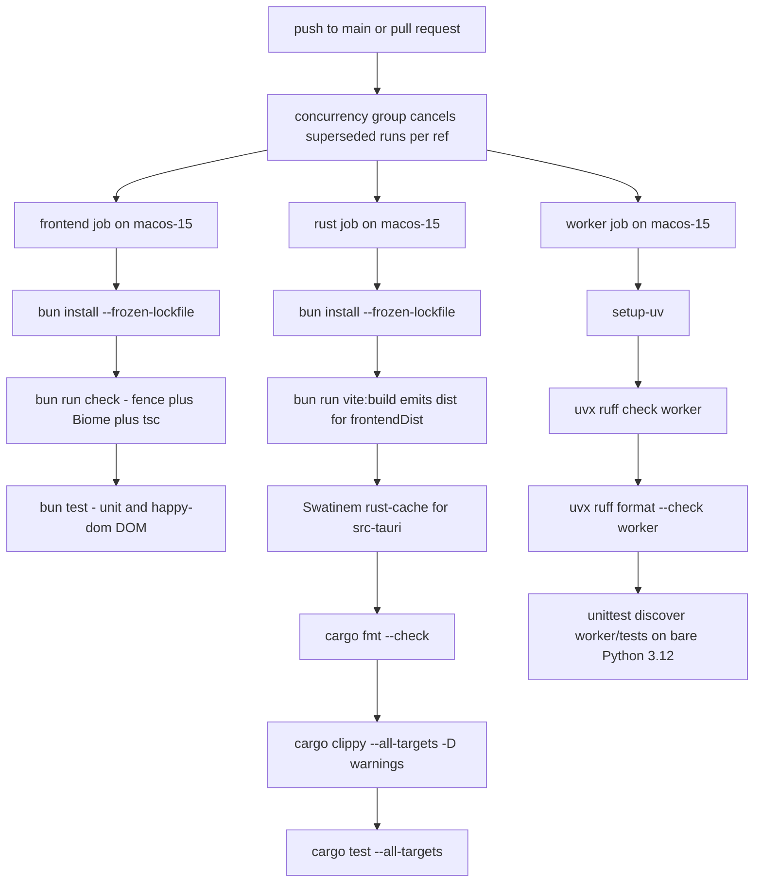

# Verification Gates & Test Architecture

Galpi spans three runtimes, so verification is organized as three independent
gate sets that share one philosophy: the narrowest quiet validation that proves
the changed behavior, with complete failure output preserved. TypeScript uses
the Bun test runner with colocated `*.test.ts` files (happy-dom for DOM
suites), Rust uses in-crate `cargo test` suites built on a `FakePort`, and the
Python worker uses stdlib `unittest` over pure modules that never import the ML
stack. On top of the unit gates sits an executable architecture fence —
`scripts/check-architecture.ts` — that makes layering violations a build
failure rather than a review comment.

## The gate commands

`package.json` is the canonical entry point for every verification workflow.
Bun (pinned via `packageManager: bun@1.3.14`, engines `>=1.3.0`) is the only
supported driver — `npm test` is not a valid gate in this repo.

| Command | What it runs |
|---|---|
| `bun run check` | `architecture:check` (the `scripts/check-architecture.ts` fence) → `biome lint .` → `tsc --noEmit` |
| `bun test` | Frontend unit tests plus happy-dom DOM tests |
| `bun run check:rust` | `cargo fmt --manifest-path src-tauri/Cargo.toml --check` → `cargo clippy --all-targets -- -D warnings` → `cargo test --all-targets` |
| `bun run check:worker` | `uvx ruff check worker` → `uvx ruff format --check worker` → `PYTHONPATH=. python3 -m unittest discover -s worker/tests -t .` |
| `bun run check:all` | `check` → `bun test` → `check:rust` → `check:worker` |
| `bun run vite:build` | `tsc --noEmit && vite build` — type check then emit `dist/` |

The practical rule: **run `bun run check:all` before declaring a change done** —
it chains all four gates. While iterating, each runtime's gate is independent,
so pick the narrowest command that proves the changed behavior: a worker-only
change needs `bun run check:worker`, not the full ladder; a frontend change
needs `bun run check` plus `bun test`; a layering change can start with `bun
run architecture:check` alone. `bun run check` covers architecture, lint, and
types only — it says nothing about Rust or Python.

## CI: three jobs on the platform they describe

CI runs on every push to `main` and every pull request, under a per-ref
`ci-<ref>` concurrency group that cancels superseded runs. Three parallel jobs
run on `macos-15` — chosen deliberately, because the app only ships for arm64
macOS 14+ and the gates should run on the platform they describe:

The CI pipeline: three parallel macos-15 jobs and the exact steps each runs.

Two job details matter for anyone touching CI:

- **The rust job builds the frontend first.** `tauri.conf.json` points
  `frontendDist` at `../dist`; without a `vite:build` run before the cargo
  steps, the Tauri context macro fails to expand. `vite:build` itself runs
  `tsc --noEmit` first, so this job transitively re-type-checks the frontend.
- **The worker job runs on a bare interpreter** (`uv run --python 3.12`): the
  pure helper modules under test import no ML stack, so no Torch/WhisperX
  environment is installed. Keeping the tests ML-stack-free is what makes this
  job fast; do not break that invariant.

The tag-triggered release workflow is a different pipeline: on `v*` tags it
builds the DMG and optionally signs/notarizes it (with conditional
`codesign`/`spctl` verification), but it runs none of the check gates —
verification is CI's job, the release workflow only packages.

## The architecture fence

`scripts/check-architecture.ts` (run as `bun run architecture:check`, the
first step of `bun run check`) is the executable authority on where code may
live. It makes two kinds of checks:

**1. Per-layer forbidden-import fences.** For each layer root, every file of
the matching extension is scanned (recursively) for forbidden literal
substrings:

| Layer root | Forbidden substrings |
|---|---|
| `src-tauri/src/domain` (.rs) | `crate::application`, `crate::adapters`, `crate::composition`, `tauri::` |
| `src-tauri/src/application` (.rs) | `crate::adapters`, `crate::composition`, `tauri::` |
| `src-tauri/src/adapters/inbound` (.rs) | `adapters::outbound`, `crate::composition` |
| `src-tauri/src/adapters/outbound` (.rs) | `adapters::inbound`, `crate::composition` |
| `src/domain` (.ts) | `../application/`, `../ui/`, `../adapters/` |
| `src/application` (.ts) | `../ui/`, `../adapters/`, `@tauri-apps/` |
| `src/ui` (.ts) | `../adapters/`, `@tauri-apps/` |
| `src/adapters` (.ts) | `../ui/`, `../application/` |

Because the check is a substring match over whole file source (not an import
graph), a forbidden token anywhere — including in a comment or a doc string —
trips the fence. That is intentional: it makes the check trivially predictable.

**2. Framework locality.** A second pass keeps platform code in its one home,
regardless of layer:

- `#[tauri::command]` may appear only in `adapters/inbound/tauri.rs`;
- `generate_handler!`, `.manage(`, and `.plugin(` may appear only in
  `composition.rs`;
- `tokio::process` and `nix::` process primitives (the latter matched at word
  boundaries) may appear only in `adapters/outbound/process.rs` and its
  `process/` submodule directory.

Violations from both passes are aggregated and thrown as a single
`ArchitectureError` listing every offending file, so one run reports the
complete violation set and fails the gate. `docs/ARCHITECTURE.md` §8 states
the rule plainly: architecture violations are gate failures, and the fence is
the authority. Run the fence before claiming any layering change is safe.

The TypeScript fences exist because the placement was wrong once: `BackendPort`
and related contracts originally lived in `adapters/tauri-backend.ts`, which
forced `ui/` and `application/` to import an adapter module. The 2026-08
refactor moved the contracts to `src/domain/backend.ts` and added the TS
fences so the mistake cannot return (documented as violation #3 in
`docs/ARCHITECTURE.md` §6).

## Frontend tests: `bun test` + happy-dom

Frontend tests are colocated with implementations as `*.test.ts` files across
`src/adapters`, `src/application`, `src/domain`, `src/ui`, and
`src/styles.test.ts`, discovered by `bun test`'s default pattern. Two styles
coexist:

**Pure reducer tests.** The state machines in `src/application/`
(`job-machine.ts`, `recording-machine.ts`) are immutable
`(state, event) → state` reducers and are tested as pure functions — no DOM,
no IPC. The suites pin behaviors that are external contracts: progress never
moves backwards within a phase, the diagnostic log buffer stays bounded at 200
entries, events from a stale job id leave the state unchanged (same object
returned), a cancelled job stays cancelled when the dying worker later reports
an error, and recording elapsed time follows wall clock (a single tick after a
minute in the background shows 60 seconds) and stays monotonic against
backwards clock steps.

**Real-DOM tests.** `*.dom.test.ts` suites import `Window` from happy-dom and
construct the real `AppView` (and, where interaction is exercised, the real
`AppController`) over a real DOM element with the real `styles.css` injected
as a stylesheet, so selectors, `hidden` flags, `data-state` attributes, and
`aria-current` are exercised against actual markup. The suites cover the stage
rail flow (`app-view.dom.test.ts`), settings autosave, the participant picker,
token settings and the token guide popover (including focus return), assistant
settings, and `recording-controller.dom.test.ts` — which swaps a happy-dom
`window`/`document` onto `globalThis` because the controller drives
`window.setInterval` and the visibility listener directly.

Cross-cutting frontend test practices:

- `controller.test.ts` drives `AppController` against a fake `BackendPort`
  whose every method rejects, proving the no-native-runtime shell shows the
  visible Korean error banner and keeps the settings sheet reachable instead
  of dying silently.
- `settings-autosave.dom.test.ts` pins both halves of the autosave contract:
  a committed field change persists with no save button (the view reports
  자동 저장), and — the rule the suite exists for — a stored assistant key is
  never rewritten when an unrelated field changes; the key travels only on its
  own `saveAssistantApiKey` command. Edits made while a save is in flight
  coalesce into the next save, and a failed save keeps the user's edit with a
  retry message instead of discarding it.
- `tauri-backend.test.ts` pins the adapter's normalization fallback: an
  unrecognized host event payload becomes a frontend log line attributed to
  its job rather than a thrown error, and a non-object payload degrades to an
  unattributed log line.
- `src/styles.test.ts` pins stylesheet invariants — `html [hidden]` keeps
  `display: none`, and the workspace grid reserves four row tracks so the
  `#app-error` banner keeps its row (regression VQA-006). This exists because
  DOM text/`hidden` assertions once passed while a grid-row collapse visually
  hid the banner: DOM visibility checks are not pixel visibility.
- Nontrivial setups use `// Given / // When / // Then` comments throughout.

## Rust tests: in-crate, FakePort-driven

All Rust tests run under `cargo test --manifest-path src-tauri/Cargo.toml
--all-targets` (wrapped by `bun run check:rust` together with `cargo fmt
--check` and clippy `-D warnings`). Tests live in-crate:

**`src-tauri/src/application/tests.rs` — the use-case suite.** A single
`FakePort` implements every port `Application` consumes (engine,
transcription, import, artifacts, recording, settings, refinement) over shared
`Mutex`/atomic state, and records what it saw (prepared tokens, opened paths,
refinement jobs, ASR contexts, engine presets). Transcription behavior is
switchable between `Success`, `Failure`, and `Blocking` (a variant that
signals the job started, then awaits cancellation), which lets the suite cover
the interesting lifecycle rules:

- Guard ordering: an invalid speaker hint is rejected with
  `INVALID_SPEAKER_HINT` before any workspace access (`prepare_calls == 0`),
  and refinement is rejected with `ASSISTANT_KEY_MISSING` before a token is
  saved.
- Cancellation reaches a running port without timing waits: the `Blocking`
  fake hands the job id back through an mpsc channel, the test cancels, and
  the outcome is `CANCELLED`.
- Roster/glossary propagation: saved participants, aliases, and glossary
  terms travel into the ASR biasing context and onto each refinement job
  (selected attendees in roster order; the glossary travels whole), and no ASR
  context is sent when nothing is saved.
- Persistence semantics: the Hugging Face token is trimmed on save and can be
  cleared; `prepare` uses the saved token; transcription defaults to Qwen3 and
  follows the saved preset.
- Registry behavior: a failed transcription releases the active job slot so a
  retry succeeds; completed artifacts open from the registry by
  `ArtifactKind`; imported transcripts refine without a transcription run and
  report `ARTIFACT_NOT_FOUND` for artifacts that do not exist.
- Recording lifecycle (`tests/recording.rs`): re-entry is refused with
  `RECORDING_BUSY`, a wrong session id with `RECORDING_ID_MISMATCH`.

The LSP rule governs fakes: a fake must preserve the production contract
(stable error codes, event ordering). When production evolves and a `FakePort`
drifts, **fix the fake to match production** — never weaken production or the
port to match the fake (`docs/ARCHITECTURE.md` §4).

**Sibling test modules next to implementations** cover the adapter and domain
contract edges:

- `adapters/outbound/process/tests.rs` pins supervisor behavior: a line over
  `MAX_LINE_BYTES` is rejected before unbounded growth; a `refined` stdout
  event is captured as the process result; cancelling a running child
  (`/bin/sleep 30`) returns `CANCELLED` promptly and reaps it; a failing
  child's error message is its **last** stderr line, not its first.
- `domain/worker.rs` tests pin the cross-language protocol at the Rust end:
  phase events parse at protocol v1, newer versions and malformed JSON are
  rejected, and `AsrContext` serializes to exactly the keys the worker's
  `parse_asr_context` reads. `application/jobs.rs` tests pin the registry:
  one job at a time (`BUSY`), the slot frees when the guard drops,
  double-cancel reports `ALREADY_CANCELLING`, unknown ids report
  `JOB_NOT_FOUND`.
- `adapters/outbound/paths/tests.rs` pins output-layout behavior: meeting
  folders named after the recording, reuse of a recording's own folder,
  collision dedup (`meeting 2`), and checkpoint seeding from a previous run.
- Recording adapter tests pin sample conversion/clamping (NaN/∞ → 0, saturation
  at `i16` bounds), treating a Core Audio xrun as recoverable, and the WAV
  writer's byte-exact output with dropped samples filled as silence and
  reported. The `SleepBlocker` pmset test is `#[ignore]`d so sandboxed CI
  images skip it; run it with `cargo test -- --ignored` on a real desktop.

Rust tests follow the same `// Given / // When / // Then` convention where
setup is nontrivial.

## Worker tests: pure stdlib unittest

`worker/tests/` uses only the standard library: `PYTHONPATH=. python3 -m
unittest discover -s worker/tests -t .` (CI uses `uv run --python 3.12` for a
pinned interpreter). The `-t .` top-level directory makes the tests'
package-relative imports (`from ..galpi_worker...`) resolve. Everything under
test is a pure module — `core`, `qwen3`, `artifacts`, `preparation`,
`protocol`, `runtime`, `minutes_prompt`, `minutes_pipeline`,
`assistant_stream`, and the CLI parser — importable without Torch, WhisperX,
or pyannote. Heavy ML imports stay lazy inside runtime functions; the
purity boundary is the worker's actual tested edge, and both the tests and the
bare-interpreter CI job depend on it.

Two of the test files are shared case libraries rather than discoverable
modules: `minutes_prompt_cases.py` and `refine_stream_cases.py` define
`unittest.TestCase` classes that `test_core.py` re-exports through `__all__`,
so `unittest discover` (which only picks up `test*.py`) executes them via
`test_core`. Together the suites pin:

- **Protocol integrity:** an `EventWriter` JSONL stream stays isolated from
  dependency noise — a `print` on real stdout under `redirect_stdout` never
  reaches the protocol stream.
- **Filtering thresholds:** the hallucination filter flags a segment at six
  dominant repeated tokens but keeps five, and keeps natural speech that
  reuses common fillers; ASR hotwords respect the char budget by dropping
  whole entries.
- **Progress semantics:** the download reporter maps downloaded bytes onto the
  models phase band, throttles so a fast download cannot flood the stream, and
  reports nothing before a size is known.
- **Qwen3 pipeline invariants:** audio chunks never exceed the 30-second
  runtime resplit limit; sentence grouping keeps model text verbatim, splits
  at speaker turns and long pauses, and assigns boundary words to the nearest
  speaker; the bias context is capped so it cannot crowd out the audio.
- **Long-meeting routing:** transcripts split only at whole speaker-turn
  boundaries, oversized turns stay whole, each chunk after the first carries
  the previous tail as explicitly context-only preamble, and chunk numbering
  is sequential.
- **CLI contract:** `transcribe`/`prepare` accept the `qwen3`/`whisperx`
  engine flags and reject unknown engines.

## Static analysis around the tests

- **Biome** lints everything under `bun run check` with project rules
  (`noExplicitAny`, `noDefaultExport`, `useImportType`, unused
  variables/imports all at `error`).
- **tsc** runs strict with `exactOptionalPropertyTypes`,
  `noUncheckedIndexedAccess`, and `verbatimModuleSyntax` — both in `bun run
  check` and in every `vite:build`.
- **clippy** is doubly enforced: the crate denies `unwrap_used`,
  `expect_used`, `panic`, `todo`, and `unimplemented` (with `pedantic` at
  warn), and CI adds `-D warnings` so any warning fails the rust job.
- **basedpyright** runs in strict mode over `worker/` with the local stubs in
  `worker/stubs` (`pyrightconfig.json`). Because it needs a WhisperX-enabled
  interpreter (`uvx basedpyright --pythonpath <WhisperX Python>`), it is
  documented in `AGENTS.md` and the README as a full-verification command
  rather than a CI step. Both clippy and basedpyright are treated as release
  gates: green CI alone is not the release bar.

## Extending the tests

New behavior arrives with its test as one change set; `docs/ARCHITECTURE.md`
§7 fixes the companion sets:

1. **New external capability**: declare the trait in
   `src-tauri/src/application/ports.rs`, implement it in an outbound adapter,
   wire it in `composition.rs`, and extend `FakePort` in
   `application/tests.rs`. A port without a fake is an incomplete change.
2. **Protocol/event changes**: `worker/galpi_worker/protocol.py` ↔
   `src-tauri/src/domain/worker.rs` ↔ `src/domain/job.ts` (+ the Zod schemas in
   `src/adapters/tauri-backend.ts`) ↔ `src/application/job-machine.ts` move as
   one commit set — the parser tests on both ends must move with them.
3. **New IPC command**: `adapters/inbound/tauri.rs` plus `composition.rs`
   registration plus the `BackendPort` method and Zod schema, with the
   frontend controller/view tests that exercise it.
4. **New UI state**: a reducer in `src/application/*-machine.ts` with a
   colocated test; the view only renders, and DOM-visible changes get a
   happy-dom assertion (and a `styles.test.ts` invariant if layout is
   involved).
5. **Layering changes**: run `bun run architecture:check` first; if the fence
   rejects the change, the change is not safe — adjust the design, not the
   fence (the forbidden lists change only with an explicit architecture
   decision).

## Test quality rules

The good/bad test criteria live in `.issueops/testing/overview.md` (the
testing family of the issueops project docs, routed from
`.issueops/TESTING.md`), and `AGENTS.md` repeats the operative rule: prefer
the narrowest quiet validation that proves the changed behavior, and preserve
complete failure output.

- Verify observable behavior through public contracts (port methods, view
  selectors, reducer outputs), not implementation details.
- Keep tests deterministic: no wall-clock dependence, sleeps, real network, or
  ordering coupling.
- One behavior per test; regression tests encode the recurring input and the
  expected result.
- Never weaken production behavior — for example, loosening a Zod schema — to
  make a test pass.
- Failure output is evidence: preserve it completely rather than summarizing,
  and prefer the narrowest quiet command (`bun test`, a single `cargo test`
  filter, or one unittest module) that proves the changed behavior.
