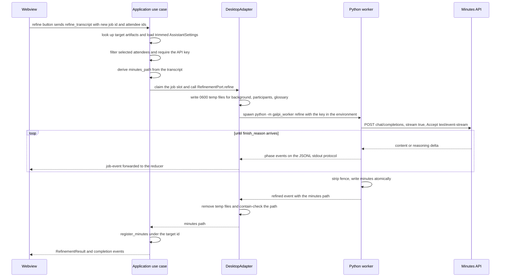

# Workflow: AI Meeting Minutes (Refine)

Refinement is the step that turns a speaker-labeled transcript into Korean
meeting minutes. It is the only stage of the product that leaves the machine:
the Rust host spawns the same Python sidecar used for transcription, but this
time the worker posts the transcript to an OpenAI-compatible chat-completions
API and streams the answer back as minutes. Everything about the flow is shaped
by three constraints: the transcript context is sensitive, so it travels
through 0600 temporary files that are removed after the run; the API key is a
secret, so it rides in the `GALPI_ASSISTANT_API_KEY` environment variable and
never touches disk or the argument vector; and the minutes are only trustworthy
if the model invents nothing, so the prompt contract forbids invented
attendees, decisions, and dates.

The flow spans three runtimes and one page cannot be read without its
neighbors: [worker protocol](../architecture/worker-protocol.md) owns the JSONL
events shown here, [meetings and artifacts](../concepts/meetings-and-artifacts.md)
owns the folder and naming rules, [roster and assistant
settings](../concepts/roster-and-assistant-settings.md) owns where the
participants and glossary come from, [external
services](../integrations/external-services.md) owns the API contract and
<!-- openwiki: broken internal link [transcription.md] file "transcription.md" does not exist. Fix the href or restore the target, then delete this comment. -->
credential storage, and [transcription](transcription.md) documents the
pipeline that produces the transcript this workflow consumes.

## The request path

*Refinement request path: the key travels host → worker by environment, the
context by 0600 files, and only `phase`/`refined`/`error` protocol events come
back. The minutes attach to the transcription's job id, not the refinement's.*

## Frontend: one refine action, two job ids

`AppController.refine` (`src/ui/controller.ts`) is the only entry point. It
refuses to run without a completed result ("먼저 전사를 완료해 주세요."),
mints a fresh `jobId` with `crypto.randomUUID()`, and invokes
`refineTranscript(jobId, result.jobId, this.view.attendees.selectedIds())`.
The two ids play different roles for the whole run:

- **`jobId`** — the refinement's own identity. The window mints it so the very
  first worker event already belongs to this job, and the host claims the
  single job slot with it.
- **`target`** — the transcription (or import) job whose `Artifacts` entry
  holds the transcript. The produced minutes are registered under this id, so
  "open minutes" and "reveal output" keep working from the original result
  row.

The attendee selection arrives as roster ids. `retainSelection`
(`src/domain/participant.ts`) returns only ids that still exist in the roster,
in roster order — so a stale selection survives a roster edit harmlessly, and
the host's filter preserves roster order rather than click order.

On the way back, the `refined` protocol event completes the job in the
frontend state machine (phase `writing`, percent 100, message "회의록을
저장했습니다."), and after the IPC promise resolves `renderMinutes` swaps the
progress block for the minutes row, which is what enables the open-minutes
action.

## Application use case: gather, gate, claim, register

`Application::refine_transcript`
(`src-tauri/src/application/use_cases.rs`) performs five steps in a deliberate
order — everything that can fail cheaply fails before the single job slot is
occupied:

1. **Target lookup** — `jobs.artifacts(target)` fetches the meeting's
   `Artifacts`; an unknown id fails with `ARTIFACT_NOT_FOUND`.
2. **Settings load** — `load_assistant()` returns the *trimmed* settings with
   the key deliberately absent (`api_key: None`, boolean `api_key_stored`
   only). This is why roster edits never touch the keychain.
3. **Attendee filter** — participants are filtered by the selected ids, in
   roster order. The glossary is not selectable: every saved term travels on
   every refinement, because a term correction is global context.
4. **API key gate** — `load_assistant_api_key()` is called at this one moment,
   because this is the one moment the key is actually needed; nothing stored
   fails with `ASSISTANT_KEY_MISSING` before any process is spawned.
5. **Claim and run** — `claim_with_id(job_id)` takes the single slot (a
   concurrent second job is refused `BUSY`, a reused id is refused
   `JOB_ID_CONFLICT`), then the `RefinementJob` struct — transcript and output
   paths, optional `source_audio`, background, participants, glossary, model,
   base URL, reasoning effort, and the key — goes to the `RefinementPort`.

The output path is not chosen by the caller: the pure domain function
`minutes_path` derives it from the transcript by stripping a `_화자별` suffix
and appending `_회의록.md`, so minutes are always a sibling of their
transcript. On success the use case calls
`register_minutes(target, minutes)` — appending the minutes to the *target's*
existing entry — before returning `RefinementResult { job_id, minutes }`.
Before registration the minutes artifact simply does not exist:
`open_artifact(minutes)` fails with `ARTIFACT_NOT_FOUND`.

## Host adapter: temp files, argv, environment

`DesktopAdapter` implements `RefinementPort` by delegating to
`adapters/outbound/refinement.rs`, which owns everything security-sensitive
about the handoff:

- **0600 temporary context files.** Background text, the selected participants
  JSON, and the glossary JSON are written to
  `std::env::temp_dir()/galpi-{kind}-{job_id}` through
  `write_private_file`: `OpenOptions` with `.mode(0o600)` **and**
  `.create_new(true)` in the same call. The mode is set at creation rather
  than chmod'ed afterwards because between a default-mode create and the
  chmod the attendee roster would be world-readable on a shared machine;
  `create_new` additionally refuses to write through an existing file. The
  worker receives only the file paths as CLI arguments.
- **Removal regardless of outcome.** After `run_worker` returns — success,
  error, or cancellation — every temporary file is removed before the result
  is propagated. A cancelled or failed refinement never leaves context in
  `/tmp`.
- **The key travels by environment only.** `assistant_environment`
  (`environment.rs`) extends the worker's scrubbed base environment with
  `GALPI_ASSISTANT_API_KEY`, plus the optional `GALPI_ASSISTANT_BASE_URL` and
  `GALPI_ASSISTANT_REASONING_EFFORT` overrides. The key never appears in
  argv, where a process listing would expose it, and never in a file.
- **The meeting date comes from the audio.** When the meeting has
  `source_audio`, `recorded_on` formats the file's modification time as a
  local `YYYY-MM-DD` and passes `--meeting-date`. The rationale is recorded in
  the code: a recording is written once, when the meeting ends, so its
  timestamp is the meeting's own day, while the transcript's timestamp is
  whenever transcription ran — possibly days later.
- **Worker invocation and protocol.** The child is
  `<venv python> -m galpi_worker refine --transcript … --output …` (plus the
  optional `--background/--participants/--glossary/--model/--meeting-date`),
  run through `run_process` with `worker_protocol: true`. Every stdout line is
  parsed as a versioned JSONL envelope; the run only counts as successful if a
  `Refined { minutes }` event arrived — a missing event or a second completion
  event fails with `WORKER_PROTOCOL_ERROR`.
- **Containment on the way out.** `canonical_minutes` canonicalizes both the
  transcript's directory and the returned minutes path and requires the
  minutes to be inside the directory, so a compromised worker cannot point the
  host at an arbitrary file. (The same containment check guards opening any
  artifact.)

Cancellation rides the same `oneshot` channel as every other job:
`run_process` selects on the receiver, terminates the worker's process group
(SIGTERM, then SIGKILL after 3 seconds), and returns `CANCELLED` — and the
temporary context files are still removed.

## Worker: `refine` orchestration

`refine()` (`worker/galpi_worker/refine.py`) first reads
`GALPI_ASSISTANT_API_KEY` from its environment and refuses with `InvalidInput`
if it is missing — `__main__.py` maps that to a protocol `error` event with
code `INVALID_INPUT` and exit code 2, while any other exception becomes
`ENGINE_ERROR` and exit 1. The worker's stdout is itself redirected to stderr
for the duration of the run, so library prints can never corrupt the protocol
stream.

It then reads the transcript and the optional context files. The participants
and glossary payloads are parsed into typed `Participant`/`GlossaryEntry`
records (a nameless participant or termless glossary row is rejected, mirroring
the host's trimming rules). Missing or blank context renders as explicit
placeholder blocks — `NO_BACKGROUND`, `NO_PARTICIPANTS`, `NO_GLOSSARY`,
each telling the model to rely on transcript evidence only — rather than
blank, so silence is never mistaken for permission. The meeting date falls
back to the transcript file's own mtime (`transcript_date`) when no
`--meeting-date` was supplied.

### Strategy: single pass vs map/reduce

Routing is a pure function of transcript length
(`minutes_pipeline.refinement_strategy`):

- **Single pass** — at most 48,000 characters (`SINGLE_PASS_CHAR_LIMIT`) go
  through one streaming request whose prompt is built by
  `minutes_prompt.build_messages` over the normative format. Progress streams
  in the 35–88% band, driven by accumulated output characters against an
  expectation of `max(2000, 60% of transcript length)`.
- **Map/reduce** — anything longer is split by `split_transcript` into chunks
  of at most 16,000 characters (`CHUNK_CHAR_BUDGET`). Chunks break only at
  whole speaker-turn lines — an oversized turn stays whole rather than being
  cut mid-sentence — and every chunk after the first carries the last 400
  characters of its predecessor as a read-only `<이전구간끝>` preamble, with
  an explicit instruction not to extract facts from it: without that context,
  a decision stated just before the cut reads as an unattributed follow-up.

The map pass extracts facts from every chunk with three concurrent workers
(`MAP_MAX_WORKERS = 3`) — the provider, not the CPU, is the bottleneck. Each
worker streams into a devnull `EventWriter`; the caller owns reporting, and
reports per **completed chunk** in the 35–68% band rather than per character,
because with several requests in flight a character count would jump backwards
as one chunk's stream overtook another's. Notes are reassembled in transcript
order by chunk number regardless of completion order. The band boundaries are
shared: `map_progress_band` gives adjacent chunks touching (rounded) bounds,
so the percent never stalls or repeats. A single-chunk map pass (possible when
one oversized turn exceeds the limit) streams within the whole 35–68% band
instead.

The reduce pass composes the final document in exactly one request
(`build_reduce_messages`) with the normative system prompt, instructed to
merge duplicated facts, resolve decisions superseded by later chunks to their
latest state, and invent nothing that is not in the notes — progress in the
70–88% band against an expectation of `max(2000, 80% of the notes' length)`.

The document is published through `write_text_atomic` (a `.tmp` sibling then
`replace`, so a crash never leaves a half-written minutes file), and the
`refined` event names the output path.

## The transport: OpenAI-compatible SSE

`assistant_stream.py` implements the API call with stdlib `urllib` — no SDK:

| Aspect | Value |
|---|---|
| Endpoint | `POST {base_url}/chat/completions`, `Accept: text/event-stream` |
| Default base URL | `https://api.z.ai/api/coding/paas/v4` (`GALPI_ASSISTANT_BASE_URL` overrides) |
| Default model | `glm-5.3` (the worker CLI default) |
| Timeout | 600 s (`REQUEST_TIMEOUT_SECONDS`) |
| Body | `stream: true`, `temperature: 0.2` |
| `max_tokens` | 131072 for GLM models on the default z.ai endpoint; 32768 everywhere else |
| `reasoning_effort` | sent only when `GALPI_ASSISTANT_REASONING_EFFORT` is `low`, `medium`, `high`, or `max`; other providers receive a clean OpenAI-compatible body |

The large GLM budget is deliberate: z.ai's output cap must cover the model's
*reasoning* plus the document. The SSE consumer folds `data:` chunks into a
document while keeping three guarantees:

- **Reasoning is visible, not silence.** Reasoning models emit
  `reasoning_content` before any visible text; while only reasoning has
  arrived, the percent holds at the band start and the message reports the
  live reasoning length, so a long "thinking" pause looks like progress.
- **Progress is throttled and monotonic.** Within a caller-provided
  `[start, ceiling]` band, accumulated characters map onto the percent
  (`streaming_percent`), emitted at most every 4,096 characters or 1.5
  seconds.
- **Malformed streams die loudly.** Keep-alives, role-only deltas, and the
  `[DONE]` sentinel are ignored; an in-stream `error` payload raises
  immediately with the provider's message.

A whole-document code fence is stripped from the finished text (inner fences
of a plain document are kept). An empty document becomes an actionable error
naming the stream's `finish_reason`: `length` (the output cap was exhausted
with no body produced — switch models or retry) and `content_filter` get
dedicated Korean operator-facing messages. HTTP failures raise with the status
code and the first 500 characters of the body, connection failures with the
underlying reason. Every one of these `RuntimeError`s reaches the host as one
`ENGINE_ERROR` protocol event via the worker's catch-all, so the UI shows the
provider's actual complaint rather than a generic failure.

## The prompt contract and the normative minutes format

`minutes_template.py`'s `SYSTEM_PROMPT` is the single source of truth for the
minutes Markdown structure: a status header line, TL;DR, meeting purpose,
decisions with content/evidence/impact/decider/status fields, an action board,
per-topic discussion, follow-ups, risks/open questions with confirmation
fields, and a correction appendix (term and speaker mappings with confidence).
Both the single-pass prompt and the reduce pass use this structure, which is
what keeps short and long meetings' minutes interchangeable downstream. The
rules that matter for trust are encoded in the template and the map prompt:

- **No invented attendees, decisions, or dates.** Decisions carry only
  confirmed, attributable content; uncertain material is isolated in
  risks/open questions and the correction appendix.
- **Real names come only from the roster.** Speaker labels are never promoted
  to real names without evidence; an uncertain mapping is written as
  `{이름} 추정` with a confidence note in the appendix. The map prompt
  repeats this per chunk: no guessing of owners, dates, or names that the
  chunk does not contain.
- **Cross-chunk uncertainty is explicit.** Content that can only be confirmed
  with adjacent chunks is marked `확인 필요`.
- **Sensitive information is masked.** Tokens, passwords, and API keys in the
  transcript are written as `[민감정보 생략]`.
- **Empty sections stay.** Sections without evidence keep their titles with
  `해당 없음`, so the document shape is stable.
- **The date is anchored, not inferred.** When the host derived a meeting date
  from the audio mtime, the prompt states it as the estimated date and tells
  the model to use it unless the transcript itself contains explicit contrary
  evidence.

Missing roster or glossary context renders as the placeholder blocks described
above, so the model is never left to guess whether context was empty or
forgotten.

## Imported transcripts refine identically

`import_transcript` copies an existing `.txt`/`.md` into a meeting folder and
registers artifacts with `minutes: None` and `source_audio: None`. From there
the flow is byte-for-byte the same as for a transcribed meeting — the same use
case, the same claim rules, the same worker command, the same prompts, and the
minutes registering onto the import's job id. The one observable difference is
the date: with no audio there is no `--meeting-date`, so the transcript's own
mtime stands in, and imported minutes are dated by when the file was written
rather than when the meeting happened. (Imported transcripts also cannot open
an SRT or checkpoint — only artifacts that exist are addressable.)

## Progress and failure semantics

The percent ladder across one refinement run:

| Stage | Band | Reported by |
|---|---|---|
| Reading the transcript | 10% | worker, once at start |
| Single-pass streaming | 35–88% | characters against expectation |
| Map (fact extraction) | 35–68% | completed chunks, 3 workers |
| Reduce (final composition) | 70–88% | characters against expectation |
| Writing the file | 90% | worker, before the atomic write |
| Done | 100%, phase `writing` | `refined` event |

The frontend reducer clamps same-phase regressions (`Math.max`) before the
`refined` event completes the job, so the ladder is monotonic as displayed.
The same progress contract drives the visible lifecycle documented in
[jobs and cancellation](../concepts/jobs-and-cancellation.md).

Failure codes a user of this workflow can see:

| Code | Source | Meaning |
|---|---|---|
| `ASSISTANT_KEY_MISSING` | use case, before claim | no assistant key is saved; save it in settings first |
| `INVALID_INPUT` | worker (exit 2) | key missing in the worker environment, empty transcript, malformed roster payload |
| `ENGINE_ERROR` | worker (exit 1) | any provider/stream failure — HTTP status and provider message preserved |
| `WORKER_PROTOCOL_ERROR` | host | no `refined` event, duplicate completion, unparseable/oversized line, minutes outside the meeting directory |
| `PROCESS_FAILED` | host | worker exited non-zero; the last stderr line is the detail |
| `CANCELLED` | host | user cancel: SIGTERM → 3 s → SIGKILL on the process group |
| `ARTIFACT_NOT_FOUND` | use case | unknown target id, or minutes queried before `register_minutes` |
| `BUSY` / `JOB_ID_CONFLICT` | registry | another job holds the slot / the job id was already used |

In every failure path the temporary context files are still removed, and the
minutes file is either absent or complete — the atomic write means no partial
document is ever observable at the output path.

## Focused tests that pin this workflow

- `src-tauri/src/application/tests.rs` —
  `refinement_sends_saved_background_and_publishes_minutes` pins the trimmed
  key, model/base-url/effort passthrough, background text, roster-ordered
  attendee selection, the full glossary, and openable minutes;
  `refinement_is_rejected_before_a_token_is_saved` pins `ASSISTANT_KEY_MISSING`;
  `imported_transcript_is_refinable_without_transcription` pins the import
  path.
- `src-tauri/src/adapters/outbound/process/tests.rs` —
  `captures_refined_event_as_process_result` pins the `Refined` event as the
  completion carrier; `cancelling_stops_a_running_child_and_reaps_it` pins the
  cancellation contract.
- `worker/tests/minutes_prompt_cases.py` — strategy routing at the 48,000
  boundary, lossless whole-turn chunking, preamble-carrying and
  context-only-marked chunks, participant/glossary parsing and rendering,
  map/reduce message construction, and shared progress-band boundaries.
- `worker/tests/refine_stream_cases.py` — SSE parsing (keep-alives, error
  payloads, `[DONE]`), reasoning-only progress, finish-reason failures,
  GLM-vs-other request bodies, fence stripping, and meeting-date anchoring.
