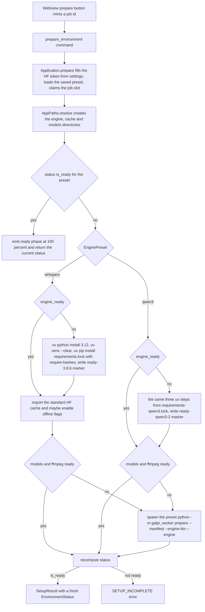

# Workflow: Engine Setup & First Run

Galpi ships no Python runtime and no models. The first time a user presses
"로컬 엔진 준비", the host builds an app-private Python 3.12 environment with a
bundled `uv` binary, installs the selected engine's pinned wheels, and then
hands off to the Python worker, which downloads several gigabytes of models and
converts them into the runtime layout the transcription path expects. This page
walks that `prepare_environment` flow end to end: the request path, the per-preset
branch, how progress reaches the screen, how the Hugging Face token travels, and
the invariants that make a failed run safe to retry.

The data model underneath the flow (paths, markers, readiness booleans) is owned
by [Engine Presets & Environment Readiness](../concepts/engines-and-environment.md);
the JSONL event format is owned by [Worker Protocol & Process
Supervision](../architecture/worker-protocol.md); the external touchpoints
(Hugging Face gating, uv staging) are cataloged in [External
Services](../integrations/external-services.md). This page is the run itself.

## The request path

1. The webview's prepare button mints a fresh `crypto.randomUUID()` job id and
   calls `AppController.prepare()`, which enters the `setup` busy state and
   invokes `backend.prepare(jobId)`
   (`src/ui/controller.ts`).
2. `TauriBackend.prepare` sends `prepare_environment` with
   `SetupRequest { jobId, huggingFaceToken: null }` — the webview never sends a
   token; the saved one is filled in on the host side
   (`src/adapters/tauri-backend.ts`).
3. `Application::prepare`
   (`src-tauri/src/application/use_cases.rs`) fills a missing token from
   settings, loads the saved `EnginePreset`, and claims the single job slot via
   `JobRegistry::claim_with_id` — a concurrent job is refused with `BUSY`
   (`src-tauri/src/application/jobs.rs`).
4. The `EnginePort` implementation (`DesktopAdapter`) delegates to
   `setup::prepare`
   (`src-tauri/src/adapters/outbound/setup.rs`), which runs the flow below.
5. Every phase event and log line travels back out through the same `JobEvents`
   bridge transcription uses; the resolved `EnvironmentStatus` returns as the
   command's `SetupResult`.

## The prepare flow



*The prepare decision flow in `setup.rs`. Every diamond re-runs `status()`, so
a retry executes only the stages whose files are still missing.*

`AppPaths::resolve`
(`src-tauri/src/adapters/outbound/paths.rs`) derives the entire layout from
Tauri's `app_local_data_dir()`: the WhisperX stack under `engine/`, the Qwen3
stack in its own venv at `engine/qwen3/` so the two dependency sets never
interact, model manifests under `models/`, and the Hugging Face / torch / uv
caches plus the uv-managed interpreter pool inside the app data root so
deleting Galpi's folder reclaims every gigabyte. `create_directories` materializes
those folders before any subprocess runs.

## Stage 1: engine install with bundled uv

The install step runs only when the preset's `engine_ready` is false — that is,
when the venv interpreter is missing or the readiness marker does not match the
currently compiled fingerprint.

`uv_binary()` resolves the sidecar: `src-tauri/binaries/uv-aarch64-apple-darwin`
in debug builds, a `uv` next to the executable in release builds (staged by
`scripts/stage-sidecars.ts` with pinned SHA-256 checksums). Three invocations
follow, each supervised by `run_process` with `env_clear` and a fully explicit
environment:

1. `uv python install 3.12` — the interpreter lands in
   `UV_PYTHON_INSTALL_DIR` (`python/` under the app data root).
2. `uv venv --clear --python 3.12 <engine>/.venv` — `--clear` exists because a
   failed first attempt leaves a partial venv behind; replacing it keeps
   retries idempotent instead of tripping uv's refusal to reuse a directory.
3. `uv pip install --python <venv python> -r <lock>` — WhisperX installs from
   `worker/requirements.lock` **with `--require-hashes`**; Qwen3 installs from
   `worker/requirements-qwen3.lock`. `UV_PYTHON_PREFERENCE=only-managed` (set
   in the process environment) guarantees a system Python on `PATH` is never a
   candidate.

Only after pip exits successfully does the host write the readiness marker —
`engine/ready-3.8.6` for WhisperX, `engine/qwen3/ready-qwen3-2` for Qwen3.
The marker's contents come from compile-time fingerprints, which is what makes
the marker a truthful record of what was installed.

### The fingerprint inside the marker

`src-tauri/build.rs` runs FNV-1a over the bytes of `worker/requirements.txt`
and `worker/requirements-qwen3.txt`, exposing
`GALPI_WHISPERX_REQUIREMENTS_HASH` and `GALPI_QWEN3_REQUIREMENTS_HASH` as
compile-time environment variables (a missing requirements file fails the build
rather than fingerprinting nothing). `environment.rs` composes them:
`whisperx_marker()` is `3.8.6+<hash>`, `qwen3_marker()` is `2+<hash>`. The
consequence: **editing a pinned dependency invalidates every existing
virtualenv on its own** — the next build compiles a new hash, `engine_ready`
flips false at the next status check, and the next prepare reinstalls the venv
and rewrites the marker, with no version bump or human memory required.

## Stage 2: cache reuse (WhisperX only)

Before touching the network, the WhisperX branch copies the three known model
directories (`faster-whisper-large-v3-turbo`, the Korean wav2vec2 aligner, and
pyannote community-1) from `~/.cache/huggingface/hub` into the app cache via
`model_cache.rs::import_standard_cache`:

- Files are **hard-linked** with a copy fallback, so an import of an existing
  cache is nearly free.
- Symlinks (the HF snapshot layout links into `blobs/`) are recreated only when
  their canonical target stays inside the source repository; an escaping link
  is an error, not a hole.
- The import is **best-effort**: a failure is emitted as a stderr log event and
  treated as zero imported, and prepare continues into the normal download
  path. Each file copy skips a destination that already exists, so re-running
  prepare never re-copies.

When the import lands **all three** directories and no non-blank Hugging Face
token is configured (`can_use_offline_cache`), the model environment gains
`HF_HUB_OFFLINE=1` and `TRANSFORMERS_OFFLINE=1`: with a complete tokenless
cache the network cannot improve anything, and the presence of a token would
suggest the user intends gated access.

## Stage 3: the worker's prepare command

Unless `models_ready` and `ffmpeg_ready` both already hold, the host spawns the
preset's interpreter as:

```
<venv python> -m galpi_worker prepare --manifest <models manifest> \
    --engine-bin <engine bin dir> --engine <whisperx|qwen3>
```

with `ProcessSpec.worker_protocol: true`, so the child's stdout is parsed line
by line as the versioned JSONL protocol and each event re-emitted to the
webview. `__main__.py` routes `prepare` to `preparation.py::prepare_models`,
and any exception becomes one `error` protocol event via the `main()` catch-all
before a non-zero exit.

### ffmpeg staging

`link_ffmpeg` links the ffmpeg binary bundled with `imageio-ffmpeg` into the
engine's `bin/` directory — a symlink, falling back to a copy with mode
`0o755` when symlinking fails, and replacing an existing link first. This one
file is exactly what `ffmpeg_ready` inspects and what `process_environment`'s
`PATH` (engine bin dir first) resolves for every later decode. Both presets'
requirement sets pin `imageio-ffmpeg`, so neither engine carries a separate
ffmpeg download.

### WhisperX model warm-up

`prepare_whisperx_models` loads `large-v3-turbo` on CPU int8, then the Korean
alignment model and the pyannote diarization pipeline on the selected torch
device (MPS when available), each wrapped in exactly one MPS→CPU retry. Every
model is dropped and `gc.collect()` runs between stages. It writes
`models/ready.json` and emits `prepared` with the whisperx version.

### Qwen3: honest download progress, MLX conversion, verification

`prepare_qwen3_models` is heavier, and its progress reporting is a design
constraint, not decoration:

- The `Qwen/Qwen3-ASR-1.7B` and `Qwen/Qwen3-ForcedAligner-0.6B` snapshots
  download **concurrently** with two workers — sequential multi-gigabyte
  fetches would leave the link idle between files.
- `DownloadReporter` subclasses tqdm and sums every per-file bar into one
  running byte counter, mapping it onto the `models` band **10–40%** with a
  message like "1.2/3.4 GB". Updates are throttled to at most one event per
  second — fast enough that a multi-GB fetch visibly moves, slow enough not to
  flood the event stream. It reports only counted bytes against known totals;
  **no ETAs are ever fabricated**. Without this aggregation the setup bar
  would sit frozen at its starting value for the whole download and the app
  would look stalled. Per-snapshot completion also emits explicit events
  (10 → 25 → 40%).
- The ASR snapshot is converted to **8-bit MLX weights** (group size 64) into
  `cache/mlx/qwen3-asr-1.7b-8bit`. Conversion is skipped entirely when the
  weights file already exists; otherwise it builds a sibling `.partial`
  staging directory — wiping any stale one first — writes the quantized
  safetensors, copies the tokenizer/config sidecars plus a
  `quantization_config.json`, and only then moves the directory into place
  with `os.replace`. A crash can therefore never leave a half-built model the
  readiness gate would mistake for a complete one.
- The gated `pyannote/speaker-diarization-community-1` pipeline downloads with
  the token from settings, and the pipeline is warmed once so the first real
  meeting does not pay the download cost.
- `verify_qwen3_session` then loads the converted weights and transcribes one
  second of silence. Preparation used to end at "the files are on disk", which
  let a bad conversion or a missing runtime dependency surface only mid-meeting;
  the verification moves that failure into the step whose job is to report it.

Finally the worker writes its manifest (`models/ready.json` /
`models/qwen3-ready.json`) atomically — a `.tmp` file plus `replace` — with
`protocol: 1`, the engine version string, and the installed distribution
versions, then emits `prepared`. The host validates that manifest against the
same constants (`whisperx == "3.8.6"`, `qwen3 == "2"`, `protocol == 1`) plus
the expected `models--Org--Name` hub directories when it recomputes readiness.

## Progress surfaces: the same bridge as transcription

All prepare progress is `WorkerEvent::Phase` JSONL — the host's own
`emit_phase` (engine 5% / 22% / 35%, models 45% when a cache import lands, 50%
when the worker starts, and the short-circuit `ready` at 100%) and the worker's
`phase` events share one enum and one channel. `run_process` parses the worker's
stdout (`worker_protocol: true`), and every event is re-emitted through the
`JobEvents` port — implemented by `TauriEvents` as a `"job-event"` Tauri event —
the identical bridge the transcription path uses. The webview reduces them with
the same `reduceJobEvent` state machine, so the setup progress card (percent,
message, log disclosure, and the `engine` → `models` phase rail in the setup
panel) behaves exactly like transcription progress, including the
percent-never-regresses rule within a phase.

Stderr is deliberately different: `uv pip install` and the model downloaders
print thousands of diagnostic lines, so `run_process` batches stderr into a
single `log` event every 100 ms or 32 lines (whichever comes first) instead of
flooding the webview, and keeps a 20-line tail whose last line becomes the
`PROCESS_FAILED` error detail when a child exits non-zero.

The window mints the job id before invoking the command, so even the first
event already belongs to this run — a job that adopted whatever arrived first
could inherit a cancelled job's trailing events.

## Why a failed prepare is safe to retry

Every stage of the flow is idempotent by construction:

- **Idempotent status checks.** `prepare` and both per-preset branches re-run
  `status()` before each stage. A completed engine install, an already-linked
  ffmpeg, or already-present models are skipped on the next attempt — an
  existing venv whose marker matches the compiled fingerprint is reused as-is,
  and only the missing pieces run.
- **Partial venvs are replaced, not feared.** `uv venv --clear` wipes a
  half-built environment from a failed attempt, so the retry recreates it from
  scratch instead of tripping uv's refusal to initialize an occupied directory.
- **Markers are written last.** The readiness marker is written only after pip
  succeeds, so a marker never claims an install that did not finish; a failed
  install simply leaves no marker, which `engine_ready` reads as "not ready".
- **Model-side work is atomic or skippable.** The MLX conversion skips a
  completed conversion, otherwise builds in `.partial` and `os.replace`s into
  place; `link_ffmpeg` replaces an existing link; the WhisperX cache import
  skips files that already exist; interrupted Hugging Face downloads stay in
  the app cache and are reused rather than re-fetched on the next run.
- **The verdict is file truth, not exit codes.** After the worker exits, the
  host recomputes `status()` and fails with `SETUP_INCOMPLETE` ("준비
  프로세스가 종료됐지만 필수 파일이 확인되지 않았습니다.") unless
  `engine_ready && models_ready && ffmpeg_ready` all hold. Markers and
  manifests — not a green exit status — decide readiness, so a run that died
  halfway is honestly reported and honestly resumed.

## The Hugging Face token: from settings to downloads only

`pyannote/speaker-diarization-community-1` is gated, so first-time prepare may
need a token. The flow keeps it narrow:

1. **Storage.** The token is saved through settings
   (`save_hugging_face_token`, trimmed; empty means cleared). The host reports
   only a *stored* boolean to the webview — `hugging_face_token_stored` exists
   so the settings sheet can show a mask without reading the value, which on
   macOS would mean a keychain-style authorization prompt on every dialog
   open. `TokenSettingsView` never holds a host-stored value: the field is
   read-only while stored, and changing a stored token means clearing and
   retyping. (Secrets currently live in the settings file rather than the
   Keychain; `secrets.rs` documents the one-line switch once the app ships a
   stable Developer ID signature.)
2. **Injection.** `TauriBackend.prepare` always sends
   `huggingFaceToken: null`; `Application::prepare` fills it from settings
   (a unit test pins this). In `setup::prepare` two environments are built:
   the **install** environment gets `None`, and only the **model** environment
   gets `HF_TOKEN` — and only when the trimmed value is non-empty. The token
   exists solely so the gated download can authenticate.
3. **Consumption.** The Qwen3 prepare path reads `HF_TOKEN` and passes it to
   `snapshot_download` and `Pipeline.from_pretrained`. Every transcription
   environment is built with `None`, so the token never rides along to
   inference; Qwen3 transcription additionally forces
   `HF_HUB_OFFLINE`/`TRANSFORMERS_OFFLINE` because it may only use the
   prepared cache.
4. **Guidance.** The settings sheet's token guide (`token-guide.ts` +
   the popover markup in `app-template.ts`) walks first-time users through the
   gating: agree to the model's terms, create a **Fine-grained** token with
   read access to only `pyannote/speaker-diarization-community-1`, and paste
   the `hf_…` value — noting the token can be left empty once access was
   approved or the model is already on the Mac. The "model access" button
   opens the Hugging Face model page in the system browser, the only outbound
   action the webview performs itself.

## Focused tests

- `src-tauri/src/adapters/outbound/model_cache.rs` (tests) — import uses hard
  links and preserves only in-repo symlinks; offline mode requires the
  complete, tokenless cache.
- `src-tauri/src/adapters/outbound/setup.rs` (tests) — the Qwen3 model ids
  keep the Hugging Face repo-id shape that `cache_dir_name` and the hub
  directory checks rely on.
- `src-tauri/src/application/tests.rs` — `prepare_uses_saved_hugging_face_token`
  pins that a missing request token is filled from settings;
  `prepare_prepares_the_selected_preset` pins that the saved preset, not a
  default, selects the stack.
- `src/ui/token-guide.dom.test.ts` — closing the guide popover from inside
  returns focus to the trigger rather than dropping to `<body>`.

## Related pages

- [Engine Presets & Environment Readiness](../concepts/engines-and-environment.md)
  — the path layout, fingerprint mechanism, and readiness model this flow
  maintains.
- [Worker Protocol & Process Supervision](../architecture/worker-protocol.md)
  — the JSONL envelope, `run_process` supervision, and cancellation
  escalation.
- [Jobs & Cancellation](../concepts/jobs-and-cancellation.md) — the job slot
  `prepare` claims and the oneshot cancel path.
- [External Services](../integrations/external-services.md) — Hugging Face
  gating, uv staging, and credential storage details.
- [Transcription workflow](../workflows/transcription.md) — what runs after
  the readiness gate passes.
e details.
- [Transcription workflow](../workflows/transcription.md) — what runs after
  the readiness gate passes.
the JSONL envelope, `run_process` supervision, and cancellation
  escalation.
- [Jobs & Cancellation](../concepts/jobs-and-cancellation.md) — the job slot
  `prepare` claims and the oneshot cancel path.
- [External Services](../integrations/external-services.md) — Hugging Face
  gating, uv staging, and credential storage details.
- [Transcription workflow](../workflows/transcription.md) — what runs after
  the readiness gate passes.
