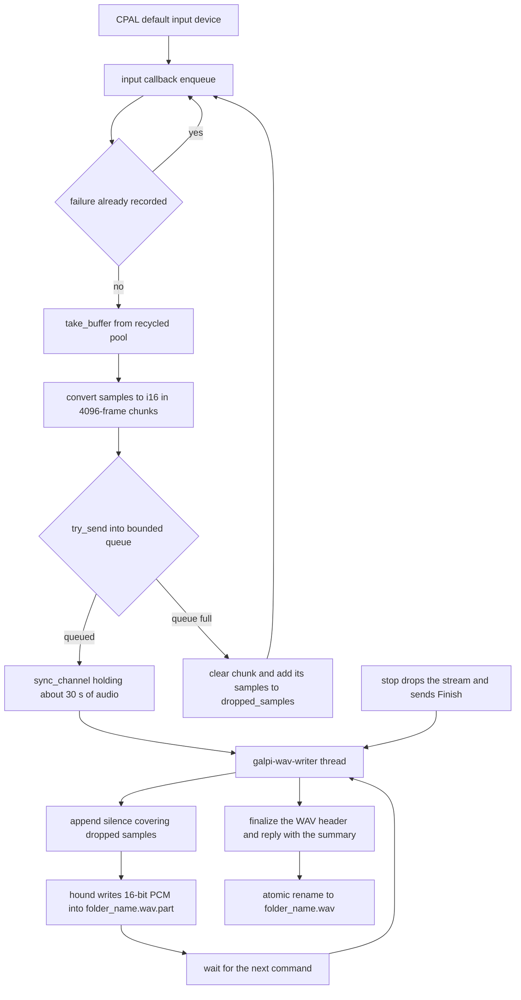

# Workflow: Microphone Recording

Pressing **마이크로 바로 녹음** starts the only capture path Galpi has: the
default Mac microphone, read by a CPAL stream on the realtime audio callback,
converted to 16-bit PCM, and written incrementally into a `.wav.part` file by a
dedicated writer thread. Stopping folds in the dropped-sample count, finalizes
the WAV header, and atomically renames the file to its final name. Cancelling
deletes the partial file and its meeting folder. This page walks that flow end
to end — request path, capture discipline, writer lifecycle, failure plumbing,
cleanup, sleep blocking, and the frontend controller that survives both native
failures racing the start call and webview timer throttling.

The port contract and the mirrored state machines are owned by [Jobs,
Cancellation & State Machines](../concepts/jobs-and-cancellation.md); where the
finished file lands and how later artifacts join it is owned by [Meetings &
Artifacts](../concepts/meetings-and-artifacts.md); the host's port wiring is
described in [Rust Host Architecture](../architecture/rust-host.md). This page
is the recording run itself.

## Scope: microphone only, by design

Capture is deliberately limited to the default microphone input device. System
audio — the remote side of a Zoom or Google Meet call — is **not** captured;
the README states this as a product boundary and lists "상대방 음성이 녹음되지
않음" under troubleshooting with "현재 시스템 오디오 캡처는 지원하지 않음" as
the answer. This is a documented constraint, not a bug: nothing in the
pipeline sniffs or loops back output devices, and `NativeRecorder` only ever
opens `default_input_device()`.

## The request path

1. The webview's record button fires `AppController`'s `record` handler, which
   calls `RecordingController.start(this.outputRoot)`; the controller refuses
   to start without a chosen output folder
   (`src/ui/recording-controller.ts`).
2. `RecordingController.start` clears its pending-failure buffer, enters the
   `starting` state, and invokes `backend.startRecording(outputRoot)`
   (`src/adapters/tauri-backend.ts`), which sends the `start_recording`
   Tauri command and Zod-validates the reply.
3. `Application::start_recording`
   (`src-tauri/src/application/use_cases.rs`) holds the tokio mutex over
   `active_recording: Option<Uuid>` across the whole native call, so
   concurrent starts serialize; a second start while one is live is refused
   with `RECORDING_BUSY`. It mints the recording id with `Uuid::now_v7()`
   (time-sortable) and stores it in the slot **only if the native start
   succeeded**.
4. `NativeRecorder::start` (`src-tauri/src/adapters/outbound/recording/mod.rs`)
   implements the `RecordingPort` trait and runs each of start/stop/cancel
   inside `tokio::task::spawn_blocking`, keeping the audio-device and
   file-system work off the async runtime. It is the only production
   implementation, wired in `composition.rs`.
5. The stop and cancel commands take the same route:
   `Application::stop_recording`/`cancel_recording` verify the id against the
   stored one (`RECORDING_ID_MISMATCH` when different, `RECORDING_NOT_ACTIVE`
   when the slot is empty) and clear the slot once the native call returns —
   even if it failed, because the native recorder has already taken ownership
   of the session.

## Owning the meeting folder at start

`start_sync` (`recording/mod.rs`) does its file layout work before touching
audio at all:

- It creates and canonicalizes the user-chosen output root.
- It immediately creates the meeting folder named by
  `recording_folder_name()` — `YYYY-MM-DD HHMMSS 녹음`
  (`src-tauri/src/adapters/outbound/paths.rs`) — so a recording owns its
  folder from the first instant. The final file will be
  `{folder_name}/{folder_name}.wav` and the recording target is
  `{folder_name}/{folder_name}.wav.part`.
- The transcription path later recognizes this layout: `create_meeting_directory`
  reuses `{stem}/{stem}.wav`'s own folder as the meeting folder, so the SRT,
  speaker txt, checkpoint, and minutes all land next to the finished WAV under
  one predictable name.

`start_sync` then resolves the CPAL default host and input device
(`MICROPHONE_UNAVAILABLE` if none), reads `default_input_config()` for sample
rate, channels, and sample format, spawns the WAV writer, and builds the
capture stream for the device's concrete sample format. If building or playing
the stream fails, the writer is cancelled and the partial file removed before
the error propagates. `RecordingStatus` returns the recording id, the
**partial** path, sample rate, and channels.

## The capture path

*The capture path from CPAL callback to finalized WAV. Dropped samples are
counted when the queue is full and later written as silence, so the timeline
stays continuous.*

## Realtime discipline: never block the callback

The hard invariant of the whole module is that the CPAL input callback must
never block — it runs on the realtime audio thread. `enqueue`
(`recording/capture.rs`) respects it in four ways:

- **Nonblocking sends.** Chunks of `FRAMES_PER_CHUNK` (4,096) frames go out
  with `try_send` on a `sync_channel` whose capacity is derived from the
  sample rate to hold roughly `QUEUE_SECONDS` (30) seconds of audio.
- **Backpressure by counting, not by failing.** When the queue is full, the
  chunk is dropped, its sample count (plus any previously accumulated drops)
  is added to an `AtomicU64`, and the buffer is kept for reuse. The callback
  keeps running; the loss is recorded instead. A dedicated test pins this:
  `counts_samples_instead_of_failing_when_writer_queue_is_full`.
- **Buffer recycling.** `take_buffer` pulls a spent buffer from the recycle
  channel the writer returns buffers through, and allocates only when the
  pool is empty — keeping allocation out of the steady state on the realtime
  thread. A test asserts the queued chunk literally reuses the same
  allocation (pointer identity).
- **Short-circuit after failure.** Once a failure is recorded
  (`has_failure`), the callback returns immediately without feeding more
  data.

All device sample formats are funneled to `i16`: integer formats convert via
`FromSample`, and the float paths clamp to the `i16` range with non-finite
values mapped to 0 (`f32_to_i16`/`f64_to_i16`, pinned by tests). Stream
*errors* are separate from samples: `ErrorKind::Xrun` (a CoreAudio overrun) is
treated as recoverable and ignored, while any other error stores a
`MICROPHONE_DISCONNECTED` failure.

## The WAV writer thread

`writer::spawn` creates the `.wav.part` with `create_new(true)` (a stale
partial cannot be silently appended to), wraps it in a hound `WavWriter` with
a 16-bit PCM int spec, and starts the named thread `galpi-wav-writer` with a
bounded command channel. If the file open, the hound setup, or the thread
spawn fails, the just-created file is removed; if even the removal fails the
error becomes `RECORDING_CLEANUP_FAILED` with both causes.

The writer loop (`run_writer`) owns three commands:

- `Samples { samples, dropped_before }` — first a size guard: if the running
  sample count plus the incoming count would double past
  `RIFF_DATA_LIMIT` (`u32::MAX - 44`, two bytes per sample), the writer
  records `WAV_TOO_LARGE` and stops accepting data. Otherwise it appends
  `dropped_before` zero samples (silence fills the hole so the timeline stays
  continuous), writes the chunk through hound's bulk `i16` writer (skipping
  per-sample checks that `write_sample` would repeat 48,000 times a second),
  returns the buffer to the recycle channel, and flushes about every five
  seconds of audio so a crash loses little.
- `Finish { trailing_dropped, reply }` — appends the trailing silence
  dropped between the stream stopping and the finish arriving, calls
  `finalize()` to patch the WAV header, and replies with
  `WriterSummary { samples, dropped_samples }` before exiting.
- `Cancel(reply)` — drops the writer (leaving the partial file for the caller
  to delete) and exits.

`WriterHandle::finish`/`cancel` perform the synchronous handshake and join the
thread, mapping a dead writer or a join panic to `WAV_WRITER_FAILED`. The
writer tests lock down the two durable behaviors: byte-exact PCM samples and
header for given input, and `fills_dropped_samples_with_silence_and_reports_them`
(`[0, 0, 1, 2, 0, 0]` for a `dropped_before: 2, samples: [1, 2],
finish(2)` sequence, with `dropped_samples: 4` in the summary).

## Failure plumbing that can outrun the IPC reply

`recording/failure.rs` implements a first-failure-wins slot shared between the
capture callback, the writer thread, and the stop path:

- `record_failure` is the audio-thread-safe variant: it stores the code and
  message only, because emitting JSON across the IPC boundary must never
  happen on the realtime thread. The callback uses it when a `try_send`
  comes back `Disconnected` — the writer thread is gone, so the recording is
  dead and the state only has to be visible to `stop`
  (`WAV_WRITER_FAILED`).
- `set_failure` stores **and** emits a `RecordingFailure { recordingId, code,
  message }` through the `RecordingEvents` port. `TauriEvents` implements it
  by emitting the `recording-event` Tauri event, which the frontend parses
  with Zod in `listenToRecordingFailures`. The stream error handler's
  `MICROPHONE_DISCONNECTED` and the writer's `WAV_WRITE_FAILED` /
  `WAV_TOO_LARGE` all emit this way, so the UI can surface native errors the
  moment they happen.
- `take_failure` drains the slot. `stop_sync` calls it after the writer
  finishes: a stored failure — including one emitted *during* the recording —
  turns the stop into an error and removes the partial file. This is what
  makes `recording-event` trustworthy: even if the UI misses the event, the
  stop reply still carries the failure.

## Stop: duration from frames, not wall time

`stop_sync` drops the stream (stopping capture), swaps out the callback-side
dropped counter, and hands the value to `writer.finish` as trailing dropped
samples. After checking the drained failure slot it computes:

- `frames = summary.samples / channels` — sample counts are per-channel
  samples; frames are the timeline unit. A `u32` overflow here fails with
  `WAV_TOO_LARGE`.
- `duration_seconds = frames / sample_rate` — the finished duration is
  derived from **frames actually written**, the only authoritative length of
  the saved file, never from the wall clock.
- `dropped_frames = summary.dropped_samples / channels`.

Then the partial file is atomically renamed to `{folder_name}.wav` and
canonicalized; `RecordingResult { recordingId, path, sampleRate, channels,
frames, droppedFrames, durationSeconds }` goes back (serialized camelCase,
Zod-parsed on the other side). Every error branch in this sequence removes
the partial file, and a cleanup failure merges into the original error as
`RECORDING_CLEANUP_FAILED` via `with_cleanup`.

## Cancel and teardown

`cancel_sync` verifies the recording id, drops the stream, then
`cancel_and_remove`: cancel the writer (joined) and remove the `.wav.part`.
`remove_partial` also removes the meeting folder — with plain
`remove_dir`, which succeeds only when the folder is empty, so a folder that
already accumulated artifacts survives. The same removal runs on every failed
start/stop branch.

Two further teardown paths guarantee the partial file does not outlive the
process:

- `Drop for NativeRecorder` (`recording/cleanup.rs`): when the last `Arc` to
  the recorder's state is being released, it takes any still-active
  recording, stops the stream, cancels the writer, and removes the partial,
  logging failures to stderr — a destructor has nowhere better to report.
- `RecordingController.dispose` cancels any active recording over IPC when
  the frontend controller shuts down (`AppController.stop`).

The state mutex itself is guarded by `state_lock`, which converts a poisoned
lock into a `STATE_ERROR` rather than propagating a panic across the audio
boundary.

## Sleep blocking

`power.rs` wraps the macOS `PreventUserIdleSystemSleep` IOPM assertion in an
RAII `SleepBlocker`: acquiring it keeps the system awake (display may sleep)
so the CPAL capture stream is not suspended mid-recording, and dropping it
releases the assertion immediately. The lifecycle is exactly the recording's
lifecycle:

- `start_sync` acquires it **after** the stream starts playing, with the name
  `"Galpi meeting recording in progress"`.
- The blocker is stored in `ActiveRecording` (`_sleep_blocker`), so it is
  released whenever that struct is dropped — on stop, cancel, failure
  teardown, or process shutdown. There is no separate release path to forget.
- `acquire` returns `None` if powerd rejects the assertion; recording
  continues without sleep protection and a note goes to stderr. An
  `#[ignore]`d test verifies the real assertion table via
  `pmset -g assertions` on a desktop session.

## One recording at a time, enforced twice

The single-active-recording invariant is enforced independently at two
layers:

- `Application` keeps `active_recording: Option<Uuid>` under a tokio mutex and
  refuses reentry with `RECORDING_BUSY`; its test
  `recording_lifecycle_rejects_reentry_and_wrong_session` pins busy, mismatch,
  stop, restart, and cancel in one flow.
- `NativeRecorder` keeps its own `Mutex<Option<ActiveRecording>>` and returns
  the same `RECORDING_BUSY` if somehow called twice; `take_recording`
  verifies the id (`RECORDING_ID_MISMATCH`) before yielding the session to
  stop or cancel.

The belt-and-braces design means a misbehaving or future second client of the
port cannot bypass the UI-level guard, and id verification means a stale
frontend cannot stop a session it did not start.

The recording slot is also independent of the job slot. `Application` holds
`active_recording` beside — not inside — the `JobRegistry` that owns the
single active engine job, and the recording commands never claim or release a
job slot, so recording and an engine job (engine setup, transcription,
refinement) cannot block each other at the host layer. The shipped UI
serializes them anyway: while a recording is active, `AppView.refreshActions`
disables the transcription, import, transcript/output selection, and refine
controls so nothing can race the capture.

## Frontend: RecordingController

The frontend controller (`src/ui/recording-controller.ts`) and its pure state
machine (`src/application/recording-machine.ts`) handle three hard realities:

**Native failures race the start call.** The `recording-event` subscription is
established before any recording starts, so a failure emitted while the
`start_recording` IPC is still in flight arrives while the controller status
is `starting`. `handleFailure` buffers such events in `pendingFailures`
keyed by recording id; once `start` resolves, the controller looks up the
fresh id, and if an early failure is waiting it runs `cleanupFailure` —
cancelling the recording over IPC (removing the partial file natively) and
rendering the failure state. A test drives exactly this interleaving: failure
arrives before `startRecording` resolves, and the controller must still cancel
and land in `failed`.

**The webview throttles timers in the background.** The elapsed clock is never
counted by ticks: `tickRecording` recomputes `elapsedSeconds` from
`nowMs - startedAtMs` against the session start, so skipped intervals lose
nothing. The controller installs 1-second `setInterval` ticks plus
`visibilitychange` and `focus` listeners — the visibility event is the first
moment a frozen counter can catch up after 90 hidden seconds (pinned by the
DOM test). A tick that only advances the clock takes the narrow
`setRecordingTime` path, leaving buttons and messages untouched.

**The recorder, not the clock, is authoritative at the end.** On a successful
stop the controller passes `result.path` into the `selectAudio` callback wired
by `AppController` — the finished WAV becomes the selected transcription input
automatically — and `completeRecordingState` sets the elapsed time from the
recorder-reported `durationSeconds` (90.2 rounds to 90 in the test), setting
the warning flag whenever `droppedFrames > 0` with the message that missing
audio was replaced by silence.

## Tests that matter

| Test | What it pins |
|------|--------------|
| `counts_samples_instead_of_failing_when_writer_queue_is_full` (capture) | Full queue drops and counts instead of blocking or failing |
| `refills_a_recycled_buffer_instead_of_allocating` (capture) | Buffer pool reuse by pointer identity |
| `converts_and_clamps_float_samples_for_pcm_wav`, `treats_core_audio_xrun_as_recoverable` (`recording/tests.rs`) | Float clamping with NaN → 0; Xrun ignored, other errors fatal |
| `writes_exact_pcm_samples_and_header` (writer) | Byte-exact PCM and WAV spec for the fed samples |
| `fills_dropped_samples_with_silence_and_reports_them` (writer) | Silence fill and dropped-sample reporting |
| `recording_lifecycle_rejects_reentry_and_wrong_session` (application) | `RECORDING_BUSY`, `RECORDING_ID_MISMATCH`, restart after stop |
| `sleep_blocker_holds_and_releases_a_system_sleep_assertion` (ignored, `pmset`) | Real assertion held while recording, released on drop |
| `cleans up a native failure emitted before start resolves` (controller) | Early-failure buffering and auto-cancel |
| `catches up on foreground return…`, `settles the finished time…` (DOM controller) | Background-throttled clock catch-up; duration from the file |

## Invariants

- The CPAL callback never blocks; it only converts, recycles buffers, and
  `try_send`s. Overflow is counted, not awaited.
- Only one active recording, enforced in both `Application` and
  `NativeRecorder`; stop/cancel verify the recording id
  (`RECORDING_ID_MISMATCH`), and the native layer is the sole owner of the
  `ActiveRecording` slot.
- The recording slot is separate from the job slot: recording commands never
  touch the `JobRegistry`, so capture and engine jobs are independent at the
  host layer.
- A recording owns its meeting folder from the start instant; the finished
  WAV and every later artifact share one predictable name.
- The `.wav.part` exists only while the recording is unresolved: stop
  renames it, cancel removes it, every failure branch removes it, and
  process teardown (native `Drop`, frontend `dispose`) catches the rest.
- The reported duration comes from frames written; dropped samples become
  silence so the timeline length is exact.
- The first failure wins and is visible on both channels: emitted as
  `recording-event` for immediate UI surfacing, and drained at stop so the
  stop reply cannot lie about a broken recording.
- The sleep assertion lives exactly as long as `ActiveRecording`.

## Related pages

- [Jobs, Cancellation & State Machines](../concepts/jobs-and-cancellation.md)
  — the port contract, stable error codes, and the frontend state machine
  this controller drives.
- [Meetings & Artifacts](../concepts/meetings-and-artifacts.md) — how the
  recording's folder becomes the meeting folder that receives every later
  artifact.
- [Rust Host Architecture](../architecture/rust-host.md) — where
  `NativeRecorder` sits in the hexagonal wiring.
- [Transcription workflow](../workflows/transcription.md) — what happens to
  the auto-selected WAV after the recording completes.
