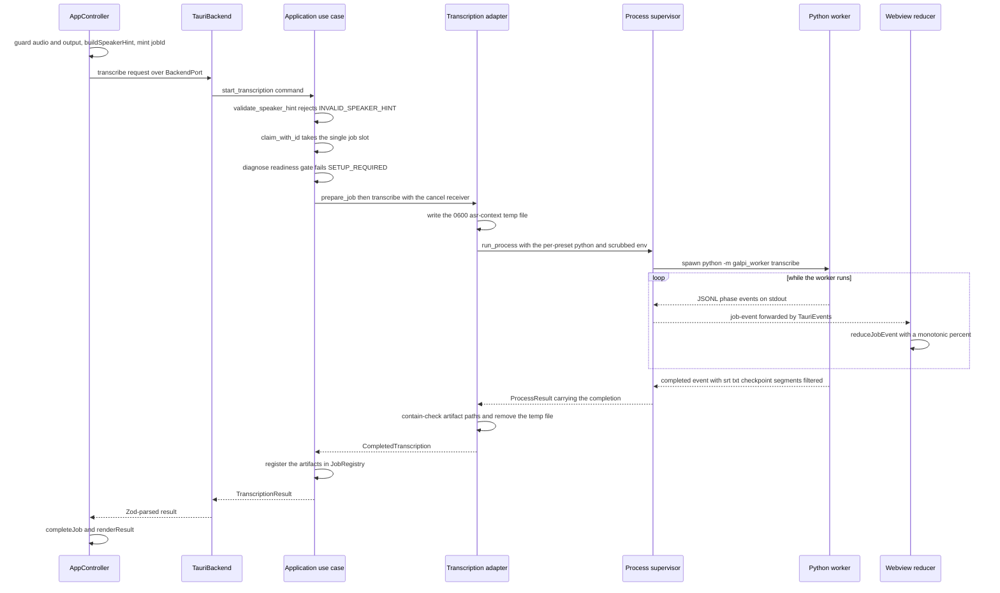
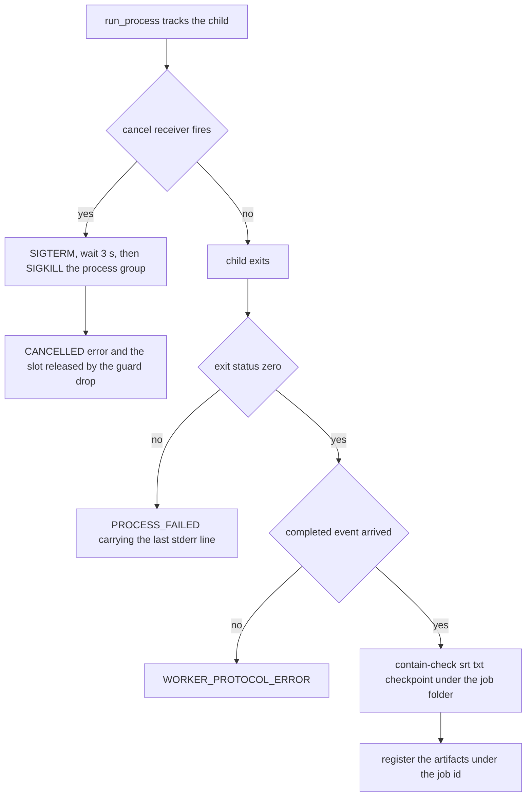

# Workflow: Transcription

Transcription is the pipeline that turns one chosen audio file into a
speaker-labeled transcript, subtitles, and an engine-tagged alignment
checkpoint inside a per-meeting folder. It spans three runtimes: the webview
that mints the job and renders progress, the Rust host that validates, gates,
and supervises, and the Python worker that runs the model stack. This page
walks the whole chain — the request path and its load-bearing ordering, the
ASR biasing context, the two engine pipelines and how they differ on one code
path, the process supervision contract, the event flow back into the job
machine, and the three ways a run can end.

The JSONL protocol the worker speaks is owned by [Worker
Protocol](../architecture/worker-protocol.md); the engine presets, venv
layout, and readiness markers are owned by [Engines &
Environment](../concepts/engines-and-environment.md); the job slot and
cancellation semantics are owned by [Jobs, Cancellation & State
Machines](../concepts/jobs-and-cancellation.md); the folder and naming rules
are owned by [Meetings & Artifacts](../concepts/meetings-and-artifacts.md).
[Recording](recording.md) produces the audio this page consumes, and
[AI minutes](ai-minutes.md) refines the transcript it publishes.

## The request path

*The transcription request path: the window mints the job id, the host gates
in cheap-first order, the adapter bridges to the worker, and completion
registers artifacts so open and reveal work.*

1. **Webview.** `AppController.transcribe`
   (`src/ui/controller.ts`) refuses to run without a chosen audio file
   ("먼저 전사할 오디오 파일을 선택해 주세요.") and output folder. It builds
   the `SpeakerHint` with `buildSpeakerHint` (`src/domain/speaker.ts`) — a
   client-side validation that rejects non-positive or inverted ranges — mints
   the `jobId` with `crypto.randomUUID()`, calls `begin("transcription", …)`,
   and awaits `backend.transcribe(...)`. The window mints the id *before*
   invoking so the very first worker event already belongs to this job; a job
   that adopted whatever arrived first could inherit the trailing events of a
   job the user just cancelled. The event subscription itself is established in
   `start()` before any action can run — subscribe-before-invoke.
2. **Port.** `TauriBackend.transcribe`
   (`src/adapters/tauri-backend.ts`) invokes the `start_transcription` command
   and parses the reply through `transcriptionResultSchema` (camelCase
   `jobId`, `srt`, `txt`, nullable `checkpoint`, `outputDirectory`,
   `segments`, `filtered`).
3. **Command.** `start_transcription`
   (`src-tauri/src/adapters/inbound/tauri.rs`) is a thin pass-through to
   `Application::transcribe`.
4. **Use case.** `Application::transcribe`
   (`src-tauri/src/application/use_cases.rs`) runs the gated sequence below and
   returns a `TranscriptionResult`; progress travels out-of-band as events, not
   in the return value.

## Gating order: fail cheap, claim late

`Application::transcribe` and `run_transcription` order their checks so
everything that can fail fast fails before the single job slot or the
filesystem is touched:

1. **Speaker hint** — `validate_speaker_hint`
   (`src-tauri/src/domain/job.rs`) rejects an exact count of zero and ranges
   with a zero bound or `min > max`, mapping any violation to
   `INVALID_SPEAKER_HINT`. This happens *before* `claim_with_id`, so an invalid
   hint produces zero `prepare_job` calls — pinned by
   `invalid_hint_is_rejected_before_workspace_access`
   (`src-tauri/src/application/tests.rs`).
2. **Job claim** — `claim_with_id` takes the slot (below).
3. **Readiness gate** — `run_transcription` loads the saved `EnginePreset`,
   re-diagnoses it, and fails with `SETUP_REQUIRED`
   ("먼저 엔진과 모델 준비를 완료해 주세요.") unless `engine_ready`,
   `models_ready`, and `ffmpeg_ready` all hold. Nothing is created and no
   process is spawned when the engine is not installed. The webview enforces a
   softer version first: `refreshActions` keeps `#start-button` disabled until
   `engineReady`.
4. **Workspace** — `transcription.prepare_job(...)` resolves the meeting
   folder (below) — the first filesystem write.
5. **ASR context** — assembled from settings and handed to the adapter.

## The single job slot

`JobRegistry::claim_with_id` (`src-tauri/src/application/jobs.rs`) holds one
`Option<ActiveJob>`: a second claim while a job runs is refused `BUSY`
("이미 실행 중인 작업이 있습니다."), and reusing a job id that already has
registered artifacts is refused `JOB_ID_CONFLICT`. The claim returns a
`JobGuard` plus the cancel receiver; the guard is held for the whole run and
releases the slot in `Drop`, so an early `?`, a cancelled future, or a panic
can never leave the registry believing a job is still running.
`failed_transcription_releases_active_job` pins that two consecutive failed
transcriptions both run rather than the second being refused.

The claim is what makes setup, transcription, import, and refinement mutually
exclusive while a microphone recording stays independent — see [Jobs,
Cancellation & State Machines](../concepts/jobs-and-cancellation.md).

## The meeting workspace

`DesktopAdapter::prepare_job` (`src-tauri/src/adapters/outbound/desktop.rs`)
delegates to `prepare_job_directory`
(`src-tauri/src/adapters/outbound/paths.rs`), which runs before the worker
exists:

- **Input validation.** The input is canonicalized and must be a regular file,
  else `INVALID_AUDIO`.
- **Meeting folder.** `create_meeting_directory` canonicalizes the output
  root, sanitizes the audio stem into the folder name, and applies the
  adoption rule: an input that already sits at `{stem}/{stem}.wav` (a finished
  Galpi recording) reuses its own folder, so artifacts land next to the WAV;
  any other input gets a fresh `{stem}` folder, deduplicated with ` 2`, ` 3`,
  … up to 100 attempts.
- **Checkpoint seeding.** `seed_checkpoint` scans the *other* meeting folders
  in the output root for the most recently modified regular
  `<stem>.aligned.v2.json` (canonicalized, still inside the root) and copies
  it into the fresh folder. The seeding itself is engine-blind — whichever
  engine runs decides at read time whether the file is reusable, purely by its
  `engine` tag. This is how a re-run of the same meeting in a new folder skips
  its ASR pass.

## ASR context: saved glossary plus roster

Recognition is biased toward the vocabulary the user already saved.
`Application::asr_context` (`use_cases.rs`) loads the trimmed assistant
settings and builds `AsrContext { terms, names, aliases }`
(`src-tauri/src/domain/worker.rs`): glossary terms first, then every
participant name, then every spoken alias flattened across the roster. The
**full saved roster** biases transcription — the attendee selection governs
refinement only, and transcription carries no per-meeting subset. When all
three lists are empty the context is `None` and nothing crosses the IPC
border at all. Both behaviors are pinned:
`transcription_carries_glossary_and_roster_for_asr_biasing` asserts the
terms, names, and aliases all reach the transcription port, and
`transcription_sends_no_asr_context_without_saved_context` asserts the port
sees no context without saved settings.

`AsrContext::into_wire_json` serializes exactly the shape the worker's
`parse_asr_context` reads: one JSON object with `terms`, `names`, and
`aliases` arrays. The adapter hands that JSON to the worker through
`write_private_file` (`src-tauri/src/adapters/outbound/refinement.rs`): a
temporary `galpi-asr-context-{job_id}` file created with `mode(0o600)` *and*
`create_new(true)` — private from the first instant, refusing to write through
an existing file — and removed after the run regardless of the outcome. The
context travels by file, never by argv, where a process listing would expose
the roster.

## Spawning the worker

`transcription::run` (`src-tauri/src/adapters/outbound/transcription.rs`)
invokes the worker with per-preset mechanics on one call shape:

- **Interpreter by preset.** `EnginePreset::Qwen3` runs
  `paths.qwen3_python` — the candidate stack's own `engine/qwen3/.venv` —
  while `EnginePreset::WhisperX` runs the pinned `engine/.venv` python. The
  Qwen3 venv exists so the pinned WhisperX environment never shares dependency
  versions with the candidate stack. The preset comes from settings and
  defaults to Qwen3;
  `transcription_defaults_to_qwen3_and_follows_the_saved_preset` pins both
  the default and that a saved switch is honored on the next run.
- **Arguments.** `python -m galpi_worker transcribe --input … --output …
  --engine …`, plus `--asr-context <file>` when a context exists, and the
  hint as `--num-speakers <n>` (exact) or `--speaker-range <min> <max>`
  (range). `Auto` adds no flag. The current working directory is the worker
  root (`resources/worker` in release, the repo's `worker/` in debug).
- **Environment.** `process_environment`
  (`src-tauri/src/adapters/outbound/environment.rs`) builds a scrubbed
  environment — `HOME`, `LANG`/`LC_ALL` `ko_KR.UTF-8`, `PYTHONUTF8`,
  `PYTHONSAFEPATH`, `PYTHONPATH` pointing at the worker root, `HF_HOME` and
  `TORCH_HOME` inside the app cache, telemetry and metrics disabled, uv
  directories pinned — with **no** `HF_TOKEN`, because transcription runs
  entirely from the prepared cache. Qwen3 additionally forces
  `HF_HUB_OFFLINE=1` and `TRANSFORMERS_OFFLINE=1`: transcription only runs
  after the readiness gate, so the stack must load exclusively from that cache
  and no network round trip can occur mid-meeting.

## Supervising the child process

`run_process` (`src-tauri/src/adapters/outbound/process.rs`) owns everything
hostile about running a long-lived child:

- The child gets a cleared environment, null stdin, piped stdout/stderr,
  `kill_on_drop(true)`, and its own Unix process group; `ProcessGroupGuard`
  (`guard.rs`) is **armed** and its `Drop` sends `SIGKILL` to the group, so a
  dropped future cannot orphan the model stack.
- **stdout is the protocol.** Each line is parsed by `parse_worker_event`
  (`domain/worker.rs`), which requires protocol version 1 (`v:1`) — anything
  newer is `WORKER_PROTOCOL_ERROR`, as is malformed JSON. `Completed` and
  `Refined` events are captured as the run's completion carrier; a *second*
  completion is a protocol error ("완료 이벤트가 두 번 전달되었습니다.").
  Every parsed event is re-emitted to the webview as it arrives.
- **stderr is logging.** Lines are batched — flushed after 100 ms
  (`LOG_BATCH_INTERVAL`) or 32 lines (`LOG_BATCH_LINES`), whichever first —
  because an install or model download prints thousands of lines and one IPC
  event per line would flood the webview. The last 20 lines are retained in an
  `error_tail` for failure reporting. Lines are read through
  `read_bounded_line` with a 64 KiB cap, so an unbounded line cannot grow the
  buffer forever (pinned by `rejects_oversized_line_before_unbounded_growth`).
- **Exit handling.** A non-zero exit reports `PROCESS_FAILED` carrying the
  *last* stderr line as the message — the worker's own final diagnostic, not a
  generic exit code (`a_failing_child_reports_its_last_stderr_line`).

On the worker side, `__main__.py` redirects stdout to stderr for the duration
of the run so dependency chatter cannot corrupt the protocol stream, and every
abnormal exit still reaches the host as one error event: `InvalidInput`
becomes an `INVALID_INPUT` error event with exit code 2, any other exception
becomes `ENGINE_ERROR` with exit 1. `EventWriter`
(`worker/galpi_worker/protocol.py`) writes versioned, lock-serialized,
monotonically sequenced JSON objects to stdout.

## The two engines on one path

`engine.py::transcribe` dispatches on `--engine` between the two pipelines.
Both end the same way: filter hallucinated and degenerate segments
(`artifacts.py::filter_segments`), write `<stem>.srt` and
`<stem>_화자별.txt` atomically, and emit one `completed` event.

### WhisperX: CPU ASR, MPS alignment, reusable checkpoint

`transcribe_whisperx` (`worker/galpi_worker/engine.py`) loads
`large-v3-turbo` on CPU (`int8`, `language="ko"`, VAD onset 0.6 / offset 0.4,
`condition_on_previous_text` off) and aligns with the Korean wav2vec2 model on
the selected torch device — MPS when available, with an automatic retry on CPU
when MPS alignment or diarization throws. Recognition biasing rides the
hotwords slot: `parse_asr_context` reads the host's JSON and
`build_asr_hotwords` (`core.py`) packs terms → names → aliases into one
comma-joined string capped at `ASR_HOTWORDS_CHAR_BUDGET` (200 characters),
deduplicated, with whole entries dropped once the budget runs out — the model
keeps the *front* of the string, so rare domain words win the slot.

`checkpoint_reusable` accepts only a checkpoint this engine could have
written: the `engine` field must be `whisperx` or absent (untagged files
predate the tag). A reusable checkpoint skips **transcribe and align only** —
the run emits a `transcribing` phase at 100% ("기존 전사 체크포인트를
사용합니다.") and resumes at diarization, which always re-runs, as do
filtering and publication.

### Qwen3: MLX on Metal, silence-aligned chunks, word-level checkpoint

`transcribe_qwen3` (`worker/galpi_worker/qwen3.py`) first decodes any input
container through the bundled ffmpeg into 16 kHz mono WAV, because the MLX
stack's libsndfile decoder rejects m4a/AAC/mov. It then:

1. **Chunks at real silences.** `plan_audio_chunks` targets 25 s chunks
   (`CHUNK_TARGET_SECONDS`) capped at 30 s (`CHUNK_MAX_SECONDS`), preferring
   the midpoints that `ffmpeg silencedetect` (−35 dB, ≥0.6 s) found. The cap
   exists because `mlx-qwen3-asr` re-splits anything longer than 30 s at an
   energy minimum that can land mid-word; a Galpi chunk stays under the
   runtime's limit so Galpi's own silence-aligned boundary is the one that
   survives (`test_chunks_stay_within_the_runtime_resplit_limit`).
2. **Recognizes per chunk with biasing.** The MLX `Session` loads the
   converted 8-bit weights from `cache/mlx/qwen3-asr-1.7b-8bit` (guaranteed by
   the readiness gate) and each chunk is transcribed with
   `language="Korean"`, `return_timestamps=True`, and a freeform context
   string built by `build_bias_context` — "도메인 용어: …",
   "참석자 이름: …", "별칭: …" lines, hard-capped at
   `BIAS_CONTEXT_CHAR_BUDGET` (500 characters) so a runaway roster cannot
   crowd out the audio
   (`test_bias_context_is_capped_so_it_cannot_crowd_out_the_audio`).
   Chunks that stop for a reason other than finishing their text are logged.
3. **Lays text over aligner words.** `build_word_spans` maps the model's
   punctuated text onto the MLX forced aligner's word entries, and
   `offset_entries` shifts chunk-local timestamps onto the meeting clock.
4. **Checkpoints the words.** `read_word_checkpoint` /
   `write_word_checkpoint` round-trip raw aligner spans in
   `<stem>.aligned.v2.json` — but only when the `engine` tag is exactly
   `qwen3`; the other engine's file is re-transcribed over
   (`test_checkpoint_round_trips_and_rejects_the_other_engine`).
5. **Diarizes and groups.** pyannote community-1 runs on MPS with a CPU
   retry, using the exclusive speaker variant so overlapping speech maps
   cleaner onto segments; the speaker hint becomes `num_speakers` or
   `min`/`max_speakers`. `group_word_spans` merges timed words into segments
   that break at a terminal punctuation mark, at a speaker change, after a
   0.8 s pause, or once a segment runs 12 s — breaking on the speaker is what
   keeps one unpunctuated stretch from collapsing several people into whoever
   spoke longest.

Both engines emit the same `phase` vocabulary along the way — `transcribing`,
`aligning`, `diarizing`, `writing` — with per-phase percentages (Qwen3's
transcribing phase reports per-chunk progress between 10% and 90%; the
aligning phase jumps to 100% because alignment happened inside the ASR pass).

## Events on the way back

`TauriEvents` (`src-tauri/src/adapters/inbound/tauri.rs`) implements
`JobEvents` by emitting a Tauri `job-event` whose payload is `{ jobId,
<flattened event> }` in camelCase — exactly the shape the webview's
`rawJobEventSchema` parses (`src/adapters/tauri-backend.ts`). `toJobEvent`
maps the parsed payload onto the domain `JobEvent`; an unrecognized payload
becomes a `log` event with stream `frontend` ("알 수 없는 작업 이벤트를
받았습니다: …") rather than a thrown error, because the listener runs inside
Tauri's callback where a throw is swallowed and a host/window version mismatch
would otherwise vanish silently.

`reduceJobEvent` (`src/application/job-machine.ts`) folds events into
`JobViewState` under rules that are load-bearing for this flow:

- **Identity.** Events whose `jobId` differs from the state's are ignored —
  the guard against a cancelled job's trailing events reaching the new job.
- **Settled is terminal.** `phase` events are dropped once the status is
  `completed`, `failed`, or `cancelled`.
- **Monotonic percent within a phase.** `Math.max` while the phase is
  unchanged; entering a new phase adopts that phase's value — so a
  checkpoint-skip jumping `transcribing` to 100% cannot be undone by a late
  low number (`does not move progress backwards within a phase`).
- **Bounded logs.** Batched log messages are split on newlines, prefixed
  `[stream]`, and capped at the last 200 lines.
- **Completion.** A `completed` event settles the job at phase `writing`,
  100%, message "결과 파일을 저장했습니다."

The phase vocabulary is what drives the waveform rail: the transcription
panel's phase list (전사 / 정렬 / 화자분리 / 결과 저장,
`app-template.ts`) is recomputed by `phaseState` against the `phaseOrder`
array (`app-view.ts`), marking earlier phases complete and later ones pending
as the worker advances.

## Outcomes

*The three endings: cancellation escalates through signals and is reported
once as a decision; process death reports the worker's own last words; and a
protocol-compliant completion is contained and registered.*

**Completed.** The adapter maps the `Completed { srt, txt, checkpoint,
segments, filtered }` event onto `Artifacts`: every returned path is
canonicalized and must sit inside the meeting folder (`canonical_artifact`),
else `WORKER_PROTOCOL_ERROR` — the worker cannot point the host at files
outside the job. An empty checkpoint string maps to `None`, keeping the
checkpoint slot optional in the type. `run_transcription` registers the
artifacts in the registry under the job id — this registration is what makes
`open_artifact` and `reveal_output` work afterwards — and returns the
`TranscriptionResult`. The controller settles the job with `completeJob`
and `renderResult` shows the artifacts plus the counts summary
("N개 발화 보존 · M개 환각 제거"), hides the checkpoint row when there is
none, and arms refinement on the transcript this job just published.

**Failed.** A worker `error` event reduces the job machine to `failed` with
the cause in the error slot while the message slot keeps the stable status
line "작업이 실패했습니다." — the two-slot split announces the cause exactly
once. The IPC promise then rejects too (`PROCESS_FAILED`, protocol errors,
`SETUP_REQUIRED`, …), and `handleFailure`/`failJob` re-apply the same state
without duplicating it. The guard drop has already freed the slot, so the next
attempt runs.

**Cancelled.** `AppController.cancel` invokes `backend.cancel(jobId)`;
`Application::cancel` → `JobRegistry::cancel` takes the cancel sender
(`JOB_NOT_FOUND` for an unknown id, `ALREADY_CANCELLING` on a second click,
`JOB_FINISHED` if the job already ended) and fires the oneshot. The
supervisor's select loop sees it, flushes pending logs, and ends the child via
`terminate_on_cancel`: `SIGTERM`, a 3 s grace period, then `SIGKILL` to the
whole process group, reaping the child either way, and returns `CANCELLED`.
The UI announces cancellation once as a decision, not a failure: the
controller applies `cancelJob` immediately on the click, and when the backend
rejection arrives seconds later, `failJob` no-ops on an already-`cancelled`
state. The cancel button is shown only while the transcription kind is busy
(`AppView.setBusy`). `cancellation_reaches_running_port_without_timing_waits`
pins that a cancel reaches a running transcription promptly.

## Focused tests that pin this workflow

- `src-tauri/src/application/tests.rs` —
  `invalid_hint_is_rejected_before_workspace_access` (INVALID_SPEAKER_HINT
  with zero prepare calls),
  `transcription_carries_glossary_and_roster_for_asr_biasing` /
  `transcription_sends_no_asr_context_without_saved_context` (the ASR
  context contract),
  `failed_transcription_releases_active_job` (the slot survives failure),
  `cancellation_reaches_running_port_without_timing_waits` (CANCELLED from
  the escalation path),
  `completed_artifact_is_opened_from_registry` (registration enables open),
  and `transcription_defaults_to_qwen3_and_follows_the_saved_preset`.
- `src-tauri/src/adapters/outbound/process/tests.rs` — bounded line reads,
  prompt cancellation with reaping, and the last-stderr-line failure message.
- `src-tauri/src/domain/worker.rs` tests — protocol version gating and the
  `AsrContext` wire format the worker's parser mirrors.
- `src/application/job-machine.test.ts` — phase advancement, monotonic
  percent, bounded logs, and stale-jobId rejection.
- `worker/tests/test_core.py` — `parse_asr_context` strictness and
  hotword ordering, deduplication, and the 200-character budget.
- `worker/tests/test_qwen3.py` — chunk limits, silence planning, bias-context
  capping, checkpoint round-trip with cross-engine rejection, and the forced
  aligner's matchable-character rule.
